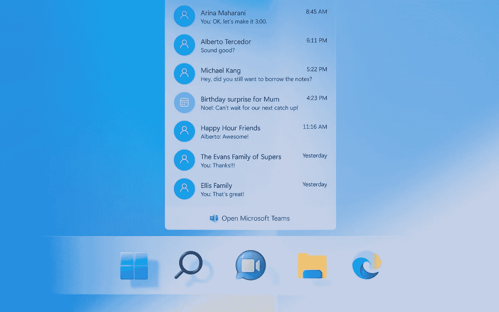

# Windows 11 不是操作系统。这是一个宣传频道。

> 原文：<https://medium.com/geekculture/windows-11-is-not-an-operating-system-its-a-promo-channel-c9aeda764bf3?source=collection_archive---------6----------------------->

## 微软又一次滥用了它的优势地位，消费者现在不得不大声疾呼

Windows 11 is designed in such a way so as to extensively promote other Microsoft products and services. If it was actually offered for free, that would have maybe been OK. But it isn’t, so it isn’t. (Image: Microsoft)

距离世界上最受欢迎的操作系统 Windows 11 的继任者向“所有符合条件的个人电脑”发布还有不到三周的时间，似乎还有工作要做。那是…