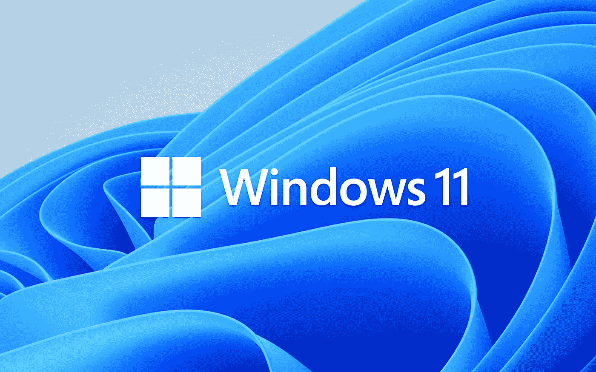

# Windows 11 已经正式发布，但是微软准备好迎接挑战了吗？

> 原文：<https://medium.com/geekculture/windows-11-is-official-but-is-microsoft-up-to-the-challenge-db8292b5d74f?source=collection_archive---------36----------------------->

## 新操作系统传入

## 雷德蒙巨人推出了今天最流行的操作系统的继任者，许多问题仍然存在

It’s happening this year: the successor to Windows 10 was just announced and it will be a free upgrade for hundreds of millions of consumers worldwide in a few months. (Image: Microsoft)

[不出所料](https://farkonas.medium.com/windows-10-support-is-ending-in-2025-what-does-that-actually-mean-9ac133c2892e) —上周该产品预发布版本的泄露破坏了所有的惊喜，不幸的是——微软发布了 Windows 11……