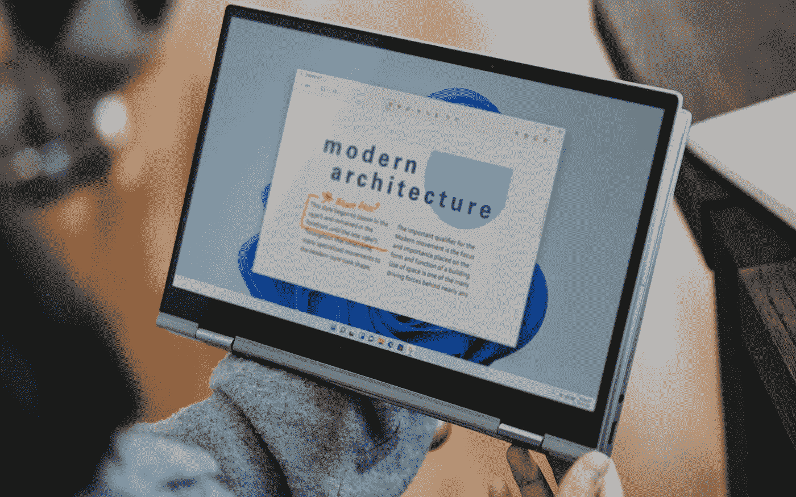

# Windows 11 在混乱中于 10 月 5 日发布

> 原文：<https://medium.com/geekculture/windows-11-launches-on-october-5th-amidst-turmoil-54b4be539878?source=collection_archive---------12----------------------->

## 微软的操作系统将作为升级版提供给符合条件的个人电脑，还是预装在新电脑上，仍有疑问

Windows 11 has had a rough ride since its unveiling in June but many of us will get to see whether it was worth the fuss in a few weeks’ time. (Image: Microsoft)

因此，尽管在过去的三天里有关于 Windows 11 的混乱和争议，倒计时现在开始了:微软宣布其新的个人电脑操作系统…