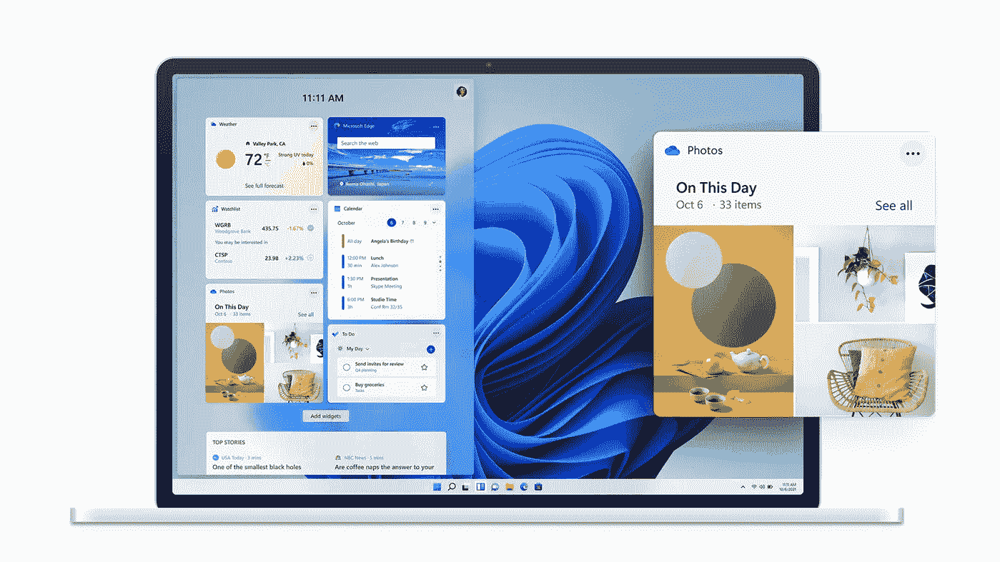

# Windows 11:Windows 10 的终结

> 原文：<https://medium.com/geekculture/windows-11-the-end-of-windows-10-e3133afb3a53?source=collection_archive---------23----------------------->

## Windows 11 正在接管个人电脑

Image: Microsoft

微软终于在其 Windows 2021 live 活动中推出了搭载 Windows 11 的下一代 Windows 操作系统。随着 Windows 11 将 10 抛在身后，微软终于向 Windows 的未来迈进了。Windows 11 仍然是我们多年来钟爱的 Windows，但经过了彻底的设计革新，一切都变得极简而超级…