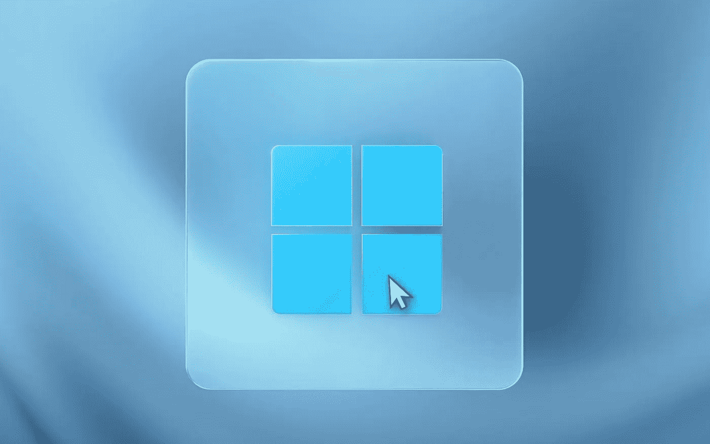

# 许多 Windows 10 用户不会选择 Windows 11

> 原文：<https://medium.com/geekculture/windows-11-wont-be-an-option-for-many-windows-10-users-d8462e894eb3?source=collection_archive---------26----------------------->

## Windows 11 传入

## 一些新的系统要求将使升级变得不可能——如何升级，最重要的是，为什么？

Windows 7 and Windows 8 users were offered to upgrade to Windows 10 for free back in 2015 back, come November, Windows 10 users will not be able to make use of the same offer for Windows 11\. (Image: Microsoft)

微软几小时前发布了 Windows 11，人们仍在收集关于这款新操作系统的零碎信息…