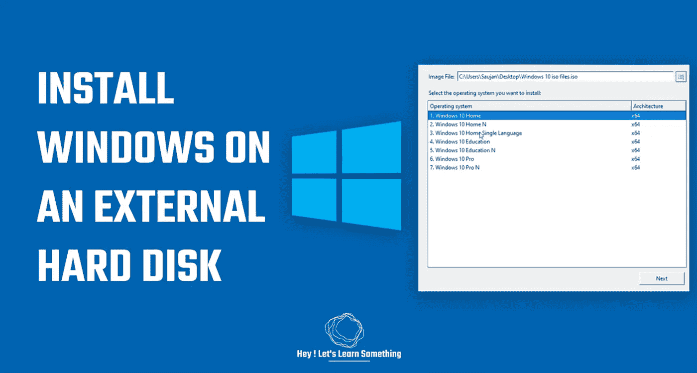

# Windows to go:在外置硬盘上安装 Windows

> 原文：<https://medium.com/geekculture/windows-to-go-install-windows-on-an-external-hard-disk-7f0f74d7f9cf?source=collection_archive---------0----------------------->

您知道吗，您可以从外置硬盘运行 Windows，而无需使用电脑的硬盘。在这篇文章中，你将会明白如何将 Windows 安装到你的外置硬盘上，然后在不使用你电脑硬盘的情况下独立运行它。如果你正在旅行，这将非常方便，并且/或者它也可以作为一个非常好的完全运行的备份。