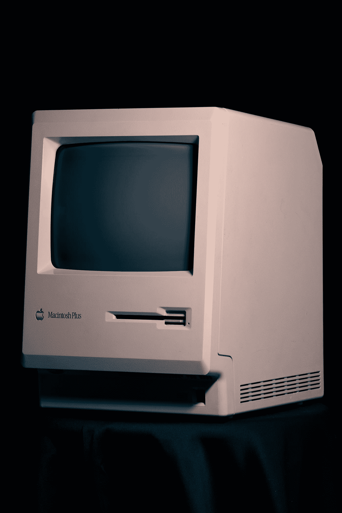

# 赢得一场没有子弹的战争

> 原文：<https://medium.com/geekculture/winning-a-war-without-bullets-ecf74dbe0ce0?source=collection_archive---------59----------------------->

现代世界与其前辈相比已经发生了巨大的变化。仅仅在过去的五十年里，技术、创新和日常生活方式发生了令人难以理解的变化。试想一下，第一部智能手机诞生于 1994 年，不到三十年前。随着世界继续发展，随着全球超级大国之间的国际关系继续相互角力，一个不太可能的盟友和敌人已经从“黄金数字时代”崛起:网络攻击。

Photo by [Lorenzo Herrera](https://unsplash.com/@lorenzoherrera?utm_source=medium&utm_medium=referral) on [Unsplash](https://unsplash.com?utm_source=medium&utm_medium=referral)

根据定义，这些恶意在线攻击是由一台或多台计算机创建和分发的，目标是数字化系统、另一台计算机、企业或仅仅是另一台计算机。这些攻击可以从邪恶的暴力方法到安静的、镇静的植入勒索软件。

无论您在互联网上的什么地方搜索，无论您决定进入哪个网站，甚至只是查看您最喜爱的歌手的唱片目录，您都一定会发现保护个人和公司免受在线数据钓鱼、系统不稳定和安全基础设施薄弱影响的网络安全措施。

你可能会认为这些在线攻击是由计划窃取银行信息、路由数字和社会安全号码的个人发明的，但国家是第一个利用这种无情的方法追求冲突的国家。

已知的第一次重大网络攻击发生在印度和巴基斯坦之间，中国扮演了第三方角色。自 20 世纪以来，他们一直在克什米尔问题上发生冲突，而且最近这种冲突进入了网络空间。

## 第一个电脑蠕虫

尽管这是第一次重大攻击，但第一次攻击是由罗伯特·塔潘·莫里斯发起的，他创造了第一个“计算机蠕虫”。作为康奈尔大学的毕业生，他有很多空闲时间，在空闲时间里，莫里斯喜欢编程和编码。可以理解的是，莫里斯想出了创新的想法来发明和处理，他决定要创建一个程序，然后评估互联网的规模。这个程序会散布在互联网上，安装在其他人的电脑上，然后计算它显示的拷贝数量。

Photo by [Thomas Millot](https://unsplash.com/@tmillot?utm_source=medium&utm_medium=referral) on [Unsplash](https://unsplash.com?utm_source=medium&utm_medium=referral)

在测试和实现蠕虫的过程中，莫里斯遇到了一些麻烦。总的来说，该蠕虫仅将自己隐藏在大约 6000 台计算机中，并造成大约 201，000 美元到 2，000，000 美元的损失赔偿。莫里斯随后被指控违反了[计算机欺诈和滥用法案](https://www.energy.gov/sites/prod/files/cioprod/documents/ComputerFraud-AbuseAct.pdf)；他的总刑期包括罚款、三年缓刑和社区服务。

## 现代网络攻击

美国最近承认，网络攻击现在与恐怖主义直接相关，这意味着如果你在网上实施攻击，那么你将被视为恐怖分子。

2021 年 5 月，起源于德克萨斯州休斯顿的美国石油管道系统 Colonial Pipeline 遭到了与俄罗斯有关联的网络犯罪集团 DarkSide 的子公司的攻击。石油管道公司为大约 45%的美国东海岸提供燃料，包括汽油、柴油、喷气燃料和军用物资。

勒索软件攻击的切入点有冲突点，它可能是一封发送给在那里工作的员工的钓鱼电子邮件，或者是使用从员工那里购买的凭据或通过黑客系统。

非常重要的是要明白，攻击的重点是 Colonial Pipeline 的业务方面，而不是系统方面，这意味着整个攻击是以金钱为导向的；网络罪犯无意破坏整个系统，尽管这很容易做到。尽管这些系统不是攻击目标，但 Colonial Pipeline 不得不关闭了许多主要的管道作业，这些作业已经扰乱了成千上万美国人的生活。

Photo by [Markus Spiske](https://unsplash.com/@markusspiske?utm_source=medium&utm_medium=referral) on [Unsplash](https://unsplash.com?utm_source=medium&utm_medium=referral)

随着这次袭击的发生，由于该公司是同类中最大的公司之一，这些供应短缺的担忧大大增加了对天然气的需求，推动汽油期货达到过去三年来的最高点。

如今，这些攻击必须被严肃对待，因为它们影响了这个国家的完整性和生活方式。许多大机构都参与其中，包括联邦调查局、CISA 和 FMCSA。

5 月 13 日，在事件平息后，几乎一切都系统地恢复正常，彭博报告说，殖民管道向黑暗面支付了大约 500 万美元的赎金，这对于可能在数百英里外发起的攻击来说是一笔巨款。

随后，拜登总统签署了一项加强美国网络安全的行政命令，真正将网络攻击视为对我们社会的威胁。

从这次恐怖袭击中我们应该吸取什么教训？首先，我们必须明白美国(它的管道、铁路和整体生活方式)从根本上是有缺陷的。以几个月前席卷德克萨斯州和美国中部的大暴风雪为例。那场自然灾害暴露了美国有多少地方完全依赖于一个过时的系统，以及没有实施任何改变来防止类似的事情再次发生。在那段时间，人们死于寒冷，我们必须像对待其他重要问题一样认真对待这个问题。

其次，由于网络攻击现在要更加认真地对待，作为一种恐怖主义威胁，网络安全必须得到彻底改善。这些攻击者中的许多人对正在发生的事情有很高的了解，如果他们能够通过搞垮一家公司来影响整个国家的一半，那么了解他们在网上完成的更多事情肯定会很可怕。

我们能做的改善情况的事情很少。作为一个国家，我们必须团结起来，防止类似殖民地管道事件的事情再次发生。与此同时，你应该高度关注互联网安全和威胁。不要轻易落入骗局或网络钓鱼的圈套，如果您想知道发送给您的任何邮件是否是正式的，请联系该电子邮件或文件的实际发件人。锁定您的密码，并确保它们是复杂的，不容易猜到。

请在网上照顾好自己，因为你永远不知道，你可能是下一个被攻击的人。