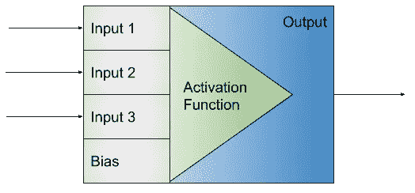

# 深度学习的巫术——激活功能

> 原文：<https://medium.com/geekculture/witchcraft-of-deep-learning-activation-functions-4f6ed323ad78?source=collection_archive---------40----------------------->

任何 DL 模型的最重要的部分之一是它的每一层的激活。具有 10 个隐藏层而没有任何激活函数的 [ANN](https://en.wikipedia.org/wiki/Artificial_neural_network) 本质上与具有一个隐藏层的 ANN 相同。

# 为什么还要添加激活呢？

你可能会奇怪为什么激活功能会有如此大的影响…