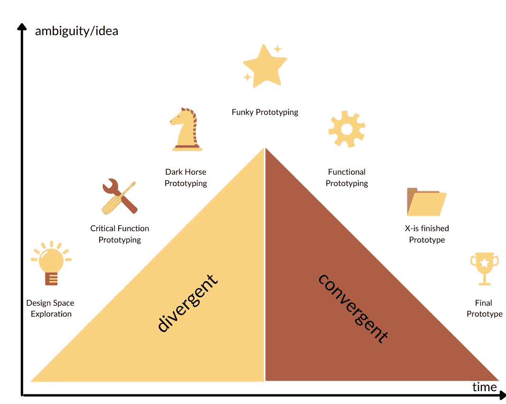
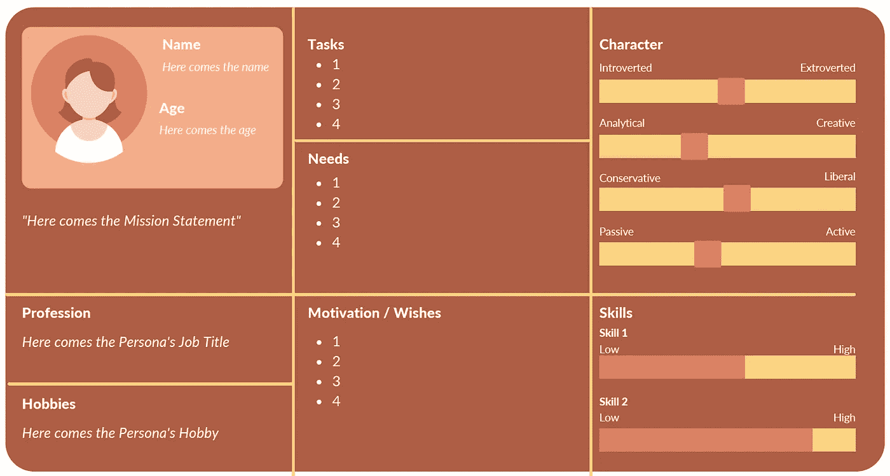
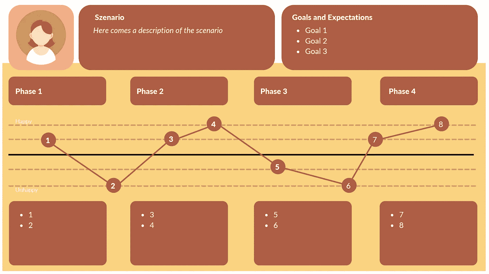
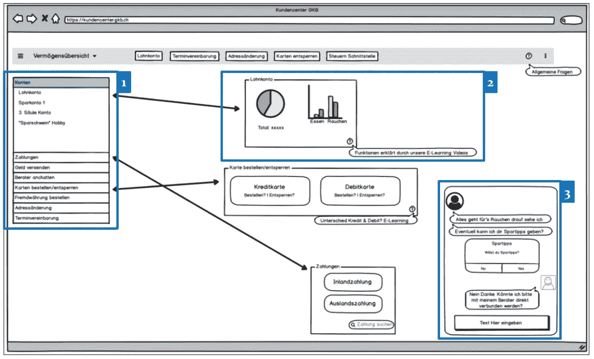
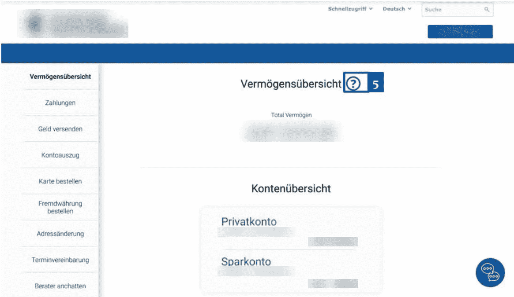

# 用设计思维做出顾客喜爱的产品

> 原文：<https://medium.com/geekculture/with-design-thinking-to-a-product-customers-love-6564a2b7905f?source=collection_archive---------3----------------------->

要制造出令人惊叹的产品，设计思维是最好的方法之一。这是一个迭代的过程，主要关注你想解决的问题而不是解决方案。在下面的文章中，我将通过一个为银行客户重新设计在线门户的真实例子，向您展示整个过程是如何最好地工作的。我会带你经历这个过程，走吧。哦，如果你想提前知道我们在讲什么，看看目录:

[Karin Schori](https://medium.com/u/16c409b655fa?source=post_page-----6564a2b7905f--------------------------------)

1.  **设计太空探索**
2.  **关键功能原型**
3.  **黑马原型**
4.  **时髦的原型制作**
5.  **功能原型**
6.  **X-已完成原型**
7.  **最终原型**

设计概要是每个设计思维挑战的开始。它包含设计项目的背景和关键信息。对于我们关于银行门户的真实例子，这是设计概要:

# 设计简介

> “在线门户现已到位，公司专注于技术功能而非客户需求。结果，客户满意度受到影响。因此，设计思维挑战赛的重点是设计、相关功能和可用性，并让客户喜欢它们。”

任务很明确，所以让我们深入到过程中。

# 设计空间探索

这个名字告诉了很多关于这一步要做的事情。在设计空间探索中，我们了解客户的具体需求。一个主要的任务是:

> 面试，面试，再一次:面试你的潜在客户！

是的，提问在面试中很重要。但更重要的是了解客户的故事。让他们说，问你能想到的关于这个话题最开放的问题。在采访银行解决方案的潜在客户时，我们提出了如下问题:

*   当向你的保险公司谈论你的事情时，什么对你来说是重要的？
*   就沟通而言，你在一家公司的最佳经历是什么？
*   就沟通而言，你在一家公司最糟糕的经历是什么？

有了这些问题，你就有了你需要的故事！人们喜欢谈论自己，所以你只需要用这样的问题创造合适的环境，瞧！

## **人物角色和用户旅程的**

你可能已经发现了面试中的相似之处——所以你知道，你做得很好！我打赌你在脑海中创造了一个虚构的角色——代表你采访过的所有顾客？恭喜你，你已经创建了第一个角色！这个[角色](https://www.interaction-design.org/literature/article/personas-why-and-how-you-should-use-them#:~:text=Personas%20are%20fictional%20characters%2C%20which,%2C%20experiences%2C%20behaviours%20and%20goals.)将来可能会使用你的解决方案，当然，你可以拥有不止一个角色。

写下所有你需要的关于你的角色的重要信息。对于银行门户网站来说，了解日常任务以及动机和特定需求是非常重要的。查看图 1，获取一个人物角色的示例。产品不同，所需信息也不同。

Image 1

现在你知道你的角色了。有了角色，用户之旅也随之而来。顾名思义，你在使用产品的同时创造了你的角色之旅。例如，旅程的起点可能是购买产品，终点可能是客户决定参与竞争。

## **情绪状态是有价值的用户旅程的关键**

确保你把角色的情感状态融入到用户的旅程中。这是最重要的见解，也是我们使用用户旅程的原因。关于情绪状态的问题如下:

*   哪一步人物角色是快乐的？
*   人物角色在哪里会生气？

在设计你的产品时，你需要知道这一点，更重要的是，解决你的角色不高兴甚至生气的部分。在图 2 中找到一个用户旅程的例子。

Image 2

如果你需要更多关于用户旅程地图的信息，请查看尼尔森诺曼集团的[这篇博文](https://www.nngroup.com/articles/journey-mapping-101/)。

## **自由资源**

为了给你一个创建令人惊奇的人物角色和用户旅程的起点，我想和你分享我创建的模板。只需使用下面的链接访问 Canva 中的我的设计:

[创建出色角色和用户旅程的模板](https://www.canva.com/design/DAEXKmU7neA/bWs0BZCy60hsi1_YW-23oA/view?utm_content=DAEXKmU7neA&utm_campaign=designshare&utm_medium=link&utm_source=sharebutton&mode=preview)

让阿尔伯特·爱因斯坦对第一阶段说几句话:

> “如果我有一个小时来解决一个问题，我会花 55 分钟思考问题，5 分钟思考解决方案。”

这不仅仅是“重要”——面试，面试，面试。

# 关键功能原型

你现在知道你的角色和他们的用户旅程了，太好了！问题面试有时候并不容易掌握，尤其是当你指望我们当中那些害羞的人的时候。此外，正确的问题也不总是容易找到！

从问题空间，我们漫步到下一个空间，在那里我们将探索你的角色需要具备的功能。所以还是原型吧！

拿一些便利贴、纸盒、钢笔和铅笔，开始制作原型！
当你对物质材料充满疯狂和创造力时，好主意就来了！

Photo by [Kelly Sikkema](https://unsplash.com/@kellysikkema?utm_source=medium&utm_medium=referral) on [Unsplash](https://unsplash.com?utm_source=medium&utm_medium=referral)

## **Post —** It Proto **type**

上面有一些便利贴的纸板已经足够上街开始测试了。这就是我们为银行原型所做的。测试原型的人只需要把最重要的功能放在最上面，比如“订购付款单”，然后从高到低排列。

在这个阶段的最后，我们知道我们的产品需要什么样的人物角色。下一步就要搞笑了，继续吧！

# 黑马原型

我承诺过，黑马原型会很有趣，原因如下:在这个阶段，我们使用一种不同的重构技术。他们很棒，因为在他们的帮助下，你可以打破关于产品、问题空间或任何关于设计过程的思维模式。

让我介绍一下我们使用的技术:

*   想一个你有的假设，然后重新构建它，它的意思正好相反。
    举例:
    *假设*:用户需要对门户的所有不同功能有一个清晰的概述。
    *Anti-Dote*:门户必须杂乱，用户必须尽可能长时间地搜索正确的功能。
*   **我们怎么可能？:**就这么简单，把这句话说完就行了，但先不要去寻找解决方法，直接提出问题就行了。
    " *我们如何帮助银行的客户为一个特定的目标存钱？*”
*   想出不同的观点，想象一下莱昂内尔·梅西或巴拉克·奥巴马会对你的设计挑战说什么。作为客户，莱昂内尔·梅西会如何最有效地利用银行门户网站？”

如果这些重构技术没有说服你，看看下面的博客文章，获取更多的灵感:

*   [用三种方法重新构想一个问题，找到一个创新的解决方案](https://www.fastcompany.com/3050265/three-ways-to-reframe-a-problem-to-find-innovative-solution)

集思广益之后——别忘了出去和现实生活中的客户再次测试。请记住，您的目标测试用户是那些符合我们在设计空间探索期间创建的角色的用户。

> 如果你设计的东西只有你在参与，而不是你的潜在客户，那你就是在为错误的人设计！

# 时髦、实用& X-已经完成原型制作

我们开始接近过程的终点。在所有这些步骤中，我们第一次将所有想法整合到一个原型中。到目前为止，我们每个想法只创造了一个原型。

**门户模型** 将所有评估的需求放在一起，我们在右侧获得了所有功能的完整概述。有了这个解决方案，我们当然又出去测试这个想法了！

# 最终原型

用户测试的最后反馈被实现。我们现在更关注设计而不是功能。创建一个潜在客户喜欢并愿意使用的可点击原型是获得最后一轮宝贵反馈的最佳方式！

[**Adobe XD**](https://www.adobe.com/products/xd.html) **是创建可点击原型的绝佳选择！**

如果你有一个想要测试的数码产品，有许多不同的工具可以用来创建你的可点击原型。如上所述，我们已经使用了 Adobe XD，并且对它非常满意。

这就是我们最终的原型:

Final Prototype

对于非英语母语的截图，我很抱歉，但银行项目是在瑞士，所以德语是创建内容的语言。然而，更重要的是要看到时髦的和最终原型在设计上的差异。

# 流程结束时追溯

设计思维是设计令人惊叹的产品的好方法，因为你与潜在客户紧密合作，几乎不可能错过任何东西。然而，由于这个过程看起来有点耗时，试着在你的日常生活中实施一些小的部分，你将已经意识到小而有效的改变。

我总是对不同的技术、方法和观点感到好奇。非常感谢你对分享这篇文章的支持。