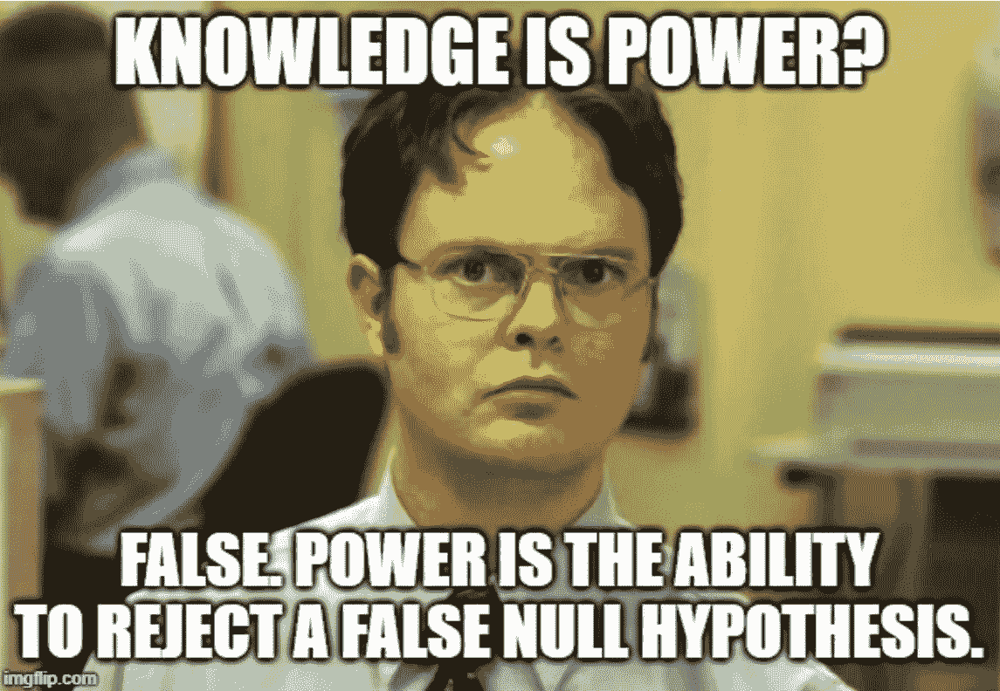
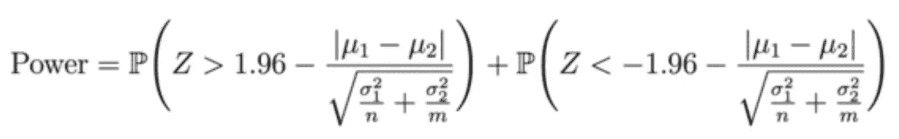
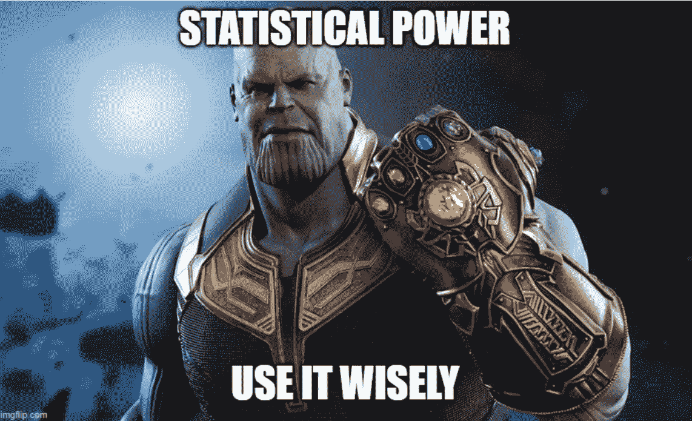

# 随着计算能力的增强，责任也越来越大

> 原文：<https://medium.com/geekculture/with-the-ability-to-calculate-power-comes-great-responsibility-8f2792e59e0c?source=collection_archive---------81----------------------->

# 什么是统计能力？

统计的力量听起来相当令人印象深刻，当笼罩在统计计算的神秘中时，它可以具有更高层次的重要性。简而言之，功效是在真的应该拒绝零假设时拒绝零假设的概率(也就是说，当真正的差异存在时——当然，除了模拟之外，不可能知道这一点)。例如，假设我们正在比较一批混合动力车和一批普通汽油动力车的平均燃油效率(mpg)。在这个愚蠢的例子中，零将是两种类型汽车的平均值之间没有差异，另一种可能是两者之间确实存在某种程度上一致和可靠的差异。在这里，统计能力是我们可以从统计上发现这种差异的可能性。显然，我们希望有很强的能力来发现差异，因为如果我们看不到这样明显的差异，我们会看起来像白痴，对吗？

This image of the calculation of power for a t-test was taken from [this fine article](https://blog.twitter.com/engineering/en_us/a/2016/power-minimal-detectable-effect-and-bucket-size-estimation-in-ab-tests) by Lucile Lu on the use of power in designing A/B tests

我不是数学家，但是看看这个等式可以提供一点指导，告诉我们什么是强大的测试。当功率范围从 0 到 1 时，它随着以下因素而增加:

*   增加样本量(等式中的 n 或 m)。在我们的汽车例子中，这相当于比较每种类型的几十到几百辆汽车的 mpg。这个变量通常是最受实验者控制的变量。
*   您试图检测的平均值之间的较大差异(分子中的 mu1 和 mu2 项)。在我们的汽车例子中，mpg 的平均差异可能非常大，而如果我们将燃气动力 SUV 与大卡车进行比较，差异(如果有的话)将非常小。
*   数据间较小的变化(用分母中的σ平方项表示)。在我们的汽车例子中，如果所有混合动力汽车的 mpg 非常相似，我们可能会看到它们之间的差异很小。相反，如果我们计算各种汽车的平均英里数，我们可能会看到我们的气体动力汽车有很大的变化:从紧凑型车到大型 SUV。

计算幂的过程有几个主要的应用，两者之间的差异是基于对变化的估计的来源。

**应用 1:实验设计** —首先，当你设计一项研究时，你会想要估计你需要达到特定功效的样本数(通常目标是 0.8 作为“功效研究”)。你也可以改变你的研究设计来增加研究结果的差异。然而，随着样本数量的增加，最大的影响是样本的变化会随着样本数量的增加而减少，这符合中心极限定理([朱](https://towardsdatascience.com/how-is-sample-size-related-to-standard-error-power-confidence-level-and-effect-size-c8ee8d904d9c)用直观的图表很好地描述了这一点)。当执行这种功率分析时，对变化的估计通常是基于初步研究或取自文献的估计。以这种方式和为设计研究的目的而进行的功率分析通常被称为先验*，因为它们是在研究进行之前进行的。这方面的一个例子是估计一家公司计划有多少用户参加 [A/B 测试](https://blog.twitter.com/engineering/en_us/a/2016/power-minimal-detectable-effect-and-bucket-size-estimation-in-ab-tests)。在我们的汽车例子中，在我们决定采取大规模的采样协议之前，我们可能会先查看每个类别中少数几辆汽车的 mpg。(顺便说一句，Levine 等人对设计研究时估计功效进行了很好的讨论。)*

***应用 2:解释研究结果** —功效分析的第二个用途是计算未显示显著效果的研究的功效。在这些情况下，研究人员没有发现感兴趣的效果，而是对更好地理解发生了什么感兴趣。因为这些类型的功效分析是使用从他们刚刚进行的研究中观察到的实际样本大小、均值和方差来完成的，所以它们有时被称为“事后功效”、“观察功效”、“追溯功效”以及各种其他名称( [O'Keefe](https://www.tandfonline.com/doi/pdf/10.1080/19312450701641375?needAccess=true) )。安德鲁·盖尔曼甚至把它比作“狗屎三明治”。正如前面的比喻所暗示的，这种权力分析并不受统计学家的欢迎。*

> *功率计算“在实验之前至关重要，但一旦实验完成，基本上就没有意义了。”(j . W . Tukey，引自 [Kraemer 等人](https://jamanetwork.com/journals/jamapsychiatry/article-abstract/209616?casa_token=zvmLPqQ-UogAAAAA:MWytW_9pLgN6BshuC1mOrPQRjjNAqQaJRfgBcoXUou-SlbP16m_Lw3JU5L0tShRYWv0hOzvm2g))*

*包括心理学、生态学、兽医外科学、人类医学和教学研究在内的几个学科长期以来都在误用、误用和曲解事后权力(参见[霍尼格&海西](https://www.vims.edu/people/hoenig_jm/pubs/hoenig2.pdf))。甚至一些著名的科学期刊也经常要求对含有非重要结果的稿件进行事后功效分析( [Levine 等人](https://accpjournals.onlinelibrary.wiley.com/doi/pdf/10.1592/phco.21.5.405.34503?casa_token=0Xo8W9QNmVEAAAAA:HsyvRBREmNN7tbT8M-Of11BdvY82QqHV9vV7gBzqfStd2zT5hTE24Y9S4BlZYekkTuwEUCcXSfpvSVI)、[张等人](https://www.ncbi.nlm.nih.gov/pmc/articles/PMC6738696/))。虽然统计学家很久以前就知道计算后权力的问题，但它的应用问题年复一年地在各种领域不断出现。*

*数据科学是一个相对较新的学科，但后特设权力问题似乎已经在社区中根深蒂固。例如，建议功效计算“对从研究结果得出的结论的可信度进行评论”( [Brownlee](https://machinelearningmastery.com/statistical-power-and-power-analysis-in-python/) )，或者“对从实验或研究结果得出的结论的可信度进行评论”([mccull um](https://nickmccullum.com/power-analysis-in-python/))——(等等，为什么这两个短语完全相同？奇怪！).事后权力在“评估结果”或“报告对实验结果得出的结论的信心”时也被认为是有帮助的。我们甚至被鼓励做好作为数据科学家进行这种权力分析的准备，因为未来的雇主会希望你这样做。不幸的是，这种方法和 30 年前一样有缺陷。*

# *事后权力有什么问题？*

*后特设权力的一个问题更多的是一个心理问题。通常，人们会在拒绝无效假设失败后进行功效分析，他们会试图解释高功效，并以一个非显著的结果作为无效假设**必须为**真的证据(而不是对拒绝无效的更保守和适当的解释)。或者，如果零假设没有被证伪，那么低的事后功效估计可能会向作者暗示真的有 ***是*** 这是一个显著的差异，但他们只是没有足够的样本来证明这一点——这是一个共同的愿望，因为所有的工作都已经进入了研究的设计和执行中(也符合我们所有人共有的许多[认知偏差](https://www.verywellmind.com/cognitive-biases-distort-thinking-2794763))。我们都在实践中见过这种情况，当有人说，“我只是没有足够的样本来发现差异”，对此的回答是，“也许差异只是没有被发现！”*

*除了心理解释问题，还有几个关于事后权力的应用和解释的统计问题。首先，一些作者注意到，功率和从测试中获得的 p 值之间存在 1:1 的关系，这意味着 p 值没有提供事后功率分析所没有提供的新信息(参见讨论、漂亮的图形和引用自[热情受到抑制](https://enthusiasmcurbed.github.io/post-hoc-power/)的关键辛普森一家)。从根本上说，低 p 值已经表明没有足够大的样本量来检测您在实验中观察到的小效应大小，因此根据观察到的方差和均值进行功效分析不会告诉您任何新东西( [O'Keefe](https://www.tandfonline.com/doi/pdf/10.1080/19312450701641375?needAccess=true) )。*

*更成问题的是，非显著的发现几乎总是等同于低的观察功效( [Hoenig & Heisey](https://www.vims.edu/people/hoenig_jm/pubs/hoenig2.pdf) )，但是统计显著的结果将产生高功效。事实上，非显著的结果几乎从来没有观察到大于 0.5 的功效，当它们超过时也是轻微的([周](https://lesslikely.com/statistics/observed-power-magic/))。此外，对事后权力的估计是高度可变的，它们的变化几乎从未被考虑过(参见[中的讨论热情被抑制](https://enthusiasmcurbed.github.io/post-hoc-power/)、[盖尔曼](https://statmodeling.stat.columbia.edu/2019/01/13/post-hoc-power-calculation-like-shit-sandwich/)，尤其是[周](https://lesslikely.com/statistics/observed-power-magic/))。有鉴于此，事后权力可以被定性为“概念上有缺陷”和“分析上误导”([张等](https://www.ncbi.nlm.nih.gov/pmc/articles/PMC6738696/))。甚至在 20 年前，它还被认为是“一个过时的想法”( [Levine 等人](https://accpjournals.onlinelibrary.wiley.com/doi/pdf/10.1592/phco.21.5.405.34503?casa_token=0Xo8W9QNmVEAAAAA:HsyvRBREmNN7tbT8M-Of11BdvY82QqHV9vV7gBzqfStd2zT5hTE24Y9S4BlZYekkTuwEUCcXSfpvSVI))。*

# *临时权力的替代方案*

*那么，有什么建议的解决办法呢？第一个是相当明显的:只进行先验功率分析，因为事后功率在最好的情况下不会增加任何额外的有用信息，在最坏的情况下会产生误导。即使在这种更合理的情况下，重要的是要认识到，这些权力的估计是不具体和精确的，但它们本身是可变的，并受到估计误差。基本上，不能保证一个极其强大的测试将检测到显著的差异。但是要小心，因为在估计先验功效时使用试点研究的方差估计值甚至会有陷阱。*

*第二，统计学家建议基于置信区间( [Hoenig & Heisey](https://www.vims.edu/people/hoenig_jm/pubs/hoenig2.pdf) ， [Levine 等人](https://accpjournals.onlinelibrary.wiley.com/doi/pdf/10.1592/phco.21.5.405.34503?casa_token=0Xo8W9QNmVEAAAAA:HsyvRBREmNN7tbT8M-Of11BdvY82QqHV9vV7gBzqfStd2zT5hTE24Y9S4BlZYekkTuwEUCcXSfpvSVI)， [Chow](https://lesslikely.com/statistics/observed-power-magic/) )来解释研究结果，而不是事后功效，因为置信区间更容易解释，更不容易被误解——特别是考虑到它们旨在显示可变性，而事后功效计算则不是。置信区间仍然容易被误解，所以它们不是解决这个问题的灵丹妙药。*

*最后，最实际也是最简单的解决方法可能就是意识到你所寻求的效果并不真正存在，至少在你所认为的形式或关系中并不存在。科学(包括数据科学)的失败并不是一件坏事，它只是意味着你没有像你想象的那样理解你的系统。也许答案是更深入地研究这个问题，寻找潜在的变量、相互作用或隐藏的关系，并再次尝试这项研究。*

**