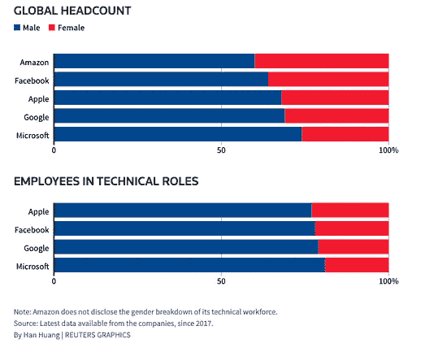

# # Womenintech 不仅仅是一个标签

> 原文：<https://medium.com/geekculture/womenintech-is-more-than-just-a-hashtag-8a86831e3d0?source=collection_archive---------8----------------------->

数据无处不在。

随着发布的数据量变得越来越容易访问，越来越多的组织竞相采用数据驱动的方法。我们将解决数据多样性作为 ThinkData Works 的使命，以便为企业提供公正、道德的预测解决方案。

虽然我们的解决方案中和了数据多样性，但正是我们广泛的“人员多样性”创造了这些解决方案。我们的团队由来自各种背景和国籍的思想家、实干家、程序员、攀登者、摇滚乐手和演说家组成。我们说着 20 种语言，是一个拥有丰富经验、教育和技能的团队。我们理解多元化在我们团队中的重要性——正是它让我们走到了今天。

在整个技术领域，组织(包括我们的)都面临着吸引女性候选人的挑战。正如公正的数据在构建数据驱动的解决方案中的重要性一样，技术团队中的性别多样性对于确保解决方案是为多样化的用户群构建的，并且旨在解决一系列多样化的挑战至关重要。

为了理解在科技领域采取行动实现性别多样性的重要性，让我们仔细看看亚马逊基于人工智能的招聘软件。在我们深入研究之前，下面是一张图表，提供了科技行业中技术与非技术角色中性别代表的背景。

如上图所示，科技行业一直未能缩小这一差距，这在技术岗位上最为明显。亚马逊的招聘引擎遵循了反映在社会中的相同模式，开始惩罚包含“女性”一词的简历。基于性别多样性的缺乏，亚马逊的人工智能系统倾向于这些性别偏见，并最终产生歧视性的招聘偏好。

技术领域缺乏性别多样性不仅会影响所创造的解决方案，还会限制可供招聘的人才库。我们的合作伙伴 [**Hackergal**](https://hackergal.org/) ，是一个慈善组织，激励加拿大各地的女孩探索代码中的机会。由于女性在科技行业的代表性严重不足，Hackergal 努力激发新一波加拿大女性程序员，为蓬勃发展的行业带来平等，自 2015 年底该组织成立以来，她们已经向超过 18，000 名女孩介绍了编码。最近，Hackergal 举办了第五届年度全国黑客马拉松:来自加拿大各地的 4，500 多名 6 至 9 年级的女孩通过数字连接参加了今年的黑客马拉松编码计划，主题是她的故事中的领导者。

> “对我们来说，在年轻时支持女孩并支持她们完成编码之旅非常重要，这样她们就可以将自己视为社区和世界的未来领导者和变革者。”
> Lucy Ho，Hackergal 创始人&执行董事

今年，女孩们的任务是考虑“日常英雄”的品质，并创造一种游戏化的体验来讲述她们的故事。Hackergal 正在确保来自各种教育中心的学生之间的数字知识转移，而不管可用的资源如何。他们还为教育工作者提供他们需要的工具，让女孩在自己的学校学习编码课程。Hackergal 希望确保女孩们不会在蓬勃发展的科技行业中落后。

虽然像 Hackergal 这样的令人惊叹的项目从早期就致力于发展技术包容性，但技术差距是人生各个阶段的问题。许多女性由于许多生活事件而长期离开她们的行业，最终她们想要重新开始她们的职业生涯。

> “暂停职业生涯并不意味着你的潜力消失了。我们拥有丰富的经验、强烈的职业道德，以及不断学习的强烈愿望。”
> Anamica Kartik，测试自动化工程师(前返校候选人)

技术是一个快节奏的行业，几乎每天都在发生变化，这对于重返职场的人来说是一个巨大的障碍。在 ThinkData Works，我们的首席执行官兼联合创始人布莱恩·史密斯(Bryan Smith)推出了[返岗计划](https://secure.collage.co/jobs/thinkdata/13627)，旨在帮助长期离开该行业的女性重新开始她们的职业生涯。它提供固定期限的就业和多样化的工作条件，帮助女性充分定制她们在技术领域的回报。Returnship 计划是一种吸引有技能和经验的女性进入创业世界的方式，同时解决了技术领域的重大性别差距。

该计划是一个吸引技术人才的机会，我们已经看到了巨大的回报——但一家公司是不够的。采取措施实现劳动力中的平等代表性非常重要，我们的结果证明，当每个人都获得公平的机会时，每个人都是赢家。

数据多样性经常是一个问题，因为数据太多了；人的多样性是不够的。从早年到高级职位，每个阶段都有挑战，但如果整个技术界采取措施改善平衡，我们公司乃至整个社会的增长和发展潜力将是巨大的。

公司正在觉醒——更多类似的举措会有助于平衡天平吗？为了大家好，我们希望如此。高盛 最近引起了很大的轰动，坚持他们接手的任何公司必须至少有一名不同背景的董事会成员，并打算在 2021 年提高这一最低要求。

你想帮助 ThinkData Works 彻底改变人们使用数据的方式吗？想和周围最酷的书呆子们一起玩吗？查看我们[目前的职业空缺](https://www.thinkdataworks.com/careers)，看看你适合哪里(或者通过 [LinkedIn](https://www.linkedin.com/company/thinkdata-works/) 或 [Twitter](https://twitter.com/thinkdataworks) 联系我们，我们希望听到你的消息！)

*原载于*[*https://blog.thinkdataworks.com*](https://blog.thinkdataworks.com/women-in-tech-is-more-than-just-a-hashtag)*。*