# 探索性数据分析

> 原文：<https://medium.com/geekculture/womentechwomenyes-annual-gala-exploratory-data-analysis-5620c00acdd4?source=collection_archive---------13----------------------->

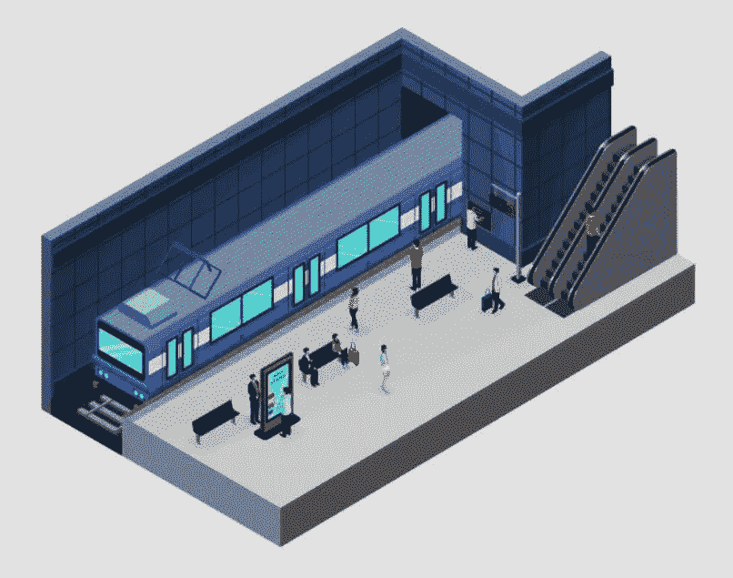

# 0。简介

大家好，与 [**伊斯坦布尔数据科学院**](https://www.linkedin.com/school/istanbul-data-science-academy/) 和 [**Hepsiburada**](https://www.linkedin.com/company/hepsiburada/) 合作的数据科学训练营的第一个项目已经在两周前完成了演示，到目前为止，这是一次非常有益的经历。下面我试着解释一下我们在那个时期做的第一个项目，这是一个探索性的数据分析，使用 Python 与 NumPy、pandas、matplotlib、seaborn 和 DateTime 的组合对 MTA 十字转门和其他支持性数据集进行分析。

首先可以从 [**这里**](https://github.com/UGURSELIMOZEN/ISTDSA_DS_Bootcamp) 访问项目的 GitHub 资源库。

# **1.a .问题陈述**

正如我们提到的，我们有兴趣利用数据和分析的力量来优化我们街头团队合作的有效性，这是我们筹款工作的重要组成部分。

WomenTechWomenYes (WTWY)每年初夏都会举办一年一度的联欢晚会。由于我们是一个新的包容性组织，我们试图通过这个晚会来履行双重职责，一方面让我们的活动空间充满对增加女性在技术领域的参与的热情**，另一方面提高意识和影响力。**

为此，我们**在地铁站**入口 **布置街头队伍。街头团队**收集电子邮件地址**并且那些**注册的人将被发送到我们的晚会**的免费门票。**

我们希望您的参与是利用 MTA 地铁的数据，我相信您知道这些数据可以从这座城市免费获得，来帮助我们**优化我们街道团队**的位置，这样我们就可以收集到最多的签名，最理想的是来自那些将参加晚会并为我们的事业做出贡献的人。

# 1.b 问题陈述

' ' WTWY 应该如何最有效地安排街道团队**？"**

*   **收集**最大电子邮件地址****
*   **获得 WTWY 的**理想与会者****
*   **找到**的财务贡献者****
*   **考虑**尺寸**和**时间**约束**

# ****2。方法学****

**收集 2021 年 1 月 2 日**、**和 2021 年 3 月 13 日**、**之间、、**、**的纽约市 MTA 十字转门数据，即 10 周。顾名思义，该数据集提供由 MTA 管理的每个车站的每个十字转门的信息。定期计划的审核提供了四小时内的进入和退出次数，但也有一些例外，有些审核是由于计划或故障排除活动而在定期计划的时间间隔之外进行的，有些审核会被遗漏。总之，我分析了一组 **2，092，870 行**的十字转门数据，并将我们的方法总结为 3 个基本步骤；**

*   **通过**总流量**查找**纽约市排名前五的车站****
*   **根据**家庭收入**过滤**纽约市前五大电视台****
*   **通过**小时交通量**推荐**最合适的纽约车站****

# **3.数据清理和处理**

**我们使用以下代码部分获取了 10 周的 MTA 数据。**

**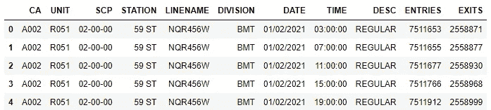**

**Figure 1: Original MTA Dataset**

**之后，对列进行了一些清理，删除或清理列名中的空白字符。**

**每个十字转门由 4 个组成部分定义(“C/A”、“单位”、“SCP”、“车站”)，在数据集中表示为 4 个独立的列，因此我们必须通过这四个组成部分对其余数据进行分组，以分析每个十字转门。**

**从 MTA 数据集可以看出，我们知道**条目**和**出口**分别是给定入口和出口点的**累积入口和出口寄存器值**。因为第一次分析我们是按天而不是按时段合计，所以我们决定从最后一个值中减去第一个最小的值，最后一个值是最大的一个，分别是入口和出口的计数器值。**

**我们还将入口和出口聚合到一个单独的列中， **TRAFFIC** ，以及附加的工作日属性，以便于以后按工作日分析数据。我们的结果被放入***MTA _ entries _ exits***。**

**执行它们的代码块如下:**

****

**Figure 2: Daily Total Traffic Dataset**

**我们从下面的代码片段中看到，数据集中没有空值**但是我们将调查**不相关和异常值**来清理它。****

**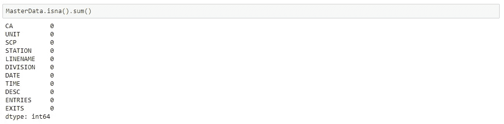**

**您可以查看入口和出口列的箱线图。**

**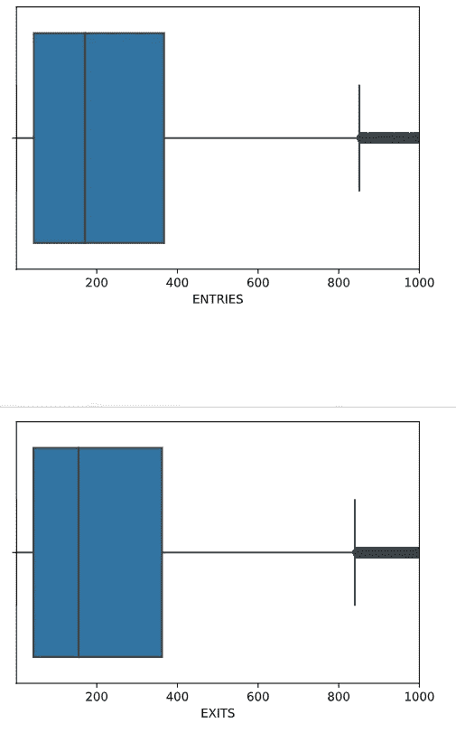**

**Figure 3: Box plot of ENTRIES and EXITS columns**

**我们已经决定**超过 17，000 个总数的入口或出口**是不合理的，因此用下面的代码块**将它们作为**异常值**删除；****

# **4.探索性数据分析和主要发现**

**现在我们按照**总客流量**找到了**排名前五的纽约地铁站**，如下:**

1.  ****第 34 届圣佩恩 STA****
2.  **第 34 先驱报广场**
3.  ****第 86 届****
4.  ****第 125 届****
5.  ****GRD CNTRL-42 ST****

**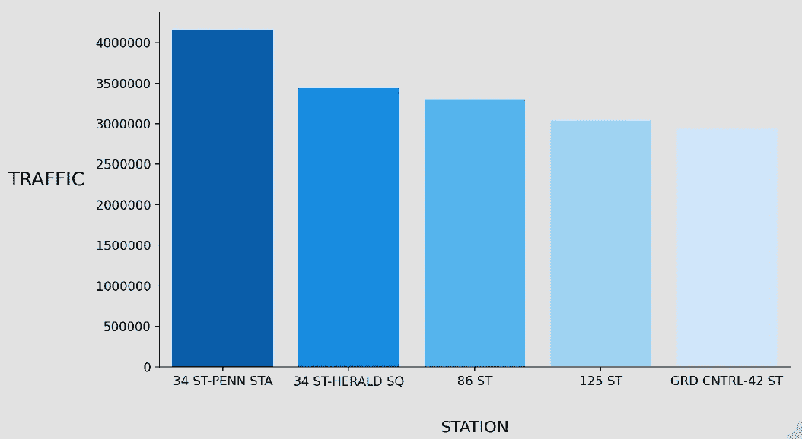**

**Figure 4: Top 5 Stations By Total Traffic**

**我们意识到这 5 个站都在同一个地区，那就是曼哈顿。使用外部数据集，我们发现曼哈顿是纽约市最富有的城市，所以我们决定关注纽约市的这五个城市。**

**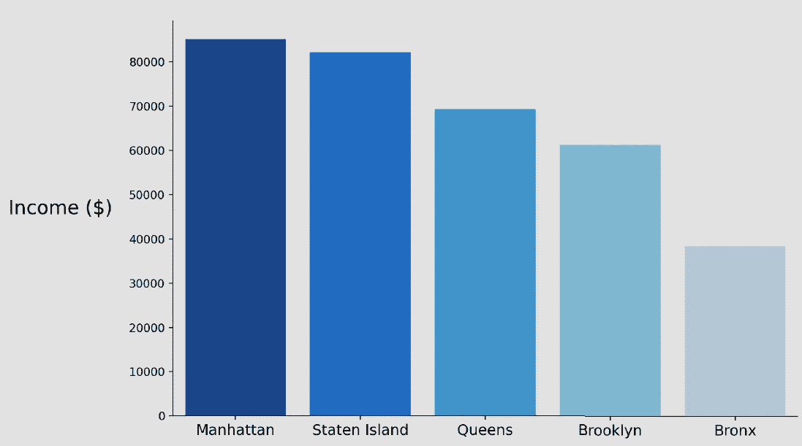**

**Figure 5: NYC Regional Average Income**

**现在我们根据**平均收入**找到了**排名前五的纽约地铁站**如下:**

1.  ****第 86 届****
2.  ****GRD 第 42 届****
3.  ****34 号圣佩恩站****
4.  ****第 34 先驱报广场****
5.  ****第 125 届****

**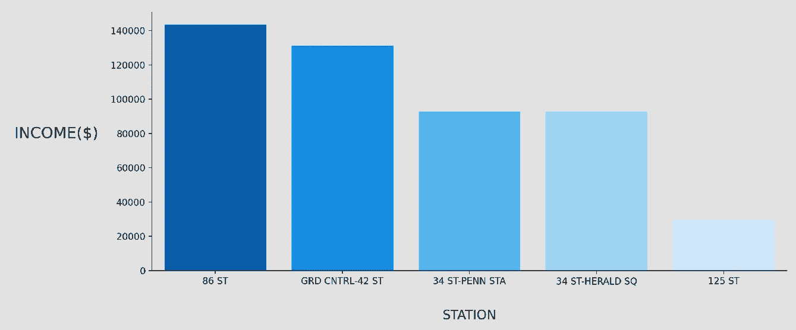**

**Figure 6: Top 5 Stations Average Income**

**我们做了一个假设:我们认为会有帮助的一件事是找到游客数量少的车站(人们不会来参加晚会)，并且大多数乘客是土生土长的纽约人(人们会)。主要用于通勤的车站将比那些受欢迎的旅游景点拥有更多的本地居民。为此，**所选车站**在**总交通量中**工作日**与**周末**之间应有**高差值**。****

**我们可以提取每个站点基于一天的总流量，如下所示**；****

**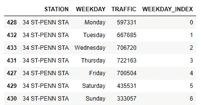**

**Figure 7: First Station’s Day Based Traffic Dataset**

**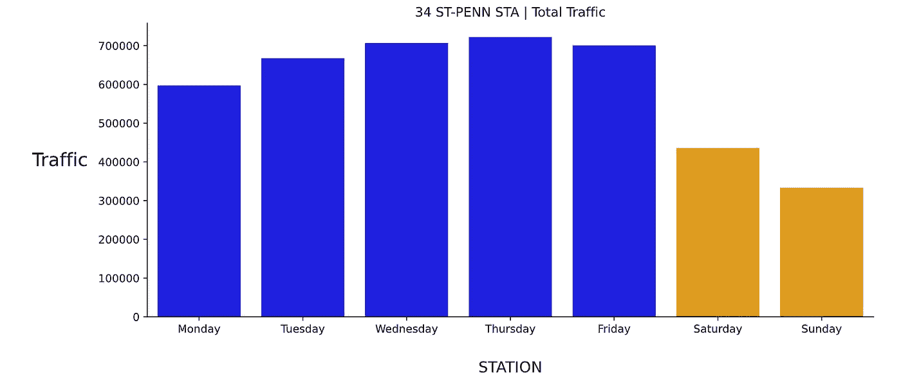**

**Figure 8: First Station’s Day Based Traffic**

**类似地，我们将 5 个站点连接在一起，**它们都验证了** **它们不是旅游站点**。**

**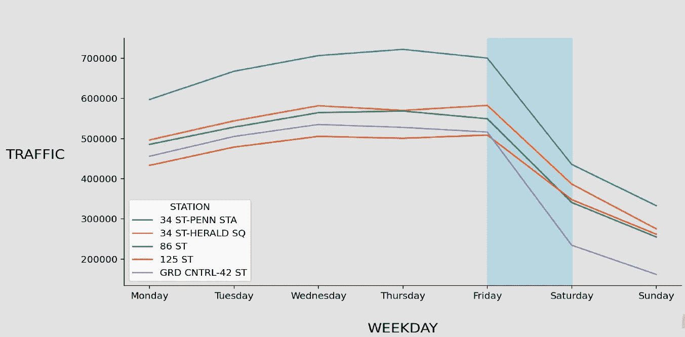**

**Figure 9: 5 Stations Weekday Traffic**

****此外，我们还分析了 4 小时的数据集，为街道团队提供了更好的建议。我们使用下面的代码块来执行计划的任务；****

**我们还添加了以下代码，以获取每个站点每小时的总流量，并获取以下数据帧。**

**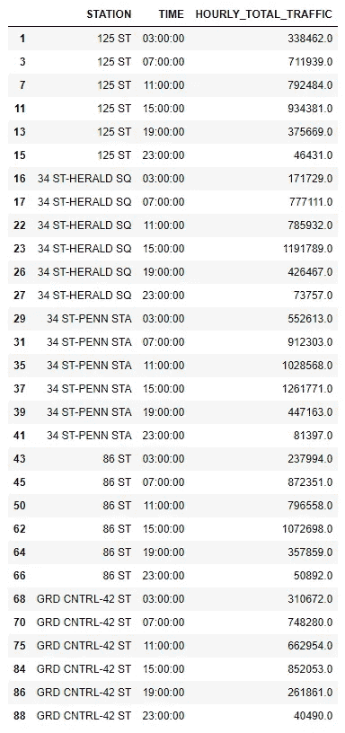**

**Figure 10: 5 Stations Hourly Traffic Dataset**

**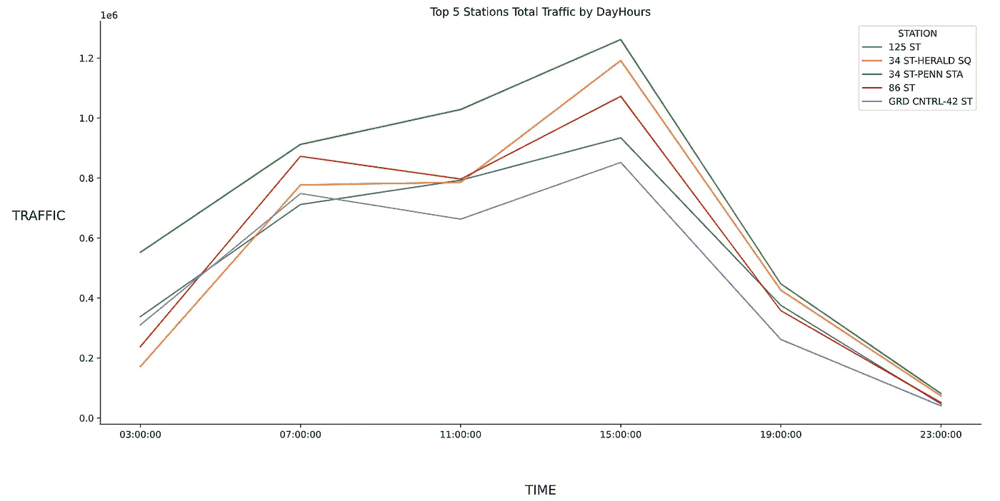**

**Figure 11: 5 Stations Traffic By DayHours**

**作为最后一步，我们用热图可视化了上面的数据框架，以便更清楚地解释结果。**

**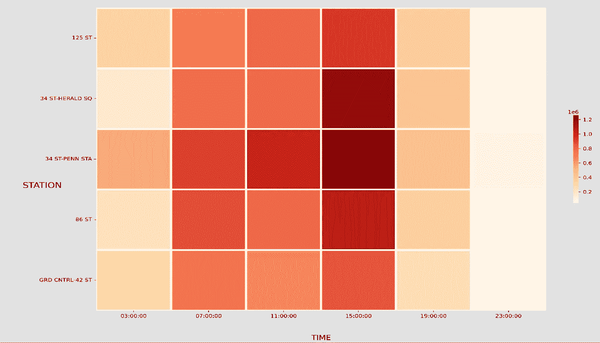**

**Figure 12: Stations DayHour Heatmap**

# **5.建议和未来工作**

**在数据清理、处理、探索性分析和特征工程流程之后，我向业务开发和街道团队推荐了以下策略。**

**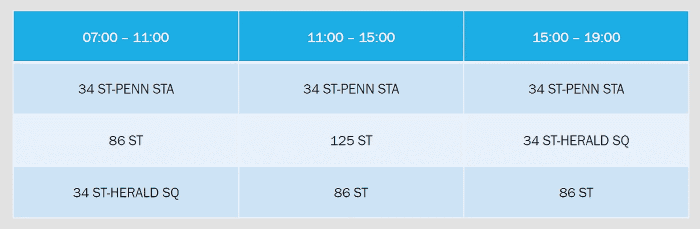**

**Figure 13: Recommendation Table for Business**

****我们可以为以后的工作列出以下步骤**；**

*   **发布时使用 [**2020 年的人口普查数据**](https://www.census.gov/programs-surveys/acs/data/experimental-data/1-year.html)**
*   **看看车站里人们的教育水平和失业水平**
*   **搜索在科技领域赋予女性权力的公司**

# **6.结论**

**这是文章的结尾。在本文中，我试图详细解释我们的数据科学训练营的第一个项目。提醒一下，你可以从 [**这里**](https://github.com/UGURSELIMOZEN/ISTDSA_DS_Bootcamp) 访问该项目的 GitHub 资源库。如果你愿意，你可以跟着我。希望在我的下一篇文章中看到你…**