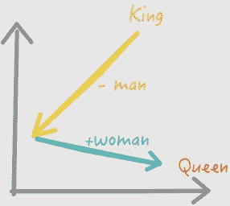
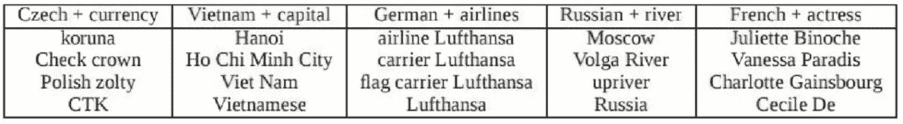
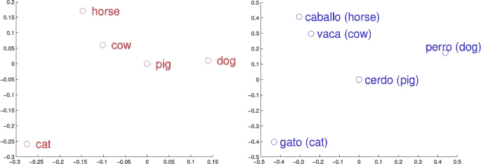

# 人工智能中的词嵌入

> 原文：<https://medium.com/geekculture/word-embeddings-in-ai-10a9e430cb59?source=collection_archive---------16----------------------->

## 用简单的英语解释。

Photo by [Wei Zeng](https://unsplash.com/@fotowei) on Unsplash

机器学习模型将数字向量作为输入。当处理文本时，我们必须将字符串转换成数字。长期以来，单词嵌入一直是人工智能中事实上的文本表示。

# 什么是单词嵌入？

我们可以将每个唯一的单词与向量中的索引相关联。用这样长的向量来表示单词或文档实际上是没有效率的，因为它们通常是稀疏的，许多位置被零值填充。

与稀疏向量相反，密集向量可以更成功地用作机器学习系统中的特征。密集向量也意味着要估计的参数更少。

如果我们在二元预测任务中训练一个分类器，“单词 *w* 有可能出现在 *v* 附近吗？”，那么我们可以使用学习到的分类器权重作为单词嵌入。基于意义是上下文相关的假设，这些成为单词意义的连续矢量表示。

# 如何计算单词嵌入？

对于给定的语料库，我们如何确定这些嵌入呢？这正是 Word2vec 语言模型的设计目的。嵌入向量通常至少大约 100 维长才有效。训练一个分类器来估计这些向量。

Word2vec 有两种版本:CBOW 模型和 skip-gram 模型，由 [Mikolov 等人提出。艾尔。，2013，](https://papers.nips.cc/paper/5021-distributed-representations-of-words-and-phrases-and-their-compositionality.pdf)在谷歌。在 skip-gram 变体中，使用目标单词来预测上下文单词。使用周围单词预测目标单词的变体是 CBOW 模型。通常人们会在大型语料库上使用 W [ord2vec 实现](https://code.google.com/archive/p/word2vec/)和预训练嵌入。

下面的例子描述了 Word2vec 模型的 skip-gram 变体背后的直觉。让我们假设下面的句子，其中“杏子”是目标单词，“汤匙”、“of”、“果酱”和“a”是考虑双单词窗口时的上下文单词。

我们可以构建一个二元分类器，它将任意一对单词 *(t，c)* 作为输入，如果 *c* 是其他地方的 *t* 和 *False* 的真实上下文单词，则预测 *True* 。例如，分类器将为*(杏，汤匙)*返回*真*，为*(杏，捏)返回*假*。下面我们会看到更多的正面和负面分类的例子，当我们把杏作为目标时。*

更进一步，我们必须将每个(上下文窗口，目标)对分成(输入，输出)示例，其中输入是目标，输出是上下文中的一个单词。出于说明的目的，对*(【of，杏子，a，pinch】，果酱)*将产生正例*(果酱，杏子)，*，因为*杏子*是*果酱*的真实上下文词。*(果酱、柠檬)*会是一个反面例子。通过对每个(上下文窗口、目标)对应用这种操作，我们获得了完整的数据集。最后，我们用词汇表中的唯一索引替换每个单词，以便处理独热向量表示。

给定一组正的和负的训练样本以及一组初始的用于目标的
嵌入 *W* 和用于上下文单词的 *C* ，分类器的目标是调整这些嵌入，使得我们最大化正样本嵌入的相似性(点积),并且最小化负样本嵌入的相似性。典型地，逻辑回归将解决这个任务。或者，使用带有 softmax 的神经网络，如下所示。

# 带单词编码的算法

令人惊讶的是，Word2vec 嵌入允许探索单词之间有趣的数学关系。例如，如果我们从单词“king”的向量中减去单词“man”的向量，然后加上单词“woman”的向量，我们就获得了单词“queen”的向量。

我们还可以使用嵌入向量元素的元素式加法来询问诸如“德国+航空公司”之类的问题。通过查看与合成向量最接近的单词，我们得出了令人印象深刻的答案，如下所示。

Image by [Mikolov et. al.](https://arxiv.org/abs/1310.4546)

当在不同语言的可比语料库上训练时，Word2vec 向量往往具有相似的结构，这允许我们执行机器翻译。下面的例子展示了英语和西班牙语单词相似的空间分布。

Image by [Juan Luis Gastaldi](https://link.springer.com/article/10.1007/s13347-020-00393-9)

嵌入有助于搜索引擎。他们可以通过比较向量并查看向量之间的角度来找到与给定查询最接近的单词。他们还可以检测单词或同义词之间的性别和复数-单数关系。单词向量也可以用于从庞大的数据集中导出单词类别，例如通过在单词向量的顶部执行 K-means 聚类。

Image by [developers.google.com](https://developers.google.com/machine-learning/crash-course/embeddings/translating-to-a-lower-dimensional-space)

# 结论

在本文中，我们讨论了 Word2vec，它属于本地上下文窗口方法。它们可以很好地处理少量的训练数据，甚至可以表示被认为是罕见的单词。然而，它们没有充分利用关于单词共现的全局统计信息。

[FastText](https://github.com/facebookresearch/fastText) 是 Word2vec 的扩展，包括字符 [n-grams](https://en.wikipedia.org/wiki/N-gram) 。 [GloVe (Global Vectors)](https://nlp.stanford.edu/pubs/glove.pdf) 通过采用不同于 Word2vec 的方法提供了一些改进。上下文相关的方法包括 [ELMo](https://allennlp.org/elmo) 。变形金刚构建了当前最先进的方法，由 [GPT-2](https://openai.com/blog/better-language-models/) 、[伯特](https://github.com/google-research/bert)、 [CTRL](https://blog.einstein.ai/introducing-a-conditional-transformer-language-model-for-controllable-generation/) 使用。