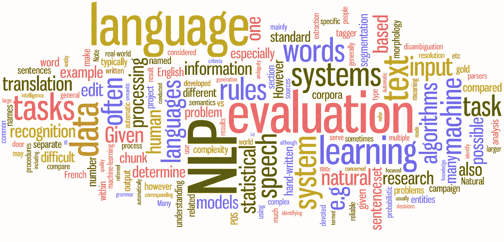

# 股票新闻中的词汇嵌入

> 原文：<https://medium.com/geekculture/word-embeddings-on-stock-market-news-7c3d17e5e7ef?source=collection_archive---------3----------------------->



单词嵌入是自然语言处理(NLP)中最流行的语言建模之一，其中来自词汇表的单词或短语被映射到多维向量空间。它能够捕捉单词的上下文、语义和句法相似性、与其他单词的关系等。

描述单词嵌入以及如何加减单词的最著名的例子是*‘Queen’*word。这个单词是通过将与单词*国王*和*女人*相关联的向量相加而得到的，同时减去*男人*等于与皇后相关联的向量。

```
King - Man + Women = Queen
```

在本文中，我们将尝试在股市新闻上进行单词嵌入。我们有一个关于 *Covid 疫苗新闻*的虚拟数据集，它被分成几个段落。

The dataset

应该首先对数据集中的每个段落进行预处理。我们的预处理功能包括:

*   **清洗**:仅用于获取字母
*   **分词**:将句子分解成音节
*   **删除停用词**:删除常用词(如:我、有、他们等。)被认为是不重要的单词

实际上，我们可以使用词汇化和词干化方法进行预处理。此外，我们可以在预处理中添加更多的停用词。

The pre-processing functions

在数据集已经被预处理之后，我们继续将数据集训练成单词嵌入模型。我们使用来自 [**gensim python 库**](https://radimrehurek.com/gensim/models/word2vec.html) 的 **Word2Vec** 工具来训练它。Word2Vec 通常用于生成检测同义词或为部分句子建议单词的模型。它有两种模型架构，分别是**跳过程序**和 **Cbow** 。不同的是 CBOW 使用周围的上下文单词来预测目标/当前单词，而 Skip-gram 使用当前单词来预测几个上下文单词。

The training model function

从我们拥有的数据集，我们将其训练成一个单词嵌入模型*(包含单词和向量)*，该模型用于获取相似单词。例如，我们试图找出哪些词与疫苗有关，结果如下:

```
# words related to vaccine
[('takes', 0.15888293087482452), ('vaccinate', 0.14267049729824066), ('access', 0.14085279405117035), ('end', 0.13962803781032562), ('eu', 0.12622541189193726), ('normal', 0.12466207891702652), ('making', 0.11808254569768906), ('provide', 0.10831684619188309), ('supplies', 0.10447120666503906), ('approved', 0.1038375273346901)]
```

在自然语言处理领域，单词嵌入是许多领域的著名方法，这可能是自然语言处理问题的关键，包括股票领域问题。

参考:

*   [https://machine learning mastery . com/what-are-word-embedding/](https://machinelearningmastery.com/what-are-word-embeddings/)
*   [https://towards data science . com/introduction-to-word-embedding-and-word 2 vec-652 d0c 2060 fa](https://towardsdatascience.com/introduction-to-word-embedding-and-word2vec-652d0c2060fa)