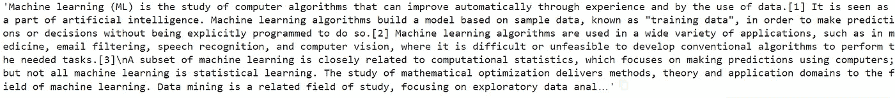
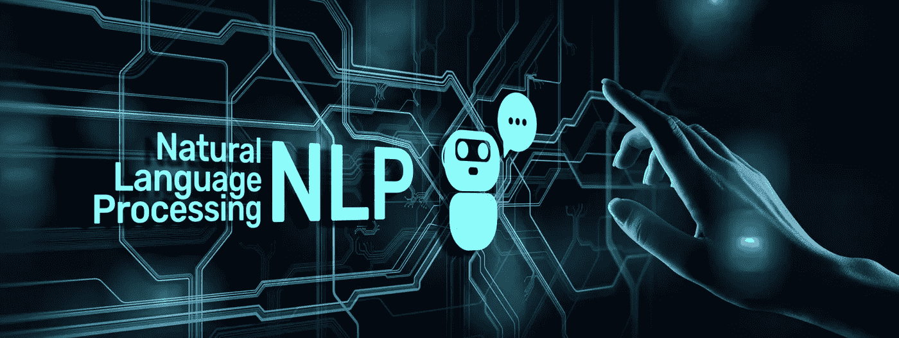
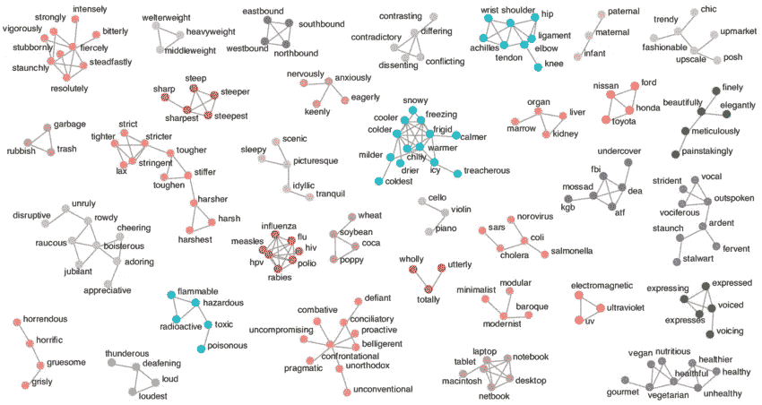
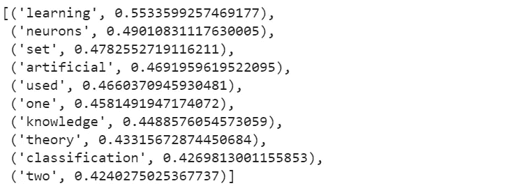

# 基于机器学习 Python 的词语相似度抽取

> 原文：<https://medium.com/geekculture/word-similarity-extraction-with-machine-learning-python-b90c8cfc7c73?source=collection_archive---------13----------------------->

机器学习、深度学习和人工智能已经存在了十年，但是现在它比以往任何时候都更加明显，以至于每个人都在使用日常生活中的人工智能产品，如 IG 过滤器、网飞电影推荐、垃圾邮件检测等等。


近年来，这项技术主要用于市场营销，以获取、保留和发展客户。它过去是取代单调乏味和重复的任务，但现在它转向分析和创造性。令人惊讶的是，在人工智能驱动的初创企业中，文本提取的数量大幅增加。

文本是用户在互联网上表达想法或阅读产品内部文档的一种方式。对于我们来说，能够获得文本文档的有用信息是另一个层面，它对我们是有帮助的，并引导我们获得关于用户或消费者使用单词的更多信息。

我不想为你们修复数据，所以我会使用一种网络抓取技术，这样你就可以使用任何网站来进行单词相似度提取。

# 用美汤获取数据

Beautifulsoup 是最强大的 Python 抓取库之一，它是从 HTML、XML 和其他标记语言网站获取数据的完美工具。要获得漂亮的效果，请在命令行中运行以下命令。对于那些喜欢探索更多关于这个库的人，请点击这里查看他们的网站。

```
pip install beautifulsoup4
```

您还需要安装“解析器”来解释网站内部的 HTML 元素。您可以运行 pip 来安装 **lxml** 解析器。

```
pip install lxml
```

首先，导入从网站获取数据所需的库。一个是 Beautifulsoup，它是 bs4，另一个是 urllib 模块，它是用于处理获取 URL 的库。但是我们将只使用请求协议来打开和读取 URL。

```
import bs4 as bs
import urllib.request
```

获取数据的代码分三步从维基百科网站获取数据(如果您愿意，可以选择任何其他网站)。

1.  用 urllib 发送 URL 请求来打开和读取网站，这里我用的是维基百科关于机器学习的内容，你只需要把参数改成你喜欢的任何网站。
2.  用 bs4 解析器阅读这篇文章，这里是 bs4 将加载网站 HTML 的时候，然后我们将选择一个包含文本信息的部分，稍后进行处理。文本部分包含在 HTML 的段落标记中。
3.  得到段落标签后，我们需要删除 HTML 标记语言，只保留文本。

```
# send the url request to open and read the website
scrapped_data = urllib.request.urlopen('[https://en.wikipedia.org/wiki/](https://en.wikipedia.org/wiki/Machine_learning)Machine_learning')# read the article with beautiful soup lxml parser
article = scrapped_data.read()
parsed_article = bs.BeautifulSoup(article,'lxml')# parse only the paragraph tag inside the website HTML
paragraphs = parsed_article.find_all('p') # get the string of the website from the paragraph tag
article_text = ""
for p in paragraphs:
    article_text += p.text
```

如果你用和我一样的网址，你看到的会是这样的。

```
print(article_text)
```



# 文本预处理

对于那些不熟悉文本的 NLP 或 ML 的人来说，在你开始获取单词相似度之前，我们要做的第一件事是将非结构化的文本准备成结构化的格式。我将使用自然语言工具包或 NLTK 来完成这项任务。



在文本预处理或自然语言处理中，在我们可以在机器学习任务中使用文本之前，我们需要首先做一件事，这就是标记化。

计算机实际上不像人类那样理解文本或字符串，标记化所做的是将单词从句子中分离出来，以便计算机可以记住每个单词。然后，标记化的单词将被用作代码中用于计算的 id 或数字。

```
import nltk
nltk.download('punkt')import string
```

在使用 nltk 时，模块的某些部分需要在 pip 安装之外手动下载。这里是“punkt”，这是标点符号化，它不纯粹从句子中标记单词，而是将标点符号考虑在内。

```
from nltk.corpus import stopwords
from nltk.tokenize import sent_tokenize, word_tokenizeprocessed_article = article_text.lower()
processed_article = re.sub(r'\s+', ' ', processed_article)
processed_article = re.sub(r'[!"#$%&\'()*+,-./:;<=>?@[\]^_`{|}~]','', processed_article)# Preparing the dataset
all_sentences = sent_tokenize(processed_article)# 
all_words = [word_tokenize(sent) for sent in all_sentences]
```

我们需要做的另一件事是去除停用词，它是语言中纯粹为了语法用法而使用的一组词，对我们人类来说，它并不真正产生有意义的关系或洞察力。

```
import nltk
from nltk.corpus import stopwordsnltk.download('stopwords')# Removing Stop Words
stops = set(stopwords.words('english'))
for i in range(len(all_words)):
    all_words[i] = [w for w in all_words[i] if w not in stops]
```

在我们删除了停用词之后，我们可以通过使用 Word2Vec 模型，使用单词列表来计算文本相似性。

# Word2Vec

Word2Vec 是将单词转化为向量的算法。通过把它转换成向量，它允许这个词被计算、量化和测量。这允许一个词显示与另一个词的关系，彼此相距有多远。我们可以利用这一点来看我们文本中的这个单词和另一个单词有什么联系。

这个词的相似性是很有见地的，因为当我们在生活中使用一个世界时，我们倾向于使用许多不同的词，但意思相同。同样，当你在网上销售你的产品时，你称它为来自你的公司“超级卖家”的“超级产品”。消费者喜欢你的产品，但通常他们会改变名称以适应他们的敌人，这将成为像“我只是一个绿色商店的 SP。”。


在这种情况下，SP 是“SuperProduct”的缩写，这是一种常见的人类交流，试图将语言的使用减少到仍然可以用于交流的水平。“绿色商店”是你的客户称之为你的公司或商店。就营销而言，这些信息很有见地，但大多数营销人员已经知道客户用来称呼他们的产品或公司的词。

然而，每当公司向客户披露新信息时，这种事情总是会发生，让营销团队跟踪每个反馈意见的活动既费时又低效。真正的应用是使过程自动化，并减少营销人员寻找客户创建的这些新同义词的时间，以便营销人员能够致力于提高客户满意度、获取或目标重新定位。

# 单词相似度



Gensim 是一个免费的开源 Python 库，用于将文档表示为语义向量，尽可能高效(对计算机而言)和无痛苦(对人类而言)。要对我们的数据使用 word2vec 算法，我们需要用我们的数据训练 word2vec 模型。

```
from gensim.models import Word2Vecword2vec = Word2Vec(all_words, min_count=2)
```

导入 Word2Vec 模块，并将参数声明为我们的单词，以及将在模型中保留的最小计数或频率。训练时间取决于你的数据，但如果你和我使用相同的维基文本，应该不到几分钟。

```
vocabulary = word2vec.wv.vocab
```

在我们创建模型之后，我们可以通过使用 wv.vocab 来访问所有要查询的单词，但是当我们想要查看单词相似性时，我们将使用 wv.most_similar(str)。这里我把字符串“data”放在里面，看看和“data”有语义关系的词是什么。

```
word2vec.wv.most_similar('data')
```



结果显示与单词数据相关的所有单词，相似性得分从 1 到 0，得分越高的单词越相似。看起来维基百科在特定的上下文中主题的变化很小。因此，相似性并没有反映到适用于现实世界的程度，但当我们去与更广泛和多样化的消费者数据打交道时，这将是一个挖掘关键词的巨大数据。

# 感谢说明和进一步的工作

感谢大家的阅读，如果你喜欢我的作品，请关注我以获取更多关于应用 ML 的文章。我目前正在做很多项目，但是如果你们想看什么特别的东西，我会为你们写一个评论。