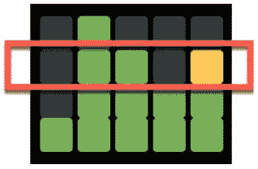
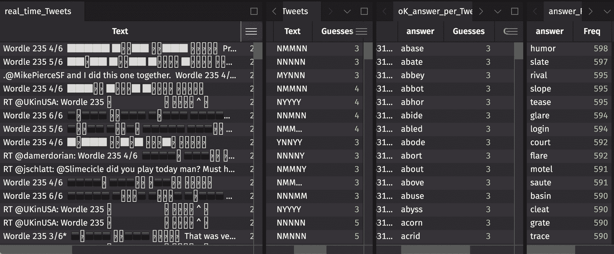

# WORDLE、Python 和实时众包

> 原文：<https://medium.com/geekculture/wordle-python-and-crowd-sourcing-in-real-time-f20b3848a355?source=collection_archive---------18----------------------->

## 一个连我十几岁的孩子都喜欢的计算机科学例子

皮特·戈达德

Source: image by author

Wordle 是个聪明的游戏，但这不是我喜欢它的原因。相反，我着迷于一个我完全孤立地玩的游戏可以感觉如此社会化。

我的青少年玩。他们的朋友玩。有时他们甚至想和我——那个跛脚的爸爸——谈谈这件事。这是不寻常的，值得珍惜的。

这种戏谑通常包括诸如“爸爸，试 5 次？…做得更好。”或者团结的短语，像“真的，沃尔多……‘哼’……真的？”然而，有两次，当几个高中生在我的厨房里吃草时，他们让我把话题转移到数学和计算机科学上。

第一次完全失败了。我试图激起关于玩这个游戏的最有效方式的讨论，甚至鼓励他们去看看关于这个游戏的 YouTube 视频。然而，很快就清楚了，分析最佳的游戏策略是一件无聊的事情。每个孩子都有他们最喜欢的开始词和游戏风格。激情澎湃。不管怎样，他们中没有人对我认为这是“有趣的计算机科学”的想法感兴趣——这对这些青少年来说是一种矛盾(尽管他们手中有令人震惊的移动计算机)。

但是昨晚，在和三个大一女生和两个大三男生吃冷冻披萨的间隙，我说，“你们应该看看我朋友科林做的视频。他每天第一次试就能猜出单词的答案。他只看到推特上的空白彩色方块。没有一个字母作为提示，他能猜出这个单词。”

"公牛嘘**，戈达德先生。"我儿子的一个朋友，Young-J，有时会说不出话来。(他赶紧道歉。)

这是真的，Young-J。以下是你如何通过在 Twitter 上“观察”几分钟的空白方格来预测当天的 Wordle 解决方案…

# 一个简单的模型

[小心:下面的例子破坏了 Wordle #235，来自 2 月 9 日。]

科林的灵感来自于本·哈姆纳在[的一篇帖子。他重复了一点——利用所有的可能性而不是模拟游戏，使用表操作而不是循环(但我不想因为写字典交叉连接而失去 Young-J)。](https://www.kaggle.com/benhamner/wordle-1-6)

前提很简单。

每天推特上都充斥着这样的图片:

Source: Image by author

忽略不言而喻的全绿色行，关键是反映任何给定行中的信息。

Source: image by author

即使没有字母，只要看看那一行的颜色图案，你就能知道一些东西。为了打字方便，请允许我使用“是-否-可能”的简写(“YNM”)将上面的红框表示为 NYYNM。

在没有任何关于实际字母的知识的情况下，当我们看到一个尼曼盒子时，我们知道:

1.  这个词可能是“幽默”——昨日黄花。(对，有剧透。)
2.  单词也可以是“报警”或“环氧树脂”或 1813 其他 5 个字母的单词。
3.  但是这个单词不能是“修道院”或“特使”或其他 497 个可能的单词解。

在幽默的例子中，像 JUMBO to BUMPH(对我来说是一个新词，意思是“无用或乏味的信息”)这样的猜测会产生这种模式。

出于警惕，对 PLAZA 或 GLAIR 的猜测会产生 NYYNM 模式。对于环氧树脂，猜测孢子和 APODE(“一群软鳍鱼类”)——谁知道呢？)工作。

但是，正如上面的第三点所提到的，没有猜测会为艾比或特使产生一个尼恩模式。

也许在阅读上述内容时，你实际上检查了我的工作。在这样做的时候，你完成了科林要求计算机完成的非常简单的任务:“对于每一个可能的 5 个字母的猜测，计算每一个可能的答案的 5-box-YNM 模式。”

大概有 3000 万种组合。对计算机处理器来说很简单。

让我们称这个过程为“结果映射表”。

# 人群的力量

有了结果映射表，你只需要再做一件事就能令人信服地预测今日世界:大量的猜测。

进入 Twitter。

这些 Wordle 结果的社交分享创造了大量的实时观察猜测。听了几分钟 Twitter 消息后，你只需要做两件事:

1.  对于每一个配备了 YNM 模式的网格图，从结果映射表中确定所有可能的答案，这些答案可以令人满意地产生这样一幅图。我们姑且称之为“非常符合条件的猜测”。
2.  统计一下 Twitter 上所有符合条件的猜测。

排名最高的非常符合条件的猜测是今日世界。

事实上，如果 Twitter 从来没有产生垃圾，那么根据定义，当天的获奖单词的数量将与你听的 Tweets 的数量完全相同。

Source: Image by author

# 开放、易用的机械

实时收听推文以在第一时间赢得 Wordle 需要一些装备:

1.  用当天的搜索词“Wordle 234”(昨天的例子)抓取 Twitter API 的代码。
2.  将 HTML 彩色方块转换成简单指示器并移除上述垃圾(如土耳其语和德语的条目)的逻辑。
3.  一个可以实时运行的数据系统。
4.  交付代码和查看结果的用户体验。

科林使用了 [Deephaven](https://deephaven.io/) 和 Python 来完成以上所有工作。Deephaven 具有处理实时表格数据的独特能力，并且专门为数据驱动的应用程序和分析而设计，这些应用程序和分析将嵌入式代码(如上面列出的 web scraper 和 html-parser)与实时表格操作(如上面提到的将猜测与结果映射表匹配所需的操作)相结合。

# 代码…还有科林在工作

我鼓励[大家观看科林](https://youtu.be/hEib74gdyWc)的 10 分钟视频，他详细描述了他的代码和计算。我发现看着他部署 web scraper 并实时继承所有 Python 计算非常令人满意。(而且有教育意义。)也许是他沉稳的明尼苏达腔调。

或者，[所有的代码](https://github.com/deephaven-examples/wordle-solving)都可以在 [Deephaven 示例-GitHub](https://github.com/deephaven-examples) 中获得。

享受比赛。很好玩。还有你的朋友。他们可能也很有趣。

加入我们的 [Slack 社区](https://deephavencommunity.slack.com/ssb/redirect)让我们知道。