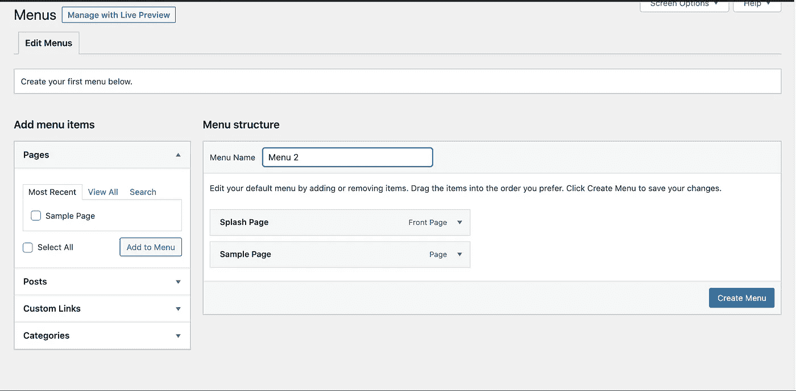
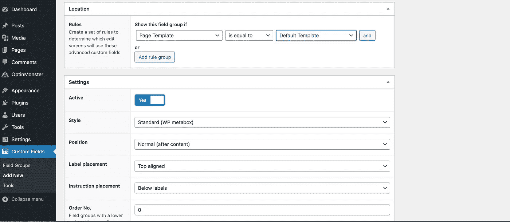
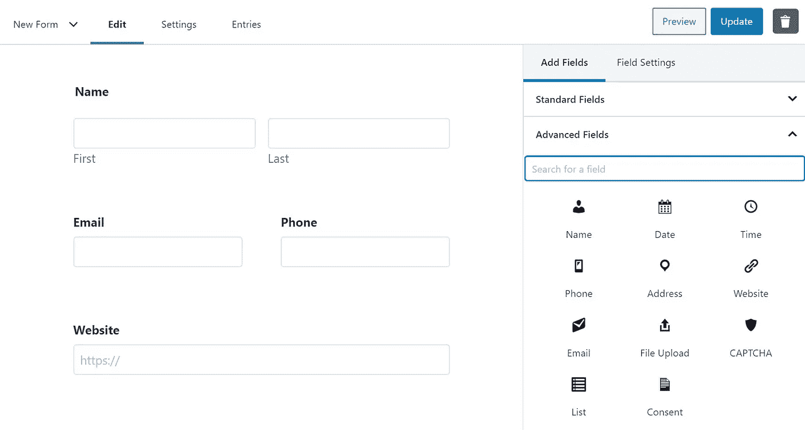

# WordPress 备忘单

> 原文：<https://medium.com/geekculture/wordpress-cheatsheet-d5b46d3f7bff?source=collection_archive---------36----------------------->

## 快速参考


Photo by [Souvik Banerjee](https://unsplash.com/@rswebsols?utm_source=medium&utm_medium=referral) on [Unsplash](https://unsplash.com?utm_source=medium&utm_medium=referral)

随着我使用 WordPress 的时间越来越长，我开始真正欣赏它的一些功能。您可以定制和添加特性的简单性真正说明了它的用途。今天，我将介绍其中的一些功能。我们将讨论主题、插件和表单。具体来说，我要谈谈 Understrap 主题，高级自定义字段插件，和重力形式，这是一个技术上的插件，但有一个非常具体的目的。我将对这三者略加介绍，然后补充一些我认为有用的具体行动。

## 主题

主题允许你快速的设计你的站点，而不需要大量的编码。现在，如果你正在创建自己的网站并且没有很多时间，或者你不是一个开发者，这是很棒的。有成千上万个主题，但我想稍微谈一下的是 [Understrap 主题](https://understrap.com/)。我喜欢这个主题的原因是它非常简单。它给你一些基本的风格，但没有太多的戏剧性。它附带了一些引导、sass、npm 支持，以及作为任务运行器的 gulp。

Understrap 标配了一个菜单，位于页面的左上角。它在头文件中设置。如果您愿意，您可以添加更多的菜单，这正是我要向您展示的。这只需要几个步骤，但是第一次可能会有点混乱，所以我会带你一路走下去。

你需要做的第一件事是进入你的 WordPress 后端。转到外观并选择菜单。您可以在那里创建一个新菜单。



给菜单起你喜欢的名字。如果可以的话，我通常会尽量描述。单击创建后，您将能够添加您创建的任何页面或帖子。现在到了更棘手的部分，你需要在文本编辑器中进入你的 functions.php 文件。您将在该文件中添加以下代码，用您的菜单名称替换这些名称。

```
**function** wpb_custom_new_menu() {register_nav_menus(**array**( 'menu-2' => __( 'Menu 2' ), 'extra-menu' => __( 'Extra Menu' )) ); }add_action( 'init', 'wpb_custom_new_menu' );
```

然后，您可以将这段代码添加到您希望放置菜单的任何位置。

```
<?phpwp_nav_menu( **array**('theme_location' => 'menu-2','container_class' => 'menu-two-class' ) );?>
```

## 插件

插件就像主题一样，允许你添加特性和定制主题。同样，有数以千计的插件，可以做任何事情，从垃圾邮件防护到时事通讯注册，再到谷歌分析。我今天要讲的是[高级定制字段](https://www.advancedcustomfields.com/)。ADF 允许你在 wordpress 的页面上添加你自己的字段。这使得添加文本、图像或链接变得容易。

一旦你安装并激活了插件，你就可以开始工作了。您需要做的第一件事是转到侧面菜单栏上的 ADF 选项卡。选择添加-新建。然后，您需要命名自定义字段集。≈


输入字段标签后，字段名称将自动生成。请记住，您很快就会需要它。输入字段后，您需要选择一个位置。



您需要选择放置字段组的位置。因为我将制作页面，所以我选择了一个页面模板，现在我已经选择了默认模板。我可能会为我正在制作的页面创建一个新模板，并选择它。字段组可以位于多个位置，因此您可以重复使用您的字段组。

要将字段放在页面上，您需要再次进入文本编辑器，并将其添加到您选择的模板中。这或多或少是您需要的代码。它需要被包装在 PHP 标签中。您将使用关键字 the_field，引号中的单词是字段名。您还需要将整个内容包装在一个 HTML 标签中，以便它显示在屏幕上。

```
 <h2>  <?php the_field('name') ?>. </h2>
```

## 形式

当然，你可以用 HTML 创建一个表单，然后用 CSS 样式化它，但是谁真的有时间做这些呢？表单插件非常适合为你的站点的任何部分生成表单。最棒的是，你可以制作多个，然后把它们插在你需要的地方。我最近开始使用的是[重力形式](https://www.gravityforms.com/?gclid=Cj0KCQjwnueFBhChARIsAPu3YkQFBnuBgyFvulMiJPfbbBR1a3NzHxAHsGherjxrVLYRB7A3O3J7Ug8aAjUTEALw_wcB)。

类似于高级定制字段，Gravity Forms 在仪表板侧边栏上有自己的位置。只需点击添加新的，你会被提示命名，并提供一个描述。一旦你这样做了，你就可以创建一个你喜欢的表单。编辑器允许您添加自定义线条，以及一些预置。



然后要放置表单，你需要进入你的文本编辑器，把它放在你想要的地方。在添加表单时，您有一些选择。这是所有的选择。

```
gravity_form( $id_or_title, $display_title = true,  
    $display_description = true, $display_inactive = false, 
      $field_values = null, $ajax = false, $tabindex, $echo = true );
```

他们的意思是:

*   $id_or_title
    ( *混合* ) ( *必选*)要嵌入的表单的 id 或标题。
*   $ display _ title
    (*boolean*)(可选)是否显示表单标题。
    默认为*真*。
*   $ display _ description
    (*boolean*)(可选)是否显示表单描述。
    默认为*真*。
*   $ display _ inactive
    (*boolean*)(可选)是否显示窗体，即使它是不活动的。
    默认为*假*。
*   $ field _ values
    (*array*)(可选)传递一个动态填充参数键数组，其中包含要填充的相应值。
    *举例:*“数组('参数 _ 名称' = >'自定义 _ 值')”
    默认为*假*。
*   $ajax
    ( *boolean* )(可选)是否使用 ajax 进行表单提交。
    默认为*假*。
*   $ tabindex
    (*integer*)(可选)指定该表单字段的起始制表符索引。
*   $echo
    ( *boolean* )(可选)是回显表单代码还是返回表单代码。
    默认为*真*。

所以一个基本的调用应该是这样的。此代码段将显示 id 为“1”的窗体；标题和描述将不会显示，如果表单处于非活动状态，表单本身也不会显示，并且表单提交不会使用 AJAX。

```
gravity_form( 1, false, false, false, '', false );
```

## 结论

WordPress 已经是一种创建网站的便捷方式。随着主题和插件的使用，它变得更好。我非常喜欢学习 WordPRess 和它的所有功能。你最喜欢的插件有哪些？让我知道。