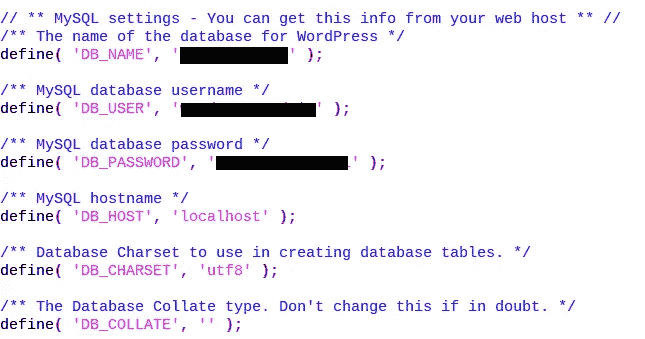
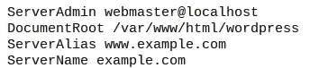
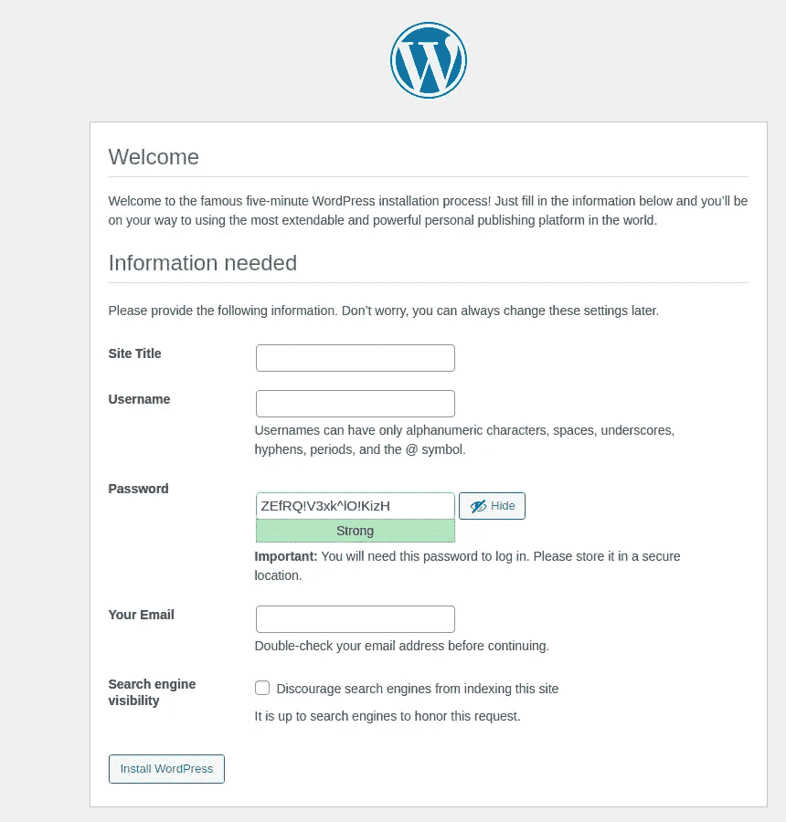

# 设置你的家庭服务器

> 原文：<https://medium.com/geekculture/wordpress-pi-setting-up-your-home-server-935a1790133f?source=collection_archive---------15----------------------->


今天，我想谈谈 WordPress 的内容管理服务(CMS)。CMS 是一个应用程序，用于以非常简单的用户友好的方式管理和发布 web 内容。它允许营销人员、内容创建者和商人与网站进行交互，而不必使用 It 部门。在这个内容决定一切的世界里，快速改变网站的能力是无价的。这是一个快速建立网站的方法。CMS 当然有多个层次，如果你从事 web 开发，这无疑是你会遇到的事情。

但我真正想谈的是如何将你的 raspberry pi 设置为 WordPress 服务器，这样如果你有兴趣学习，你就可以获得一些实践经验。查看这个[网站](https://www.bloomreach.com/en/blog/2019/08/content-management-system.html#what-are-the-different-types-of-content-management-systems)上关于 CMS 的大量信息，了解更多信息。

我们将在 LAMP 服务器上安装 WP。如果你还没有 LAMP 服务器，请点击这里查看我的文章…然后再回来。

…正如你已经知道的，我们的 apache 服务器在 **/var/www/html** 存放了我们的网站，我们想把 WP 文件夹放在那个文件夹中。所以到那里，通过输入命令下载 WP zip 文件:

```
wget [https://wordpress.org/latest.tar.gz](https://wordpress.org/latest.tar.gz)
```

你可以在你的终端上看到下载的 zip 文件。要解压缩类型:

```
tar -xzvf latest.tar.gz
```

现在你应该看到一个名为**的新目录。只需 cd(改变目录)到那里，你会看到所有的安装文件。我们稍后会更深入地讨论这个问题，但首先，我们要建立我们的数据库。我们运行的是 MySQL，或者因为这是 raspbian 版本的 MariaDB。无论哪种方式，您都可以输入命令 *MySQL* 来配置数据库。为了创建我们的数据库，我们将使用 create 命令，在这里我们还将创建数据库名称。**

```
create database **new_database_name_here** default character set utf8 collate utf8_unicode_ci;
```

接下来，让我们设置用户名、密码，并授予一切权限状态。看起来是这样的。

```
grant all on **database_name**.* to '**database_user**'@'localhost' identified by '**user_password**';
```

之后，只需输入命令:“刷新权限”和“退出”来离开 MySQL。

回到安装文件所在的文件夹，我们需要编辑配置文件，并将它们指向我们的数据库。在文件夹中，你会看到一个*wp-config-sample.php*文件。这是一个很好的模板，他们提供给我们，但我们想要自己的，所以继续复制它重命名为 wp-config.php。

```
cp wp-config-sample.php wp-config.php
```

从这里抓取你最喜欢的文件编辑器，(除非你用的是 nano -you animal)并定位 MySQL 设置。



填写我们之前设置的信息，DB、名称和密码。

如果你继续向下滚动，你会看到一个已定义的部分，其中填充了**将你独特的短语放在这里。**你可以去 https://api.wordpress.org/secret-key/1.1/salt/[网站](https://api.wordpress.org/secret-key/1.1/salt/)生成自己的密钥。复制它并替换文件中的内容。这就是我们需要的所有变化。

所以我们的 WP 网站上线了，但是 apache 不知道。所以让我们在/etc/apache2/sites-available 上告诉 apache，在那里可以找到 000-default.conf 文件。在 DocumentRoot 行上显示:/var/www/html/-在它的末尾添加 WordPress。



重新启动我们的 apache 服务器，使更改生效:

```
service apache2 restart
```

现在打开浏览器，输入 <ipaddr>/wp-admin/install.php，你会看到你的网站登录页面。</ipaddr>



注册，登录，祝贺你！你的服务器上有 WP。摆弄一下，建立自己的个人网站，前途无量。