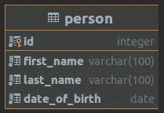
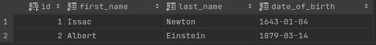
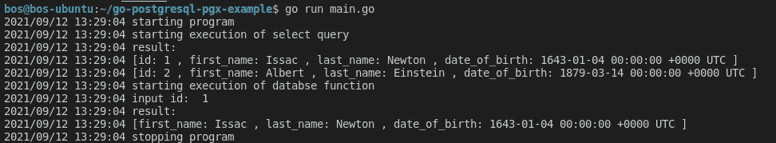

# 使用 pgx 处理 Go 和 PostgreSQL

> 原文：<https://medium.com/geekculture/work-with-go-postgresql-using-pgx-caee4573672?source=collection_archive---------2----------------------->

介绍如何使用 ***pgx*** 库在 Go 程序中使用 PostgreSQL 数据库


Photo by [Chris Liverani](https://unsplash.com/@chrisliverani?utm_source=unsplash&utm_medium=referral&utm_content=creditCopyText) on [Unsplash](https://unsplash.com/?utm_source=unsplash&utm_medium=referral&utm_content=creditCopyText)

# 介绍

作为一名程序员，当你试图开发任何产品时，使用数据库存储数据是一个隐含的假设。根据不同的用例，您可以选择关系数据库或非关系数据库(又名 NoSQL)。如果您的用例需要关系数据库，有相当多的选项可用。PostgreSQL 是目前可用的常见开源选择之一。

在本帖中，我们将讨论如何使用 ***pgx*** 库从 Go 程序连接到 PostgreSQL 数据库。

# pgx 是什么？

*pgx* 是用 Go 编写的 PostgreSQL 驱动和工具包。

## 什么时候用？

根据 ***pgx*** 的开发者，建议:

> 如果应用程序只以 PostgreSQL 为目标，并且没有使用其他需要数据库/sql 的库。

如果这两个条件都满足，你就好跟 ***pgx*** 走了。如果没有，最好不要使用 ***pgx*** 并留意其他库。

## pgx 家族

***pgx*** 提供了一套可以独立使用的库。以下是其中的一些:

*   [pgconn](https://github.com/jackc/pgconn) :底层 PostgreSQL 数据库驱动
*   pgx pool:pgx 的连接池。
*   [stdlib](https://github.com/jackc/pgx/tree/master/stdlib):pgx 的`database/sql`兼容层。
*   [pg type](https://github.com/jackc/pgtype):70 多种 PostgreSQL 类型的 Go 类型的实现

请注意，当前版本(v4)要求启用 Go 模块支持。更多细节可以在[这里](https://github.com/jackc/pgx)找到。

# 我们的使用案例

出于演示目的，让我们考虑一个高度复杂的用例。开玩笑的。让我们尽可能简单。:-)

我们希望在我们的数据库中存储一个人的详细信息，并希望检索相同的内容。这就是我们在这里所要尝试的。简单:-)

# 安装和配置 PostgreSQL

在开始使用 ***pgx*** 之前，让我们快速回顾一下如何为您的开发环境安装和配置 PostgreSQL。

你可以从[这里](https://www.postgresql.org/download/)下载最新版本的 PostgreSQL。根据您的操作系统选择安装选项。

在 Ubuntu 机器上，你可以遵循以下步骤:

## 安装

执行以下命令来安装 PostgreSQL 和一些附加模块。

```
*$ sudo apt update**$ sudo apt install postgresql postgresql-contrib*
```

## 开始

安装完成后，您可以使用以下命令启动数据库:

```
*$ pg_ctlcluster 12 main start*
```

## 登录到默认帐户

使用以下命令登录默认帐户( *postgres* ):

```
*$ sudo -i -u postgres*
```

## 重置默认密码

最初，默认帐户没有任何关联的密码。建议在初次登录后设置密码。您可以通过使用以下 SQL 命令来实现这一点。

```
*ALTER USER postgres PASSWORD 'mypassword';*
```

*(用更安全的密码替换‘我的密码’。)*

*注意:对于生产级系统，最好创建单独的数据库(而不是默认的 postgres 数据库)和用户。为了简单起见，我们将继续上面的设置。*

# 创建表和函数

现在，我们的 PostgreSQL 安装已经可以使用了。为了开发我们的项目，让我们开始创建示例表。

**模式**

默认帐户带有一个名为 *public* 的默认模式。让我们暂时使用它。*(注意，对于生产级系统，最好创建一个不同的模式。)*

**表**

如上所述，我们计划在表中存储人员的详细信息。

*人员*表需要有以下字段:



person table structure

我们可以使用下面的 SQL 脚本创建 *Person* 表。

SQL DDL statement to person table

您可能不需要在表名前添加前缀 *public* ，因为这是默认名称。不过，保持这个习惯是一个好习惯，这样可以清楚地表达你的意图。这将有助于我们在使用不同的专用模式时保持一致性。

**数据**

现在，让我们插入如下几行:

insert statements for person table

插入后，表格会是这样的:



data in person table

**功能**

现在，让我们创建一个简单的数据库函数，根据输入的 id 检索这个人的详细信息。我们可以使用下面的 SQL 代码来创建函数。

现在，让我们按如下方式使用该函数:

```
select * from public.*get_person_details*(1);
```

一旦执行，我们将得到以下结果。


function result

至此，我们的数据库端编码就完成了。让我们将焦点转移到 Go 层。

# 创建 Go 项目

让我们创建 Go 项目，并将其命名为 *go-postgresql-pgx-example。*

通过执行以下命令初始化模块:

```
*$ go mod init go-postgresql-pgx-example*
```

# 安装 pgx 和 pgxpool

现在，我们需要安装 ***pgx*** 和 ***pgxpool*** 。

```
$ go get github.com/jackc/pgx/v4
$ go get github.com/jackc/pgx/v4/pgxpool
```

# 创建连接池

要连接数据库，我们可以使用 ***pgx*** 或者 ***pgxpool*** 。对于我们的例子，让我们创建一个连接池。下面是这样做的样例 Go 代码。

# **执行查询**

现在，让我们添加代码来调用一个简单的 select 语句。可以按如下方式完成:

# 执行功能

让我们添加代码来调用 DB 函数。它类似于查询执行，只是略有不同。

现在，当我们执行 Go 程序时，我们将从数据库中获得如下数据:



program result

仅此而已。

这个例子的完整源代码可以在下面的 GitHub repo 中找到:

[https://github.com/bijeshos/go-postgresql-pgx-example](https://github.com/bijeshos/go-postgresql-pgx-example)

# 摘要

在这篇文章中，我们简要讨论了**p*GX*库以及如何使用相同的库从 Go 代码连接到 PostgreSQL。**

感谢您抽出时间阅读。下次再见，编码快乐！

# 参考

[https://github.com/jackc/pgx](https://github.com/jackc/pgx)

[https://www.postgresql.org/docs/](https://www.postgresql.org/docs/)

[https://github.com/bijeshos/go-postgresql-pgx-example](https://github.com/bijeshos/go-postgresql-pgx-example)