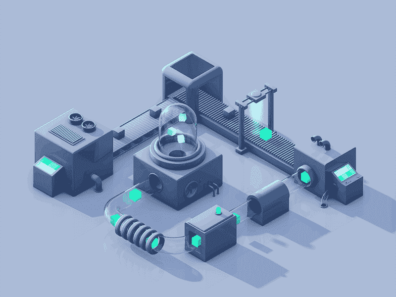

# 数据分析的工作流程

> 原文：<https://medium.com/geekculture/workflow-in-data-analysis-45ed5b8d804a?source=collection_archive---------38----------------------->

Example of industrial workflow. photo by [omnimind](https://www.omnimindtech.com/copy-of-omnibrain)

# **简介**

这一切都始于一个我们必须找到答案的问题或一个有待解决的问题。

**工作流程**:

1.  **商业理解**
2.  **数据采集**
3.  **数据准备**
4.  **数据可视化&解读**
5.  **报告**