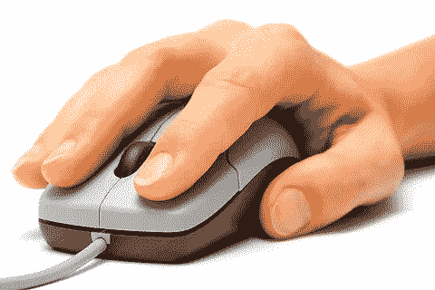
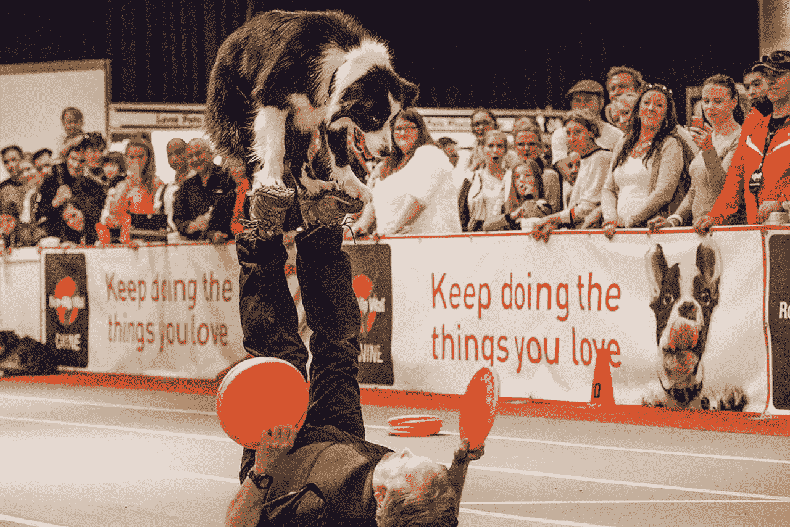
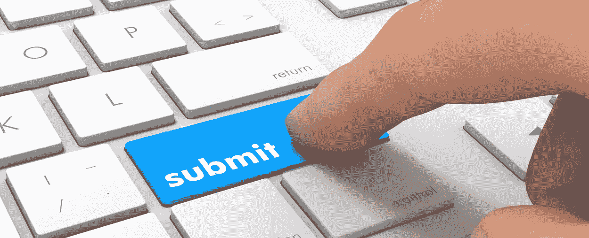
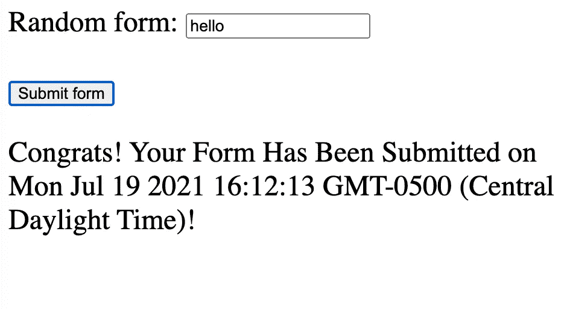

# 解决 JS 事件:单击并提交

> 原文：<https://medium.com/geekculture/working-around-js-events-click-submit-58b0d7725564?source=collection_archive---------39----------------------->


Photo by [Markus Spiske](https://unsplash.com/@markusspiske?utm_source=medium&utm_medium=referral) on [Unsplash](https://unsplash.com?utm_source=medium&utm_medium=referral)

自从开始学习 JavaScript 以来，我很快发现在学习另一种编程语言之前，我还有很多工作要做。我花了 2020 年的大部分时间和 Ruby 一起工作，但是 2021 年很快就变成了关于 JS 的。这种语言的一个方面，我仍然很难学习的是处理事件。在 FlatIron 的第三阶段，我两次未能通过代码挑战，因此不得不重新进入这一阶段，但老实说，我很高兴能有时间学习。那段时间，我把注意力集中在两个常见的、让我纠结的事件上:“点击”和“提交”。



## 点击

当指针位于元素内部时，按下并释放定点设备按钮(如鼠标)会发生 click 事件。它在鼠标按下和鼠标抬起事件触发后触发，并且必须按顺序发生。

所以我下面提供的例子有一个按钮。当点击时，它会简单地呈现一只狗的随机图片。首先是 HTML 代码:

```
<html><body><button id="btn" type="button">Click Me!</button></body></html>
```

接下来是包含一个`addEventListener`和两个函数的 js 文件。编写点击事件的示例语法如下:

```
document.getElementById('btn').addEventListener('click', firstThangsFirst) const BASE_URL = 'https://api.thedogapi.com/v1/images/search' function firstThangsFirst() {fetch(BASE_URL).then(r => r.json()).then(dogThang => dogThang.forEach(renderDog))} function renderDog(dog) {let home = document.querySelector('body')const dogImg = document.createElement('img')dogImg.src = dog.urlhome.appendChild(dogImg)}
```

一旦用户点击按钮，他们应该会看到一个可爱的狗图片类似于下面的❤️.



## 使服从

当提交一个`<form>`时，就会发生一个`submit`事件。值得注意的是，它是在`<form>`元素本身上触发的，而不是在它内部的`<button>`或`<input type="submit">`上触发的。现在，当触发提交事件时，需要`<button>`(与提交按钮关联)和`<input type="text"`(当用户在字段中按下`enter`时关联)。

下面的例子包含了一个带有按钮的表单，点击这个按钮会显示祝贺信息。首先是 HTML 代码:

```
<html><head></head><body><form id="form"><label>Random form: <input type="text"></label><br><br><button type="submit">Submit form</button></form><p id="response"></p></body></html>
```

接下来是包含一个`.addEventListener`和一个函数的 js 文件:

```
const form = document.getElementById('form');const response = document.getElementById('response');form.addEventListener('submit', handleSubmit);let today = new Date();function handleSubmit(event) {
response.textContent = `Congrats! Your Form Has Been Submitted on ${today}!`;
event.preventDefault();
}
```

用户单击该按钮后，应该会看到类似下面示例的结果。



请随意评论、分享和查看下面发布的一些资源。感谢阅读！

[](https://developer.mozilla.org/en-US/docs/Web/API/Element/click_event) [## 元素:单击事件-Web API | MDN

### 当定点设备按钮(如鼠标的主鼠标按钮)同时为……时，元素接收 click 事件

developer.mozilla.org](https://developer.mozilla.org/en-US/docs/Web/API/Element/click_event) [](https://developer.mozilla.org/en-US/docs/Web/API/HTMLElement/click) [## html element . click()-Web API | MDN

### HTMLElement.click()方法模拟鼠标单击元素。当 click()与支持的元素一起使用时…

developer.mozilla.org](https://developer.mozilla.org/en-US/docs/Web/API/HTMLElement/click) [](https://developer.mozilla.org/en-US/docs/Web/API/HTMLFormElement/submit_event) [## HTMLFormElement:提交事件-Web API | MDN

### 请注意，submit 事件在元素本身上触发，而不是在任何元素或元素内部触发。但是，SubmitEvent 是…

developer.mozilla.org](https://developer.mozilla.org/en-US/docs/Web/API/HTMLFormElement/submit_event) [](https://www.w3schools.com/js/js_htmldom_eventlistener.asp) [## JavaScript DOM 事件监听器

### 组织良好，易于理解的网站建设教程，有很多如何使用 HTML，CSS，JavaScript 的例子…

www.w3schools.com](https://www.w3schools.com/js/js_htmldom_eventlistener.asp)