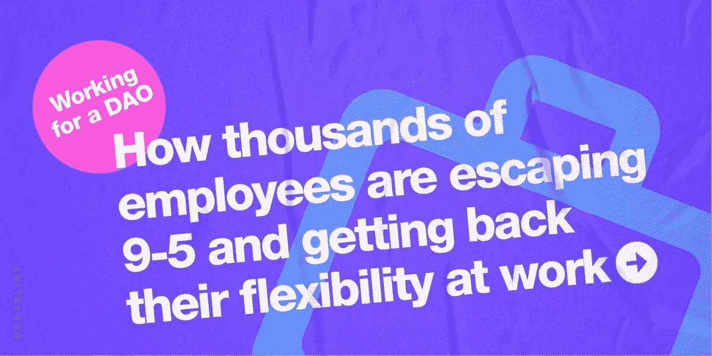

# 为道工作:成千上万的员工如何摆脱朝九晚五的工作模式，恢复工作的灵活性

> 原文：<https://medium.com/geekculture/working-for-a-dao-how-thousands-of-employees-are-escaping-9-5-and-getting-back-their-flexibility-c39b7e3b158c?source=collection_archive---------13----------------------->

几十年来，个人通过创建公司和签署法律合同来合作并确保各方之间的信任。虽然这一系统取得了成功，但它也显示出了它的局限性，在员工重塑自我、寻找新的工作机会的时期，它更倾向于安全性而不是灵活性，更倾向于集中指导而不是个人主动性。

随着权力从组织转移到个人，我们需要新的解决方案，使个人能够灵活，同时拥有正确的工具来轻松协作并建立相互信任。

社交令牌是人们合作方式的一次彻底的范式转变，Dao 正在利用它们将权力还给世界各地的个人。下一代员工可能会在 DAO 中开始他们的职业生涯，开始时只是活跃在这些符号化的社区中，帮助发展他们喜欢的项目，从娱乐中获得报酬，最终不再为传统公司工作。

随着我们的社会不断变化，社会代币似乎是实现未来工作的正确途径，并且似乎是一种越来越原始的实现集体努力的方式。

# 1 —公司有什么问题？

协作一直是创新的关键。众所周知:“如果你想走得快，就一个人走，但如果你想走得远，就一起走。”然而，在合作中总会有重大的挑战，因为你能信任的陌生人是有限的。

克服信任障碍是人们开始创建公司的原因之一。从长远来看，通过雇用他们并签署适当的合同，确保这个人不会泄露公司的秘密，更容易与他们合作。当公司限制股东的风险和责任时，也更容易筹集和分配资本。

随着时间的推移，与传统公司签订工作合同的模式已经显示出其局限性。决定长期为一家公司工作意味着对数百个其他令人兴奋的项目说不，失去灵活性，并限制受薪工人尽最大努力的激励。

传统大型科技公司的当前模式阻止员工对未来战略计划做出决策，缺乏员工所有权，并激励公司留在封闭的环境中，不鼓励与他人建立伙伴关系。

今天，我们看到传统就业的分解，个人现在是原子单位。世界各地的个人都渴望更多的灵活性和自主权，而公司仍在努力快速发展以跟上这些变化。

我们倾向于一种更灵活的工作方式，在这种方式下，个人将追随自己的兴趣，同时在多个项目上合作，而不会受到在一家公司工作的限制。与此同时，这些个人往往需要与他人合作来实现他们的目标，而不想在余生中独立工作。

为了处理这些问题，我们需要新的解决方案，使个人能够灵活，同时拥有正确的工具来相互协作和建立信任。社交标志可能是未来工作的关键。

# 2 —社交令牌和 Dao 如何解决这些问题？

**2.1 —社交代币是建立信任的一种方式**

社交代币创造信任。我不认为它们会完全取代我们今天用来在工作中建立信任的方式，如法律合同或法定付款，但它们是一种比传统法律地位更快启动项目的方式。

通过令牌和加密机制建立信任的一种方法是创建多签名钱包(multi-sig)。多重签名是一种加密钱包，允许您管理您的社区加密资产(令牌)，并可以选择要求预定义数量的签名来确认交易。由于需要多个团队成员来执行每笔交易，因此可以防止未经授权访问钱包中的资金。没有人可以带着所有的钱离开，因为这需要大多数其他成员的授权。

当通过智能合同分享利益时，社交令牌也能创造信任。智能合约是仅在满足所有条件时才接受交易的代码。我们不必相信有人会与你分享利益，我们可以想象一个智能合同，它会说:“如果我们共同创造的物品已经出售，那么销售的利益将在以下加密地址之间平均分配。”由于智能合约部署在区块链上，因此不可能对其进行更改，从而从一开始就确保各方之间的信任。

一些项目已经成功地利用社交令牌的力量来创造信任。例如，[Modern Billboard Collective](https://mirror.xyz/0x8cCBf346E4D3623aFBE2278b43a267D39854D147/f5rGPFSdOQxFlp-xR_ERP8m4YE6oPJ0JuK1gffI3DSQ?fbclid=IwAR1WC4gYWFuRLMHgO5S86_mZz4IyLhMwp7XAhwDFTPU0AbM-DyPQeKH7pHo)是三家初创公司之间的一个项目，旨在创建一个类似于[百万美元主页](https://en.wikipedia.org/wiki/The_Million_Dollar_Homepage)的令牌化版本，这是一个由 100 万像素组成的网页，排列在 1000x1000 像素的网格中，任何人都可以花 1 美元购买一个像素，并放置一个广告，使整个页面价值 100 万美元。这个集体的目的是利用这个想法，使用代币让品牌通过出售其主页的部分像素，在各自的网站上做广告，而不需要使用中介。为了在整个项目中利用加密机制，他们在三家初创公司之间建立了信任。事实上，通过让任何人在三个“在线”网站中的一个网站上购买数字“拍品”，参与这一集体的每家公司都很容易相互信任，因为版税将在各方之间公平、自动地分享。如果没有这项技术，这三家初创公司将需要法律合同，耗费金钱和时间，并需要手动共享版税，这又耗费时间，并导致流程效率低下。社交令牌带来了信任、灵活性和速度。

**2.2——社交代币是调整激励措施的更好方式**

创造社交令牌的整个概念是建立一个虚拟经济，早期的信徒可以分享好处。这是人们合作方式的一次彻底的范式转变。

基本上，DAOs 的最终目标通常是奖励帮助社区发展的贡献者，给他们社区的股份(社交代币)并创建一个如此雄心勃勃和强大的社区，以至于人们热衷于购买代币来获得该社区中的特殊访问权、特权和投票权。早期的支持者可以将他们的社交代币卖给那些新来者，并从他们一开始投入的工作中获得报酬。贡献者不是简单地获得现有加密货币的报酬(类似于工资)，而是受到激励来帮助 DAO 成功，因为他们的令牌的价值与项目的成功直接相关，并且可以获得几乎无限的价值。

从某种意义上来说，我们可以将社交令牌与股票相比较。一开始，它们没有价值，但是真正相信这个项目的人会热衷于用工作来交换这些股票，希望它以后会更值钱。这个系统允许社区领导公平地奖励任何有贡献的人。有了一致的激励，就更容易培养集体努力。

**2.3 —社交令牌赋予未来关键决策的所有权**

社会代币也伴随着投票权。贡献者可以每天使用他们的令牌对提案进行投票，并对 DAO 内的未来战略决策拥有所有权。已经创建了有效的工具来促进投票过程。

其中一个工具是 Snapshot，它允许任何人用他们的令牌对提案进行在线投票，这使得世界各地的个人可以很容易地对重要决策进行投票。Dao 和传统公司的根本区别在于，这些人围绕共同的使命和价值观进行合作，为战略决策投票。

理论上，一个人拥有的代币越多，他的投票权就越大。这种“象征性”投票系统允许真正的扁平化文化，消除了所有的等级制度。每个人都可以以真正平等的方式对未来的决策进行投票。

在现实中，通过代币投票的制度仍不完善，在投票权方面仍存在许多不平等。每月以代币支付的核心贡献者和项目的早期信徒通常被认为是鲸鱼，通常比 DAO 的普通成员拥有更多的投票权。代币投票仍然存在一些问题，但是人们正在努力解决这些问题。

为了解决这个问题，许多人正在研究新的解决方案。新工具将很快实现二次投票的选项，这是一个给予每个投票者相同权重的系统，不管他们持有多少代币。

Dao 就像员工所有的合作社，这个生态系统中的每个人都试图让它们尽可能公平和分散。社会代币就像有投票权的股票。它们还不完善，但在传统公司中，员工经常收到不授予投票权的股票期权，传统公司环境中没有人试图改变这一点。

**2.4——将权力还给人民的社交代币工具**

比代币本身更有价值的是生态系统和围绕它的所有工具。事实上，每天都有新的解决方案被创造出来，为这场革命提供动力，并让那些想要开始新项目的 Web3 社区和个人的生活变得更加轻松。

Coinvise 是当今最繁荣的 Web3 平台之一，它创建了一整套工具来帮助 DAO 领导者创建和管理他们的令牌。例如，他们的 Airdrop 工具允许 DAO 领导者向以太坊地址批量发送令牌，从而可以轻松奖励贡献者的工作，通过向领导者网络中的人发送令牌来提高项目的知名度，或者发送令牌来授予对令牌门控内容的访问权限。硬币也创造了大规模的任务，创造了一个归属时间表，以抑制投机，并在第二层桥代币，以避免在几分钟内汽油费。这套工具允许任何人创建一个令牌化的社区，并以一种不可信的方式轻松地大规模采取行动。

**2.5——社交标志培养文化并留住贡献者**

长期以来，传统公司一直试图创造一种强大的文化，培养归属感，但公司的主要目的是盈利。文化通常是第二层，用来获取利润和新的市场份额。

另一方面，Dao 是一个虚拟社区，拥有共同价值观的人决定联合起来，一起出去玩，实现他们的目标。这和工作无关。首先也是最重要的是关于文化，关于与他人一起生活和创造，建造你一直想要创造的东西。在 DAOs，文化第一，产品和项目第二。而不是相反。

为了建立一个强大的文化，道的领导者可以设置工具来增强成员的自信心或鼓励友善和支持的姿态，这是伟大文化的两个关键要素。在许多 Dao 中，这可以通过向其他贡献者发送提示来实现，以示感谢、认可和联系。通过首先关注文化，DAOs 可以克服传统公司难以克服的信任障碍。

卓有成效的 DAO 领导者将大量的注意力和努力放在创建强大的文化上。文化不是附加物，它是核心特征。它将人们联系在一起，并在不同于加密机制的层面上创造信任。

# 结束语

当然，社交令牌并没有解决所有传统公司的问题。它们并不完美，完美的解决方案可能永远不存在。

由于加密机制和社交令牌，Dao 寻求解决传统公司今天面临的许多最紧迫的问题。通过利用新技术，他们将自由和权力还给个人，并归还个人今天寻求的和传统公司很久以前拿走的资产。

网络 2 公司的激励永远不会完全一致。公司付给员工的工资越多，他们获得的利润就越少。在这种过时的模式下，员工永远不会尽最大努力工作，因为他们知道他们为公司付出的努力永远不会得到回报。

另一方面，我们看到令牌化社区今天蓬勃发展，并利用社交令牌的所有优势来创建没有它们就不可能实现的项目。宪法道就是一个很好的例子。这个符号化的社区是为了在高端拍卖行苏富比(Sotheby's)举办的一场拍卖会上购买美国宪法的原版之一而创建的，这场拍卖会最终在 7 天内筹集了 4000 万美元。他们说服了全球成千上万的人向他们发送资金，利用智能合约在各方之间建立信任。

要让这些 Dao 完全高效并真正去中心化，我们还有很长的路要走。今天创造的大多数工具在几年内都不会存在，但这是真正创新的正常周期。我们正在以光速进行实验。

我相信我们会看到更多雄心勃勃的人建立 Dao 而不是公司，因为这种新的合作模式有很多优势。我们还将看到更多的 DAO 对 DAO 的合作，因为 DAO 需要利用他们的优势，而不能依靠为 Web2 公司制造的产品和工具来做到这一点。

Dao 是新的创业公司。我们还很早，这种新的合作方式是混乱的，无序的，未经证实的。但通过加入道，你会学得很快，有无与伦比的上升空间，发现比以往更多的自由和灵活性。

摆脱 Web2 公司。来为刀工作吧。

**想要更多？**

在[推特](https://twitter.com/CDTEliot)上关注我，通过[购买我的书](https://www.amazon.com/Social-Token-Revolution-revolutionize-together/dp/B09NGTB395/ref=sr_1_1?crid=2AT2T4B6LHWAB&keywords=Eliot+couvat&qid=1642185338&sprefix=eliot+couvat%2Caps%2C244&sr=8-1)了解更多关于社交令牌的信息。感谢来到这里**🔥**