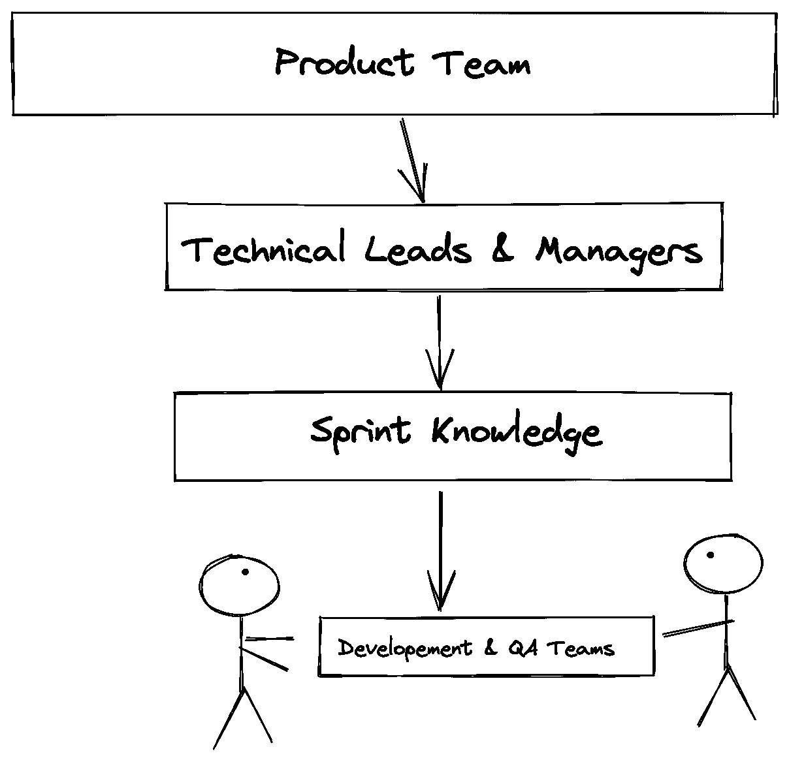
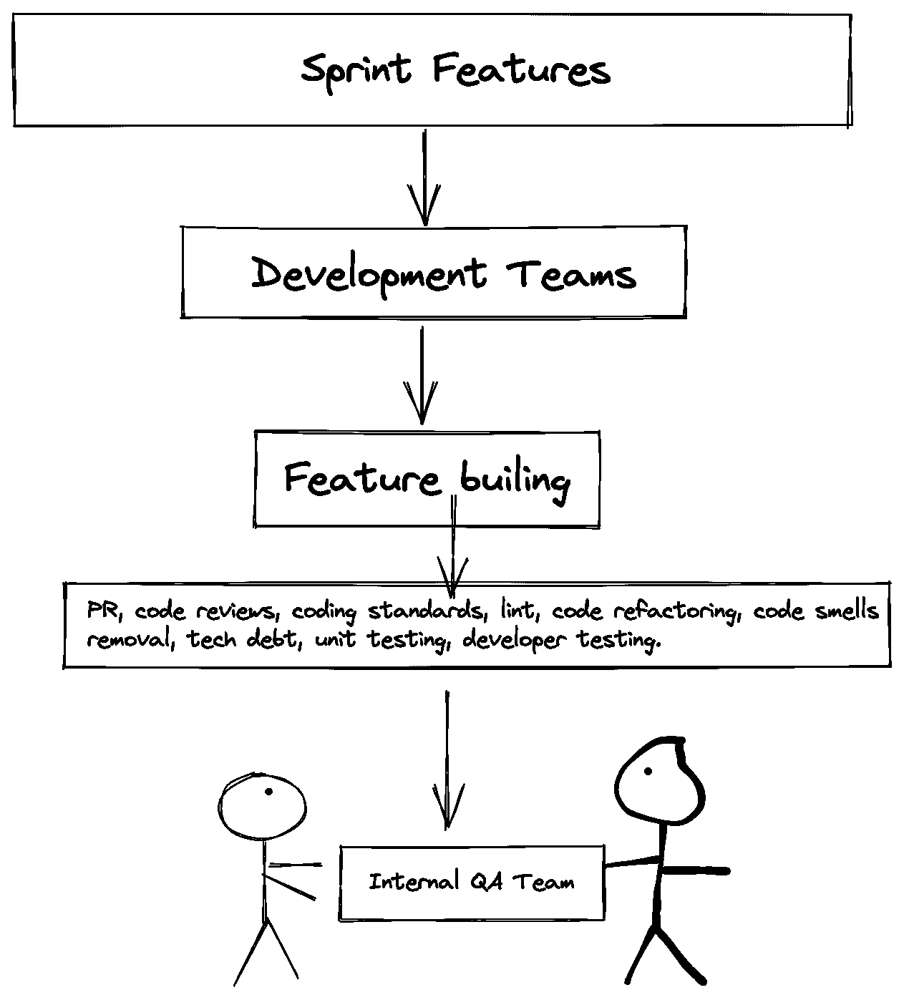
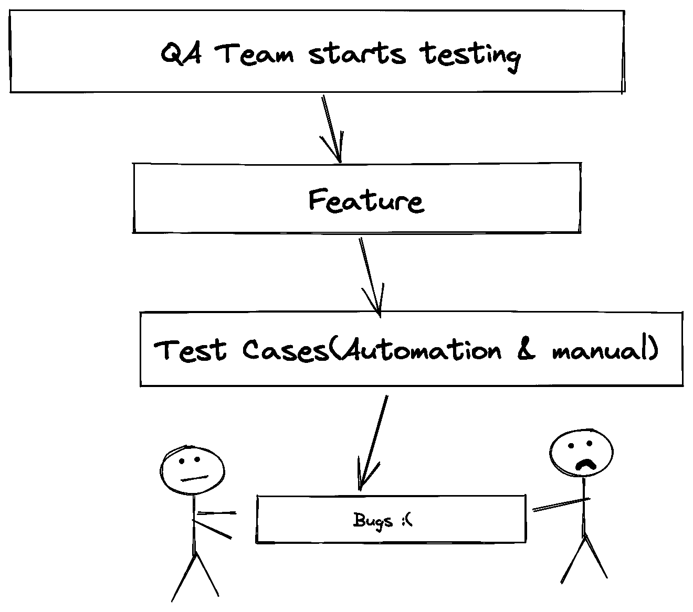
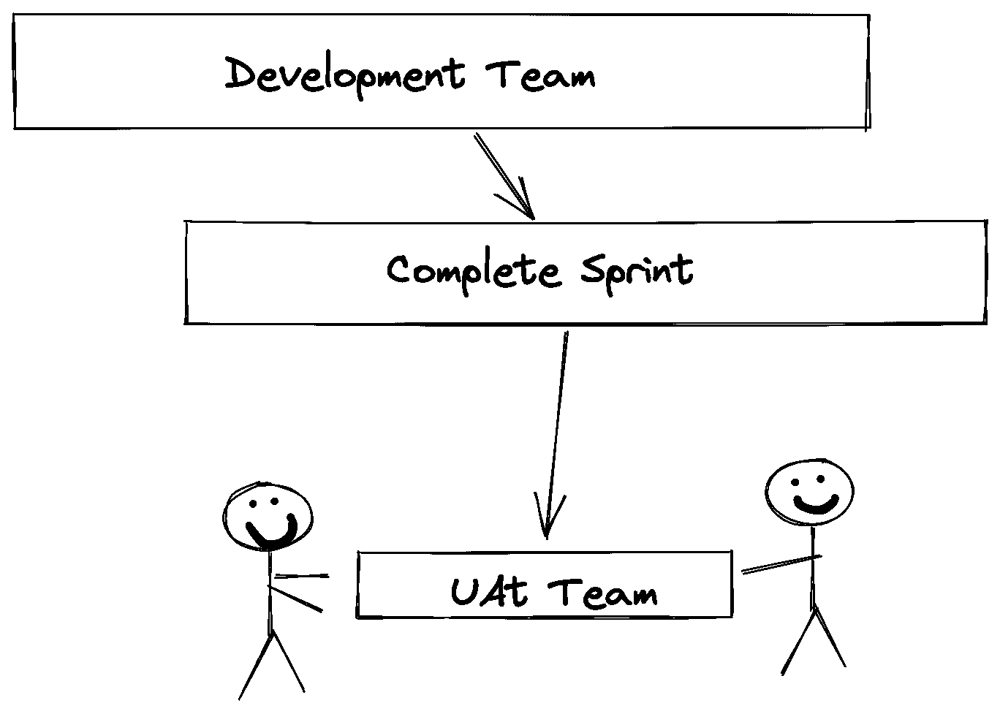
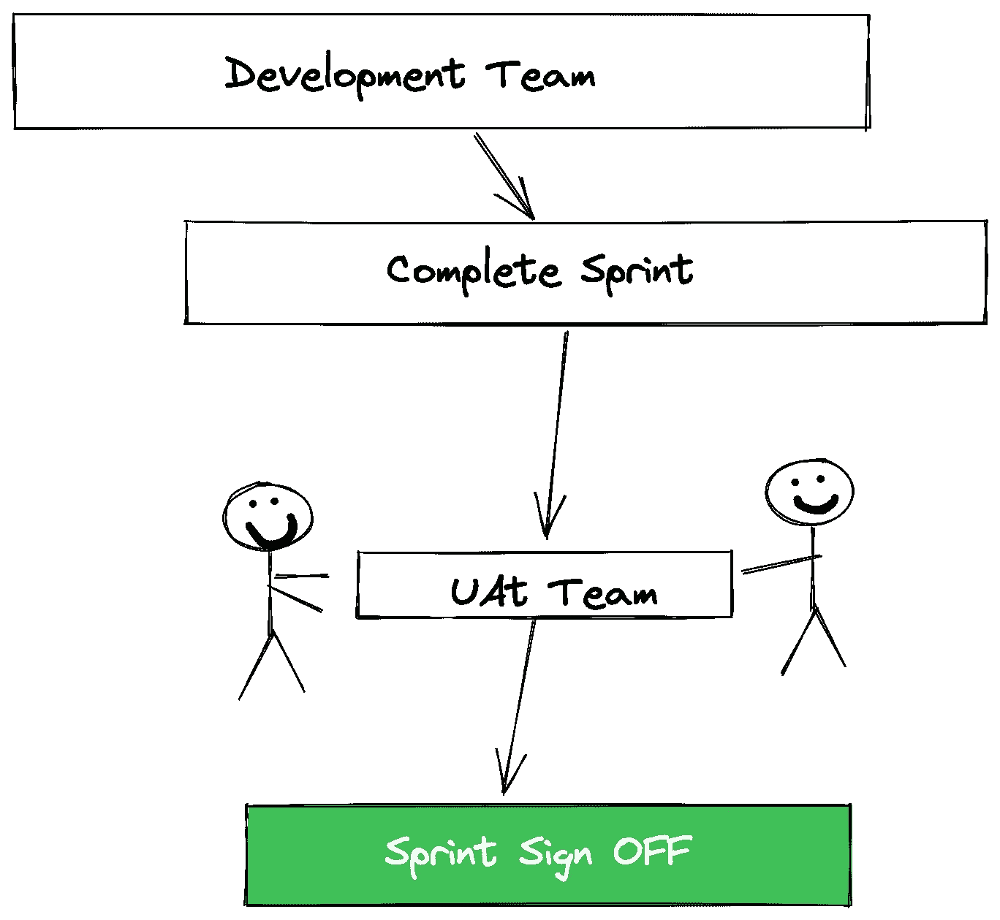

# 开发一个拥有数百万用户的软件应用程序。

> 原文：<https://medium.com/geekculture/working-on-a-software-application-having-millions-of-users-813abd2d656c?source=collection_archive---------51----------------------->

作为一名 iOS 工程师，开发一个拥有超过 1000 万用户的应用程序。

Photo by [Austin Distel](https://unsplash.com/@austindistel?utm_source=unsplash&utm_medium=referral&utm_content=creditCopyText) on [Unsplash](https://unsplash.com/s/photos/software-development?utm_source=unsplash&utm_medium=referral&utm_content=creditCopyText)

众所周知，我们在一个非常多样化的行业中工作，每个组织的发展标准都不同。每个组织都遵循自己的手册和选择的 SDLC 来开发和推进任何特定的软件产品。

在本文中，我将与我工作的开发团队分享我的经验&将分解一个高潜力的产品如何向产品团队交付高质量的特性，并最终投入生产。

对我来说，开发一个高用户参与度的软件产品和开发一个低用户群是非常不同的。作为一名 iOS 工程师，我开始开发一款拥有超过 1000 万用户的应用已经有大约 1 年了。通常，一个大产品有多个开发团队，我也是如此。

**产品&冲刺计划:** 通常，产品团队总是领先于开发团队新功能&的需求，如果开发团队正在开发 Sprint 1，产品团队通常已经决定了将覆盖接下来 5-10 次冲刺甚至更多的额外功能。
基于开发团队的能力，团队经理将挑选 Sprint 中包含的特性。

An overview of how knowledge is transferred from the product team to managers and then to the technical team.

**开发:** 在 sprint 被锁定并且 sprint 的理解已经被转移到特定的特性团队之后，开发就开始了。

作为软件工程师，我们在将原始需求转化为高度可用的功能方面扮演着最重要的角色，这些功能将作为最终产品提供给最终用户。

开发总是需要对 Sprint 的特性有一个清晰的理解。对于开发人员来说，产品知识在开发阶段起着至关重要的作用，开发人员对产品范围了解得越多，拥有的技术知识越多，交付优秀功能的机会就越大。

对于这种规模的产品，您在编写代码时通常必须非常警觉，因为通常，您的代码会与许多旧的和预先存在的功能交互，这些功能在生产中很有可能被破坏。

因此，您必须多次运行您的特性，以确保其他一切都工作正常，并且测试总是通过。然而，你会习惯于每天都这样做。

每个特性都有进入 QA 的优先级和交付日期，基于此，每个开发人员都知道优先级列表上有什么。

在构建了一个特定的特性之后，拥有这个特定特性的不同平台的开发团队在把它交给内部 QA 团队之前，都要仔细测试它。臭虫出现的几率已经降低了。

Overview of how the development team works for the product.

测试人员:
另一方面，一旦开发开始，QA 团队就开始为 sprint 编写测试用例，这有效地帮助他们节省了时间，当开发团队对任何特性进行测试时，他们可以轻松地执行测试用例。

Feature testing by the QA Team.

**修复问题:** 来自特定特性的问题通常被分配给特性所有者(开发者)，因为他对它有更好的了解。

开发人员很快修复它，然后它再次进入 QA 阶段，通常在确认之后，QA 会清除该特性。

循环继续，这个过程被应用到每一个特性上，直到整个冲刺被 QA 批准，确保每一个特性的质量都处于最佳状态。

有时你被分配了一个几年前写的问题，现在它处于优先地位，在这种情况下，你永远也不能进去修改代码，假设它会很好地工作，有时你的小修正会引起很多麻烦。因此，关于如何编写单元测试，最好是多次运行该代码。

**UAT 团队:** 作为经理，开发和 QA 团队确保所有的东西都被覆盖，然后我们将 sprint 中覆盖的完整特性发送给 UAT 团队。

After the sprint is internally tested, the development team provides all the features to the UAT team to test before being sent to the production and production team.

**签核:** 如果产品团队认为一切都好，他们就签核 sprint，之后，特性进入生产的过程就开始了。然后其他团队接管特定的功能。

After UAT assures everything is fine as per their regard they give a sign-off for the sprint.

**超级关怀** 这是系统上线后的一段时间，在这段时间里，可以提供更高级别的支持，以确保新系统的顺利采用。

在一个新的模块、功能或一个全新的应用程序发布后，软件团队通过向他们的用户提供额外的支持进入 hypercar。这种额外的支持有助于新老客户了解如何使用新发布的功能或模块。

***原来基本上就是这样！！*** 只是一个概述，伟大的团队总是为用户付出很多努力，给他们一个高质量的产品。通常在那里

如果你喜欢这篇文章或者对这篇文章有任何疑问，请留下你的评论。
下次见。

谢谢你。
[谢拉兹·艾哈迈德](http://@shirazkhan030)