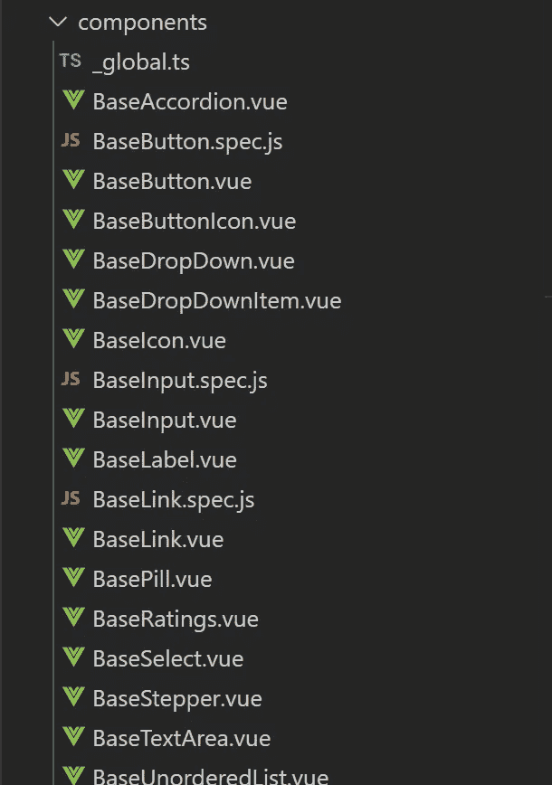

# 在 vue 中使用平面组件目录结构

> 原文：<https://medium.com/geekculture/working-with-a-flat-component-directory-structure-in-vue-6892e121f543?source=collection_archive---------30----------------------->

Vue 开发人员热衷于使用 Vue 组件目录中的嵌套目录结构。我在大型项目中使用过这两种结构，我在这里分享一些关于为什么我更喜欢平面目录结构而不是嵌套目录结构的观点。


Photo by [Andrej Lišakov](https://unsplash.com/@lishakov?utm_source=unsplash&utm_medium=referral&utm_content=creditCopyText) on [Unsplash](https://unsplash.com/s/photos/flat?utm_source=unsplash&utm_medium=referral&utm_content=creditCopyText)

你是否曾经在一个项目中使用了大量的组件和嵌套架构？让我猜猜，在项目的某个时候，你问自己放置这个特定组件的最佳目录是什么。嗯，当我使用嵌套架构时，这种情况经常发生在我身上，所以我会继续假设这种情况也可能发生在你身上。附言:我可能是错的，可能是唯一一个面对过这个问题的人(但可能性极小)。

当我使用嵌套的组件目录架构时，我会遇到这样的问题:

1.  需要很长时间来决定放置组件的特定组件子目录。
2.  给予两个组件相同的名称。(当在一个实时发生变化的团队中工作时，这种情况更加普遍)例如，有两个文件，如:

```
src\components\dashboard\QuickActions.vueAndsrc\components\profile\QuickActions.vue
```

这很容易带来混乱，尤其是在调试的时候。

当正确使用平面组件目录结构时，它可以消除这些问题并带来额外的优势。例如，如果我要用一个平面结构来表示它，我会这样命名它:

```
src\components\DashboardQuickActions.vueAndsrc\components\ProfileQuickActions.vue
```

当在 vue 项目的模板中使用这些组件时，可以更容易地阅读、跟踪确切的文件，也可以更容易地区分两个快速动作组件。例如:

```
<dashboard-quick-actions />
<profile-quick-actions />
```

您可能会对自己说:平面目录结构是不可伸缩的，组件的分组可能会变得一团糟，目录中的文件列表会变得非常大。这就是为什么我在这里向你展示如何有效地处理这个问题😃。

首先，我将告诉您平面目录结构的好处:

1.  不再需要花几分钟来决定某个特定组件应该放入哪个文件夹。
2.  通过像 hygen 这样的工具来实现组件的自动化更加简单明了。
3.  不可能给两个组件取相同的名字，这样可以减少你的调试时间。
4.  对组件进行分组非常容易，例如:



A group of base components.

当使用平面组件目录时，我们仍然希望能够对文件进行分组，以便于访问和组织。实现这一点的最佳方法是使用组件的名称，从最高级别的元素或父组件开始。例如，如果我们有一个名为 CalendarWidget 的组件，我们需要该组件的其他原子，如工作日、日项目等。在这种情况下，最高级别的元素是 CalendarWidget，因此，文件的命名格式如下:


Proper grouping of a CalendarWidget component.

使用这种命名格式，所有组件都与最高的元素或父组件相链接，在本例中是 CalendarWidget。

# 在长长的文件中导航

您可能会问，当您有一个很长的组件列表时，如何处理文件的滚动？嗯，除了按名称正确分组的事实之外，在您喜欢的 IDE 上，使用一些快捷方式可以很容易地找到文件。例如，我使用了 visual studio 代码，在 visual studio 代码中，可以通过以下命令轻松定位文件:

```
ctrl + p
```

之后，VS 代码会显示一个搜索输入框，通过名称来查找组件。不管你用什么工具，我敢打赌都有一条按名称查找文件的捷径。我想这是对您的一个号召，让您对自己选择的 IDE 进行研究，找出有助于提高工作效率的捷径。既然你每天都在使用 IDE，那就让它成为你的朋友吧😃。

# 摘要

尽管我更多地强调了平面目录结构，但这两种结构都很棒，它们中的任何一种都可以满足您团队的需求。但是，我发现平面目录结构更容易使用和自动化，而且它的伸缩性与嵌套结构完全一样。