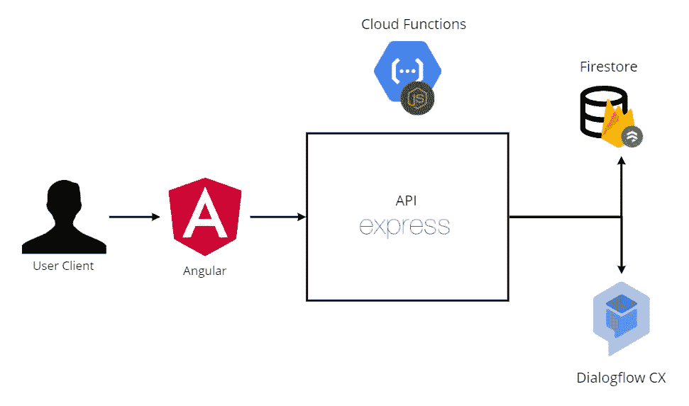
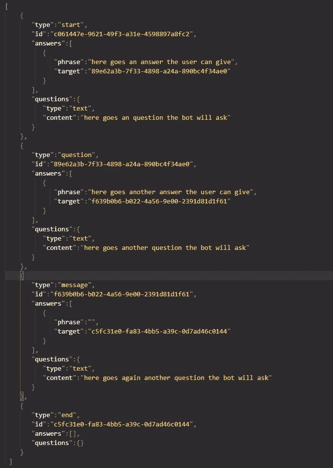
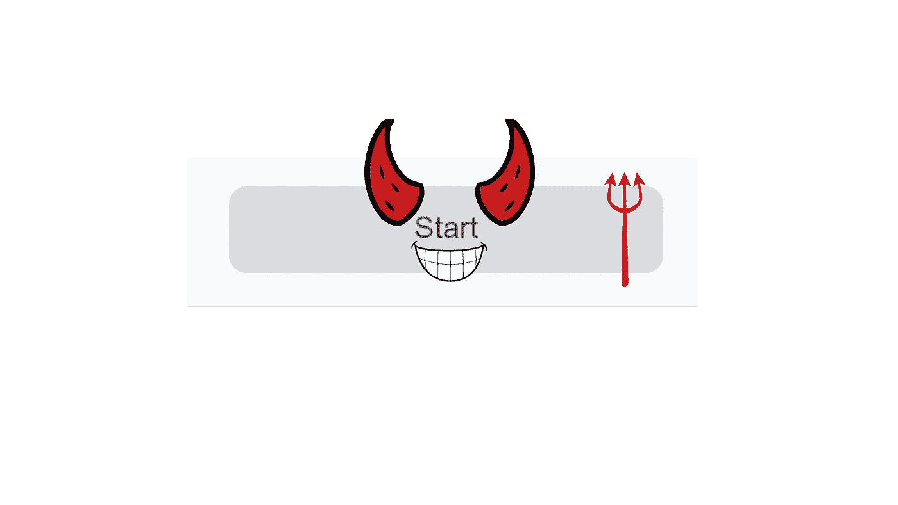
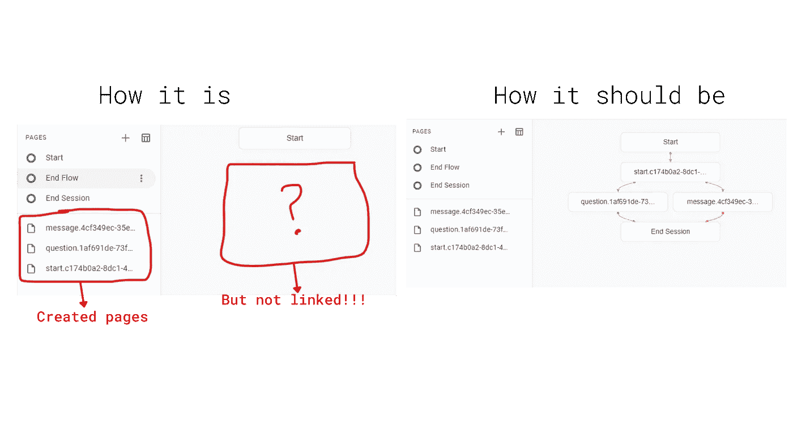
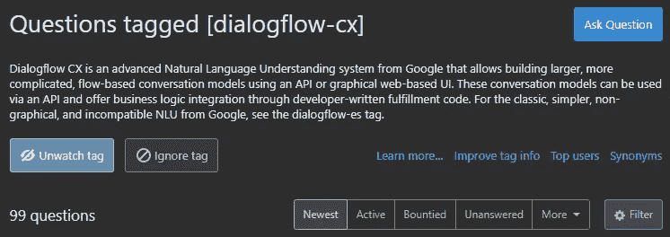
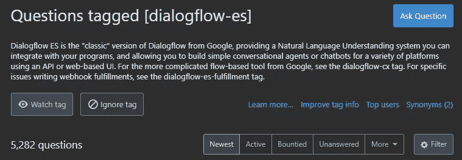
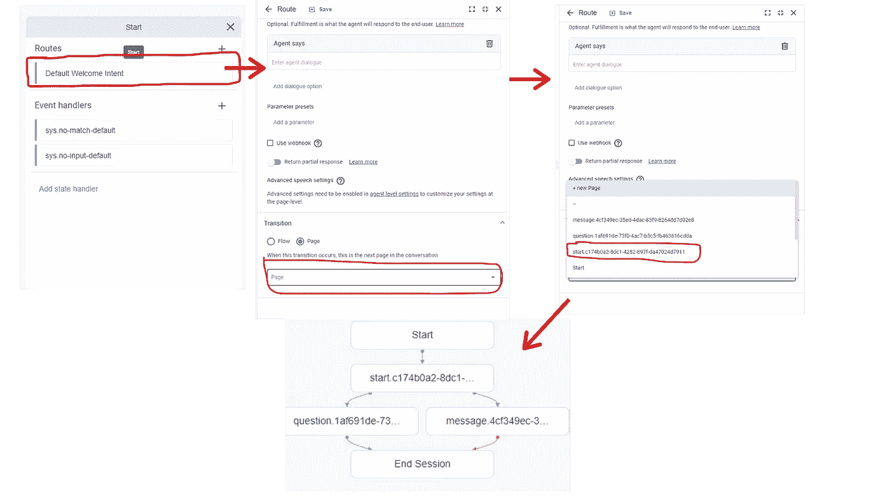

# 使用最新技术 dialog flow CX-flow builder

> 原文：<https://medium.com/geekculture/working-with-an-almost-new-technology-dialogflow-cx-a368ab64f14d?source=collection_archive---------30----------------------->

我们在 FlowBuilder 项目中与 AtomChat 合作，这是一个图形界面，用于以简单易行的方式为希望与客户进行自动化通信的企业和个人创建聊天机器人，我们创建了一个名为 Ternary Devs 的团队，其成员是亚历杭德罗·弗朗哥、埃斯特万·卡斯塔诺和胡安·巴布罗·蒙托亚(我本人)。

我们选择这个项目是因为它是相当具有挑战性的东西，新技术，当我们来自 Python 时与 Typescript 一起工作，完全与 Dialogflow API 一起工作，并将其与一个简单直观的应用程序集成在一起，我们没有失望，这是一次疯狂的尝试。

在开发之初，我们被分配了一些技术，包括前端**角度**和**打字稿**。对于后端的 **Node.js** 、 **Express.js** 、 **Google Cloud Functions** 、 **Firestore** 和 **Dialogflow ES** ，最后一个是 Google 的技术，允许用 NLP 技术创建代理并允许与真人对话，它已经上市 5 年或更长时间了，但我们决定使用 [**Dialogflow CX**](https://cloud.google.com/dialogflow/cx/docs/basics) ，这是一个

我负责后端，简而言之就是一个 API，以及与 **Dialogflow CX** 和 **Firestore** 的连接。最开始的开发是研究工具， **TypeScript** ， **Node.js** 和 **Express.js** 是第一批，然后我继续用 **Dialogflow CX** 找到了 [**客户端库**](https://googleapis.dev/nodejs/dialogflow-cx/latest/index.html) ，以及它与 Node.js 的轻松集成，从那里我开始意识到 SDK 文档(客户端库)不是很完整，最好去

我开始创建端点来创建页面(*页面本质上是与机器人对话的状态，页面可以有路径，如果用户说了它理解的东西或它不理解的东西*)和意图(*意图是机器人试图理解的关于用户输入的东西， 它可以有即时响应，也可以生成动态响应*，但是后来我意识到以这种方式创建它不会很有用，所以我决定改变创建流的策略。

我们最终为将要发送的数据创建了一个新的结构，这是一个发送到 API 的示例，它包含了我们在前端管理的所有元素:**开始**，**问题**，**消息**和**结束**:

基于设计的数据结构，我创建了一个接收流内容的端点，并在他们的 SDK 的帮助下在 **Dialogflow CX** 中创建它。

由于我们需要元素的 id 来连接它们，我首先创建了数据结构中传递的所有元素，然后通过已经有了它们各自的 id 来连接所有的元素(*类似于单个* [***链表***](https://en.wikipedia.org/wiki/Linked_list#:~:text=In%20computer%20science%2C%20a%20linked,which%20together%20represent%20a%20sequence.) *，但是所有节点都是在链接它们之前创建的*)，流程是如何创建的示例:

到目前为止，所有的开发都进行得很顺利，我不需要在任何不是官方文档的地方搜索，直到我找到了有问题的'**起始页**'，"*什么是'* ***起始页*** *'？*“你可能会问，嗯，这是创建代理时默认创建的内置页面，问题是每当你想编辑此页面的连接(*链接*)时**对话流 CX** 会抛出一个错误，说该页面不存在，当试图更有力地编辑它时，它会说我不允许编辑它。

My perspective of the Start Page

这真的是一个大问题，我在后面连接了这个大流量，但是如果我不能将它与起始页链接起来，就好像什么都没发生一样。

当这种事情发生时，你首先想到的是查看官方文件，对吗？官方文档中对起始页的唯一引用是告诉我们它的 ID 是什么，也就是“START_PAGE ”,并不是很有用。
那还有什么？堆栈溢出就是答案！但是…

就是这么多问题贴上了【dialogflow-cx】， **99** ！(*和计数*)，为了比较，让我们看看 Dialogflow ES 有多少个问题，它的前身

**5282**！挺大的吧？这就是问题所在，我在 **CX** 找不到任何关于我具体问题的问题，所以我做了什么？当然，**问**！这是我的[问题](https://stackoverflow.com/questions/67958275/how-to-get-the-default-start-page-with-dialogflow-cx-api-and-edit-its-default-ro)，已经被看了 95+次，和 **Stackoverflow** 这一节几乎每个问题一样没有答案。你可以说，“*你为什么不去别的地方问问？*“嗯，我在 **Slack** 做了一个关于 CX 的 **Google group** ，甚至还有一个关于 CX 问题的 **Google Form。**

在这一切之后，我决定继续，我唯一的解决方案，手动操作**，进入 Dialogflow CX 并连接它，这就是我一直工作的方式，直到我解决我的问题**

****

**手动就是这么做的。**

# ****结论:****

**我真的，真的，真的学到了很多东西，一些我起初甚至没有想到的东西在某些时候变得很重要，比如项目结构，代码可读性，最佳实践，那些可能没有像我这样的初学者首先会看的东西。这些技术令人惊叹。**

**-与 Firestore 合作令人惊叹，它使存储一切变得如此简单和易于管理。起初 Typescript 是我的敌人，但后来我开始意识到它更像是父母，它通过预先给我错误来防止我在运行时出错。云功能没什么好担心的，因为谷歌会为你处理所有的服务器管理，我只需要部署代码就行了。
-显然 Dialogflow CX 非常喜欢这项技术，并且不得不问自己一些以前从未被质疑过的问题，因为这真的很新，理解这些库并使用给定的工具设计自己的解决方案感觉真好。**

**毕竟，我要感谢**三元开发者**，我的团队 **AtomChat** ，以及一位伟大的导师 [**Jackzeel**](https://www.linkedin.com/in/jackzeel-zadir-garcia-vallecillo-0763bb145/) ，他们在整个过程中帮助了我们很多，并让我们理解了所有这些技术。**

****简单介绍一下我:** 我是一个喜欢用技术和游戏把人们聚集在一起的人，我的 [**Github**](https://github.com/jumoc) ， [**Twitter**](https://twitter.com/Jumoc0) ，以及[**Linkedin**](https://www.linkedin.com/in/jumoc/)
项目的 [**页面**](https://atomchat-flowbuilder.netlify.app/)**