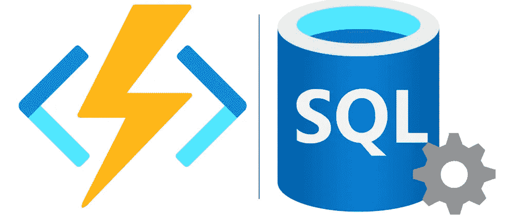
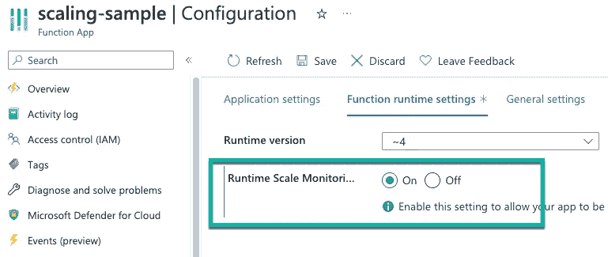
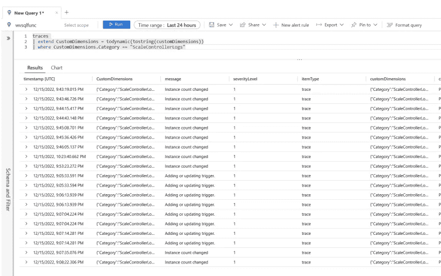
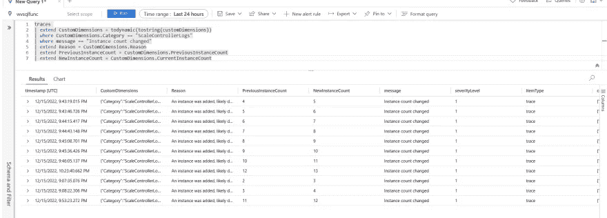

# 在 Azure 函数中使用 Azure SQL 触发器

> 原文：<https://medium.com/geekculture/working-with-azure-sql-triggers-in-azure-functions-6bd755eb6b7d?source=collection_archive---------2----------------------->

## 我们现在可以在 Azure 函数中使用 SQL 触发器来监听 SQL 变化跟踪！



Azure 函数的 Azure SQL 触发器上个月进入了 C#函数的公共预览版。当您在 Azure SQL 数据库、托管实例或 SQL Server(是的，本地 SQL Server)中的表上启用更改跟踪时，您可以创建一个每次创建、更新或删除行时都会触发的函数。

在本文中，我们将深入探讨 SQL 触发器函数的细节，更改跟踪是如何工作的，以及我们如何配置我们的函数来监听 SQL 更改跟踪。最后，我们将讨论如何使用 scale controller 日志来监控我们的函数在处理更多更改时如何伸缩。

# 关于 SQL 触发器函数

正如我之前提到的，Azure SQL 触发器使用 SQL 更改跟踪功能来监控 SQL 表的更改，然后在该表中创建、更新或删除行时触发一个函数。

在撰写本文时，该功能正在公开预览中。目前，您只能使用高级或专用计划中的 C#函数。另一个限制是还不支持独立的工作进程函数。

# 什么是 SQL 更改跟踪？

SQL 更改跟踪是一种跟踪机制，使应用程序能够查询数据库中数据的更改。在 SQL 触发器函数之前，您必须实现一个定制的更改跟踪机制来轮询表或数据库的更改。

更改跟踪用于回答两个问题:表中的哪些行发生了更改，以及某一行是否发生了更改。我们可以使用更改跟踪来发现某一行已经更改，以及该行的最新数据是什么。

必须与 SQL Server 同步数据的应用程序必须能够查询更改。使用更改跟踪，您可以将其用于单向和双向同步。

有关 SQL 变更跟踪的更多细节，请阅读本文。

# 在 Azure SQL 上启用 SQL 更改跟踪

让我们使用下面的 SQL 查询来创建我们的表:

```
CREATE TABLE dbo.[Orders] (
    [Id] UNIQUEIDENTIFIER PRIMARY KEY,
    [ProductName] NVARCHAR(200) NOT NULL,
    [Price] DECIMAL(38,2) NOT NULL
)
```

现在我们有了表，我们需要在数据库上启用变更跟踪，然后在表上启用它。我使用 Azure Data Studio 来执行这些步骤，但您也可以使用 VS Code 或 SQL Server Management Studio (SSMS)。

对于我们的数据库，我们编写以下内容:

```
ALTER DATABASE [Todo]
SET CHANGE_TRACKING = ON
(CHANGE_RETENTION = 2 DAYS, AUTO_CLEANUP = ON);
```

这里，`CHANGE_RETENTION`选项指定了我们的变更跟踪信息将被保存的时间。根据您的功能需求进行正确的调整是很重要的。在上面的查询中，我将其设置为 2 天。但是，如果我的功能关闭了几天，它将只能捕捉到这两天发生的变化。

`AUTO_CLEANUP`选项用于启用或禁用删除旧变更跟踪信息的清理任务。如果您遇到了导致触发器问题的问题，关闭自动清除有助于防止在问题解决之前删除超过保留期的信息。

对于该表，我们编写以下内容:

```
ALTER TABLE [dbo].[orders]
ENABLE CHANGE_TRACKING;
```

触发器需要对表具有读访问权限，以监视更改，这样触发器就可以访问更改跟踪系统表。

在底层，每个 SQL 触发器在模式`az_func`中都有一个关联的变更跟踪和租约表，如果这些表不存在，触发器就会创建这个表。这些表用于跟踪触发器的当前状态，允许跨会话保持状态，并允许并行执行触发器绑定的多个实例。

目前，SQL 触发器中不支持 Azure AD 身份验证，因此我们使用 admin 连接字符串来连接函数以进行更改跟踪。

为什么这很重要？我们用于触发器的登录名必须具有创建这些表和模式的权限。否则触发器将不起作用。如果您删除或修改这些表，那么您的函数可能会表现得有点滑稽。要重置触发器的状态，您需要停止所有正在运行的带有触发器绑定的函数，然后截断或删除表。当您再次启动触发器功能时，它将根据需要创建表格。

当 SQL 触发器最终支持 Azure AD 时，请确保 MSI 有足够的权限级别来创建这些表。

有关这些内部状态表的更多信息，请阅读下面的文章[。](https://github.com/Azure/azure-functions-sql-extension/blob/triggerbindings/README.md#internal-state-tables)

# 编写我们的 SQL 触发器函数

为了在我们的函数中使用 SQL 触发器，我们需要安装下面的 NuGet 包(版本可能会随着时间的推移而改变😂):

```
dotnet add package Microsoft.Azure.WebJobs.Extensions.Sql --version 1.0.44-preview
```

一旦安装完毕，我们就可以像这样编写函数:

```
[FunctionName("ReadOrders")]
public static void Run(
[SqlTrigger("[dbo].[orders]", ConnectionStringSetting = "SqlConnectionString")] IReadOnlyList<SqlChange<Order>> changes, ILogger logger)
{
    foreach (var change in changes)
    {
        Order order = change.Item;
        logger.LogInformation($"Change operation: {change.Operation}");
        logger.LogInformation($"Id: {order.Id}, Product Name: {order.ProductName}, Price: {order.Price}");
    }
}
```

在此函数中，我们使用以下属性配置触发器:

**TableName =** 触发器所监视的表的名称。

**ConnectionStringSetting =** 包含被监视更改的表的数据库的连接字符串

SQL 触发器绑定到一个`IReadOnlyList<SqlChange<T>>`，它是一个包含两个属性的`SqlChange`对象列表:

1.  **项目**。这是被更改的项目。这种类型的项目应该遵循表模式。
2.  **操作**。这是在被监视的表上执行的操作。支持的值有**插入**、**更新**和**删除**。

作为参考，下面是我们的`Order`对象，它与`[dbo].[orders]`表中定义的模式相匹配:

```
public class Order
{
    public Guid Id { get; set; }
    public string ProductName { get; set; }
    public decimal Price { get; set; }
}
```

当变更跟踪机制获得变更时，我们将它们绑定到我们的列表。然后，我们可以遍历该列表来执行下游操作。这个函数非常简单，我只是从**项目**属性中获取**订单**对象，记录对其执行的操作，然后记录我的**订单**的值。

我们的日志应该是这样的:

```
[2022-12-15T20:25:42.951Z] Change operation: Insert
[2022-12-15T20:25:42.952Z] Id: deaa1643-00a4-4d99-810e-e00aca361835, Product Name: Generic Steel Chicken, Price: 2.00
```

除了将我们的函数连接到 Azure SQL，我们还可以为我们的触发器配置以下设置:

**Sql_Trigger_BatchSize =** 它控制在发送到触发函数之前一次处理的更改数量。

**Sql _ Trigger _ polling intervalms =**这控制着处理每批变更之间的延迟(毫秒)。

**Sql _ Trigger _ MaxChangesPerWorker =**这控制了每个应用工作程序允许的用户表中的挂起更改的数量上限。如果更改计数超过此限制，将导致向外扩展。仅适用于启用了运行时驱动缩放的功能应用。

# 运行时驱动的缩放

如果您使用的是高级计划函数，请启用运行时驱动的伸缩，以允许您的函数在使用 SQL 触发器时正确伸缩。

为此，进入您的函数应用程序，选择**配置**，并在**函数运行时设置**选项卡上，打开**运行时规模监控**。



# 监控我们的功能

启用运行时驱动缩放后，您可以将缩放控制器日志发送到 App Insights 或 Blob 存储，以便了解缩放控制器如何在您的函数中控制缩放。

要实现这一点，您需要添加一个名为`SCALE_CONTROLLER_LOGGING_ENABLED`的设置，并以`<DESTINATION>:<VERBOSITY>`的格式为其提供一个值。**目的地**是我们将日志发送到的地方(或者是 **AppInsights** 或者是 **Blob** )，而* *VERBOSITY* *是日志记录的级别( **None** 、 **Warning** 或 **Verbose** )。

将秤控制器日志发送到 App Insights 后，我们可以像这样查询它们:

```
traces 
| extend CustomDimensions = todynamic(tostring(customDimensions))
| where CustomDimensions.Category == "ScaleControllerLogs"
```

这将产生以下结果:



我们可以扩展这些日志以包含特定的事件，如下所示:

```
traces 
| extend CustomDimensions = todynamic(tostring(customDimensions))
| where CustomDimensions.Category == "ScaleControllerLogs"
| where message == "Instance count changed"
| extend Reason = CustomDimensions.Reason
| extend PreviousInstanceCount = CustomDimensions.PreviousInstanceCount
| extend NewInstanceCount = CustomDimensions.CurrentInstanceCount
```

该查询将向我们显示缩放控制器增加了多少个函数应用实例，以及它缩放的相关原因。



使用这些日志，我们可以将我们的**Sql _ Trigger _ MaxChangesPerWorker**配置为适当的计数，以确保我们的函数应用程序根据该函数从 Sql 更改跟踪中获得的传入更改进行正确伸缩。

有关在 Azure 函数中查询 scale controller 日志的更多信息，请阅读下面的文章中的[。](https://learn.microsoft.com/en-us/azure/azure-functions/analyze-telemetry-data#query-scale-controller-logs)

# 结论

有一段时间，我有几个客户问我关于在 Azure 函数中使用 SQL 触发器的问题，所以我对这个功能感到非常兴奋，并看到人们将如何使用它！

希望等到 Azure AD 正式发布时，触发器的 Azure AD 身份验证将会就位。支持更多的语言将是伟大的！

如果你想了解更多关于 Azure 函数中的 Azure SQL 触发器，请阅读以下文章:

*   [Azure SQL 函数触发器(预览)](https://learn.microsoft.com/en-us/azure/azure-functions/functions-bindings-azure-sql-trigger?tabs=in-process%2Cportal&pivots=programming-language-csharp)
*   [Azure 函数的 Azure SQL 绑定 GitHub 文档](https://github.com/Azure/azure-functions-sql-extension/blob/triggerbindings/README.md)

如果你对这篇文章有任何疑问，或者对 Azure 函数中的 SQL 触发器有任何反馈，请随时在 twitter 上联系我 [@willvelida](https://twitter.com/willvelida)

下次见，编码快乐！🤓🖥️