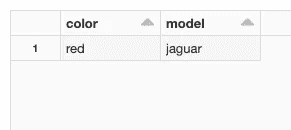
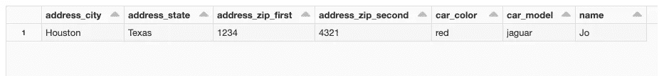

# 如何折叠 Apache Spark 中的任何复杂数据

> 原文：<https://medium.com/geekculture/working-with-complex-data-in-apache-spark-made-simple-d791841646a?source=collection_archive---------10----------------------->

# 一个 Python 函数，可以将 JSON 这样的复杂数据折叠成单独的列


Photo by [Lukas Blazek](https://unsplash.com/@goumbik?utm_source=medium&utm_medium=referral) on [Unsplash](https://unsplash.com?utm_source=medium&utm_medium=referral)

最近更新—2022 年 3 月 15 日—更新了示例代码，以支持名称中带有空格的属性。

Apache Spark 本身支持复杂的数据类型，在某些情况下，如 JSON，如果有合适的数据源连接器，它可以很好地表示数据。顶级键值对出现在它们自己的列中，而更复杂的分层数据则使用转换为复杂数据类型的列来持久化。在 select 子句中使用点符号，可以选择复杂对象中的单个数据点。例如:

```
from pyspark.sql.functions import coljsonStrings = ['{"car":{"color":"red", "model":"jaguar"},"name":"Jo","address":{"city":"Houston",' + \
      '"state":"Texas","zip":{"first":1234,"second":4321}}}']
otherPeopleRDD = spark.sparkContext.parallelize(jsonStrings)
source_json_df = spark.read.json(otherPeopleRDD)source_json_df.select(col("car.color"), col("car.model")).show()
```

这将返回以下数据帧:



这种机制很简单，而且很有效。但是，如果数据很复杂，有多个级别，跨越大量的属性和/或列，每个属性和/或列都与不同的模式对应，并且数据的消费者无法处理(例如，像大多数 BI 工具一样，它们喜欢从 Oracle、MySQL 等关系数据库生成报告)，那么问题就会接踵而至。手动写出 Select 语句的方法也是劳动密集型的，并且难以维护(从编码的角度来看)。

为了简化复杂数据的处理，本文将提供一个函数，用于将多级复杂层次列转换为非层次列。本质上，一个没有复杂数据类型列的数据帧。所有嵌套属性都被分配了以其原始位置命名的自己的列。例如:

```
car.colorbecomescar_color
```

# 入门，方法

假设我们需要转换下面的 JSON，它已经使用 spark.read.json 加载到 Spark 中:

```
{
  "car":{
    "color":"red", 
    "model":"jaguar"
  },
  "name":"Jo",
  "address":{
    "city":"Houston",
    "state":"Texas",
    "zip":{
      "first":1234,
      "second":4321
    }
  }
}
```

第一项任务是创建一个函数，该函数可以解析绑定到 Dataframe 的模式。该模式通过在数据帧本身上找到的同名属性来访问。

接下来，我们将遍历模式，创建所有可用属性的列表，记录它们的整个祖先路径。我们的目标是以数组的形式创建元数据，其中每个元素都是每个值的完整祖先分支。由于复杂数据是分层的，所以需要一个递归函数来遍历所有的树分支。最后，我们将处理元数据以创建列对象的集合，使用点标记约定来选择每个属性，然后使用 alias 属性来分配一个惟一的名称。如上所述，我们将使用每个属性的路径作为别名。

# 解析模式

Apache Spark 模式是 StructType 和 StructField 对象的组合，StructType 表示每个分支的顶级对象，包括根。StructType 拥有通过 Fields 属性访问的 StructFields 集合。每个 StructField 对象都用三个属性进行实例化，即名称、数据类型及其为空性。例如，如果我们对上面创建的数据帧运行以下代码:

```
schema = source_json_df.schema
print(schema)
```

输出将是:

```
StructType([
  StructField("car", StructType(
    StructField("color", StringType(), True),
    StructField("model", StringType(), True)
  ), True),
  StructField("name", StringType(), True),
  StructField("address", StructType(
    StructField("city", StringType(), True),
    StructField("state", StringType(), True),
    StructField("zip", StructType(
      StructField("first", IntegerType(), True),
      StructField("second", IntegerType(), True)
    ), True)
  ), True)
])
```

Apache Spark 支持许多不同的数据类型，例如字符串和整数，以及 StructType 本身。当需要新的分支时，StructField 的数据类型设置为 StructType，如上面的示例所示。

递归函数是一种调用自身的函数，它非常适合遍历像我们的模式这样的树结构。例如:

```
from pyspark.sql.types import StructTypedef get_all_columns_from_schema(schema, depth=None):
  if depth is None: depth = 0
  for field in schema.fields:
    field_name = ""
    for i in range(depth):
      field_name += "--"

    field_name += field.name
    print(field_name)
    if isinstance(field.dataType, StructType):    
      get_all_columns_from_schema(field.dataType, depth+1)   

#
get_all_columns_from_schema(source_json_df.schema)
```

假设我们使用上面声明的 source_json_df 数据帧，如果我们对它执行这段代码，我们将看到下面的输出:

```
address
--city
--state
--zip
----first
----second
car
--color
--model
name
```

递归解决了一个问题，但 Python 引发了另一个问题。不幸的是，Python 不支持通过引用传递函数属性。当你把一个变量传递给一个函数时，Python 会复制一个变量，不会保留对原始变量的引用。每次我们迭代 get_all_columns_from_schema 时，Python 都会复制两个参数 schema 和 depth，这样当我们将 depth 增加 1 时，depth 的原始副本保持不变，只有函数的下一次迭代接收到的实例会被更新。

这是一个问题，因为 get_all_columns_from_schema 的每次迭代都不知道在它之前发生了什么。虽然我们可以为每个分支创建一个数组，但是我们无法将所有分支数组整理成一个列表，并返回给正在执行的代码。将创建 select 语句的代码。为了克服这个 Python 限制，我们需要将解析函数包装在另一个函数中(或者一个类，但函数更简单)，并使用父函数的上下文作为元数据数组的容器。

```
from pyspark.sql.types import StructTypedef get_all_columns_from_schema(source_schema):
  branches = []
  def inner_get(schema, ancestor=None):
    if ancestor is None: ancestor = []
    for field in schema.fields:
      branch_path = ancestor+[field.name]     
      if isinstance(field.dataType, StructType):    
        inner_get(field.dataType, branch_path) 
      else:
        branches.append(branch_path)

  inner_get(source_schema)

  return branches
```

主外部函数 get_all_columns_from_schema 现在将 dataframe 模式作为单个输入参数。该函数从声明一个列表开始，这个列表对于内部函数来说实际上是全局的。这是以数组形式保存所有分支的列表。递归函数是在 get_all_columns_from_schema 中声明的，它与上面演示的函数相同，只是做了一些小的调整(用一个列表更改深度计数器，以持久化单个分支的所有祖先节点)。此外，对 print 的调用被替换为对外部函数拥有的分支列表的追加。

如果我们对数据帧的模式运行此代码，get_all_columns_from_schema 将返回以下列表:

```
[
  ['address', 'city'], 
  ['address', 'state'], 
  ['address', 'zip', 'first'], 
  ['address', 'zip', 'second'], 
  ['car', 'color'], 
  ['car', 'model'], 
  ['name']
]
```

# 折叠结构化列

现在我们已经有了所有分支的元数据，最后一步是创建一个数组来保存我们想要选择的 dataframe 列，遍历元数据列表，并在为每个分支值分配唯一的别名之前，创建使用每个分支值的点标记地址初始化的列对象。

为了克服属性名中可能有一个空格的可能性，我们用反引号将列括起来。

```
from pyspark.sql.functions import col

  _columns_to_select = []
  _all_columns = get_all_columns_from_schema(source_json_df.schema)

  for column_collection in _all_columns:
    _select_column_collection = ['`%s`' % list_item for \ 
         list_item in column_collection]    

    if len(column_collection) > 1:
      _columns_to_select.append(col('.'.join( \ 
         _select_column_collection)).alias('_'.join( \ 
         column_collection)))
    else:
      _columns_to_select.append(col(_select_column_collection[0]))
```

我们首先用 get_all_columns_from_schema 的输出初始化一个数组，然后进行循环迭代，并测试每个元素的项目长度。如果长度大于 1，那么它是一个分支，否则它是一个常规的非层次列的名称。在 Pythons 字符串上使用 join 方法，我们将数组成员连接在一起，首先创建点符号字符串来选择分支值，然后声明新列的别名。

新数组 _columns_to_select 现在包含了完全折叠所有复杂数据类型所需的一切，为每个单独的值创建一列。正在执行:

```
collapsed_df = source_json_df.select(_columns_to_select)
collapsed_df.show()
```

输出以下数据帧:



Github 的源代码可以在 https://github.com/jamesshocking/collapse-spark-dataframe 的[找到](https://github.com/jamesshocking/collapse-spark-dataframe)