# 熊猫的日期和时间:时间戳和日期范围

> 原文：<https://medium.com/geekculture/working-with-dates-and-time-in-pandas-part-1-timestamps-and-date-ranges-ac87e74878cf?source=collection_archive---------7----------------------->

## 深入探讨时间戳，熊猫日期和时间功能的核心。

Photo by [3209107](https://pixabay.com/users/3209107-3209107/) from [pixabay](https://pixabay.com/)

当在数据项目中处理时间和日期时，如果没有合适的工具，您很容易感到困惑——日期格式、您需要的日期分辨率(年、月、日、纳秒？)日期差异—如果没有使用正确的数据类型，所有这些事情都会变得非常困难。从任何意义上来说，时间都是困难的，数据处理也不例外。它有如此多的属性和功能，任何复杂的操作都可能因为一个失误而变得完全无用。

让我们熟悉一下 Pandas 中使用的日期和时间功能——因为这恰好是您处理时间时需要涵盖所有方面的工具(但不是在物理世界中，因为您要么需要一个好的笔记本，要么需要理解相对论，抱歉)。

对于本文，我将使用 Kaggle 的“Twitter 上的平坦地球”数据集。

注意:本文中展示的特性只是 Python 和 Pandas 中不同时间对象的所有功能的一小部分——我觉得值得在一篇介绍性的文章中展示这些特性，只是为了体验一下这些对象的强大功能。我不想给人留下这样的印象，即这些是这个话题的极限——无论怎么想象都不会是真的。

# **时间戳**

Pandas 利用 [NumPy 的*datetime 64*](https://numpy.org/doc/stable/reference/arrays.datetime.html)*dtype 与标准库的 *datetime* 和 scikit learn *timeseries* 对象相结合，为 date 系列提供功能——Pandas 还扩展了这些功能([请点击此链接获取文档](https://pandas.pydata.org/pandas-docs/stable/user_guide/timeseries.html))。*

*根据您正在处理的数据，如果 Pandas 成功猜测到数据类型，将日期列加载到 DataFrames 中可以将它们转换为 *datetime* 列，但有时这不会发生，正如您在下面看到的“user_created”列:*

*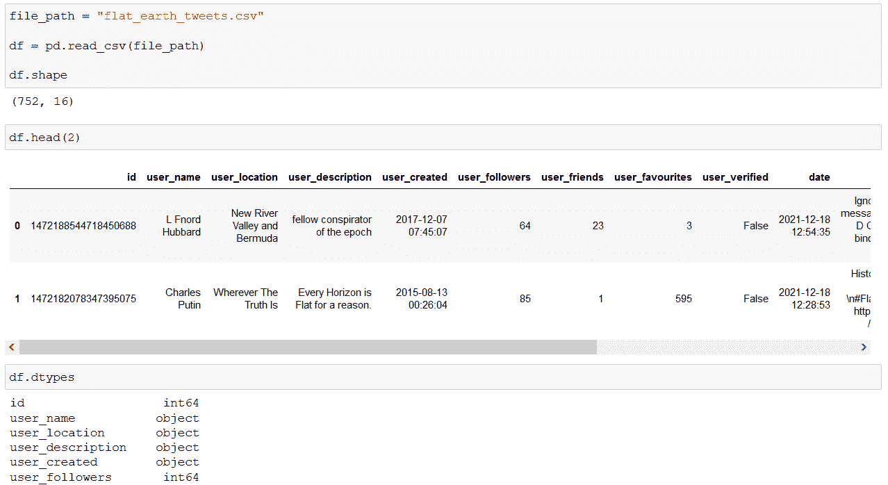*

*Screenshot by Author*

*Pandas *to_datetime* 方法可以用来转换这些值:*

*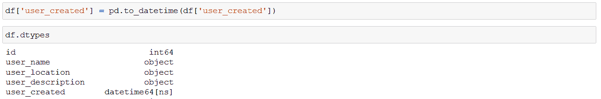*

*Screenshot by Author*

*有时候解析日期格式并不简单(至少对于 Pandas 来说)，但是我们可以提供格式参数来指定解析(这也加快了转换本身)。*

*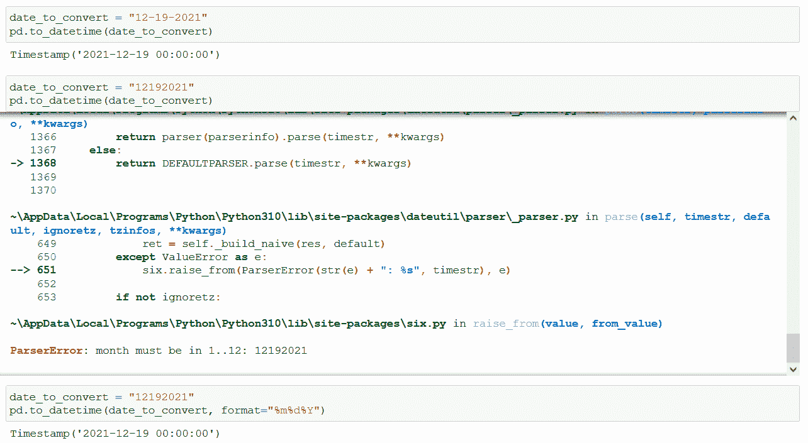*

*Screenshot by Author*

*在 format 参数中，您需要用特定的代码指定输入的日期格式(在上面的示例中%m 表示月，%d 表示日，%Y 表示年)。有关这些格式代码的完整列表，请参考[日期时间文档](https://docs.python.org/3/library/datetime.html#strftime-and-strptime-format-codes)。*

**to_datetime* 返回一个时间戳对象:这是对日期和时间数据进行编码的基本元素。*

## ***纳特***

*正如我们对数字类型(NaN)使用特殊的“null”值一样， *datetime* 也有自己的名称 *NaT* (不是时间)。例如，在将 *None* 转换为 *datetime* 时，或者在转换无法解析的数据时，我们会遇到这个值。 *to_datetime* 方法是用参数 errors = ' coefit '调用的:这意味着如果一段数据不能被解析，则不会返回任何值( *NaT* )。*

*在下面的例子中，我们从 DataFrame 列中创建 *datetime* 对象。第一个没有值:*

*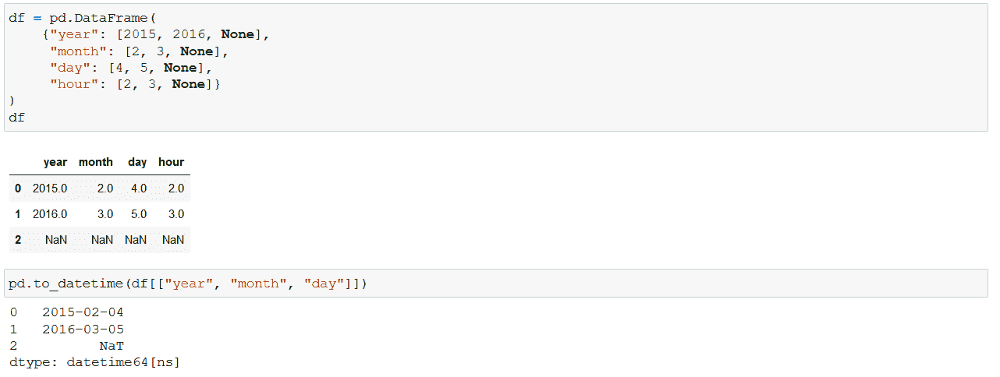*

*Screenshot by Author*

*第二个包含无效输入:*

*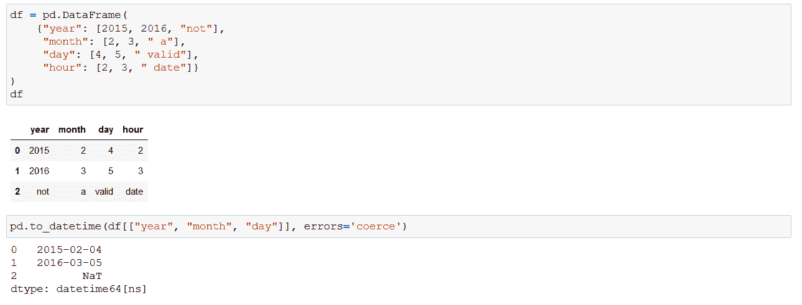*

*Screenshot by Author*

> *如果你想让我保持咖啡因创造更多这样的内容，请考虑支持我，只要一杯咖啡。*

**

## ***日期时间属性和方法***

*使用 *datetime* 确实是一件乐事的原因之一是这些对象中包含了大量的功能。链接的属性和方法是其中之一:我们都记得尝试在 Excel 中构建逻辑，例如，在不打开日历的情况下了解有关特定日期的更多信息—使用 Pandas，我们只需访问这些属性—例如，年、月或日:*

*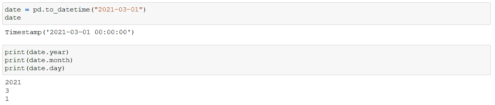*

*Screenshot by Author*

*我们可以使用*日期*或*时间*方法访问整个日期或时间段:*

*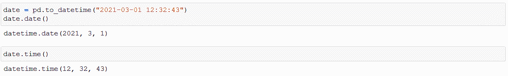*

*Screenshot by Author*

*想知道日期是星期几？ *dayofweek* 酒店在此提供帮助:*

*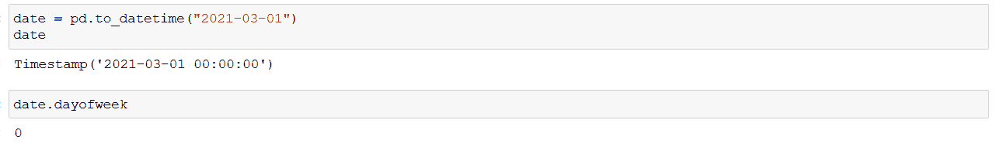*

*Screenshot by Author*

*注意，星期一是使用这种方法的第 0 天。*

*你总是忘记一个月有多少天吗？您已投保:*

*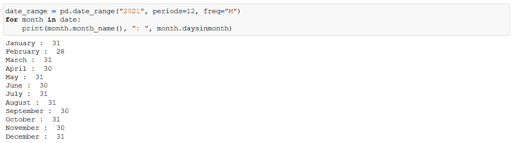*

*Screenshot by Author*

*目前不要担心日期范围，我将继续讨论它们。*

*假设您想在我们的平面地球数据中添加每个用户在 Twitter 上被创建的日期名称。我们可以使用 *day_name* 方法:*

*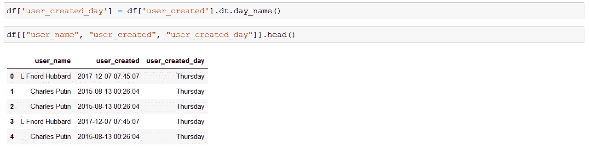*

*Screenshot by Author*

*不要这个。在调用 *day_name* 方法之前:如果我们在单个*时间戳*上调用它，就不需要这样做:*

*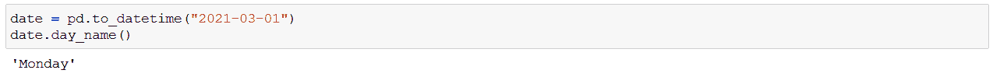*

*Screenshot by Author*

*我们在创建“user_created_day”列时需要它的原因是，我们对一个系列(包含 *datetime* 对象)调用了该方法:当我们想要访问系列值的 *datetime* 属性时，会使用这个 [datetime 访问器](https://pandas.pydata.org/docs/reference/api/pandas.Series.dt.html)。*

*有许多方法和属性无法在一篇文章中全部列出:请查看 [Pandas API 参考文献](https://pandas.pydata.org/docs/reference/arrays.html#properties)了解所有细节。要点:如果您正在考虑一种提取日期或一系列日期信息的聪明方法，该方法可能已经存在于 Pandas 中，您只需要知道要使用的正确方法或属性。*

## ***日期范围***

*例如，有时您需要使用预定义的时间段，即具有统一频率的时间戳序列，而不是使用由用户活动定义的时间数据。 [date_range](https://pandas.pydata.org/docs/reference/api/pandas.date_range.html) 方法返回一系列时间戳，包括预定义的开始日期、结束日期、周期数和频率——您必须提供这四项中的三项来精确定义范围:*

*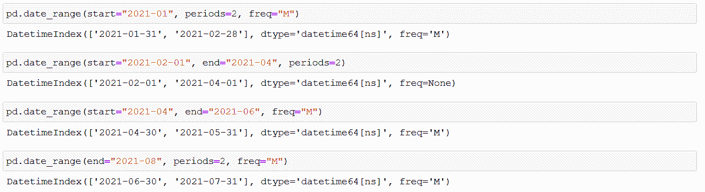*

*Screenshot by Author*

*请注意，频率的“freq”参数在几个月内得到一个“M ”,正如您可能已经猜到的那样，从每小时到商业季度末的频率，有一批所谓的[偏移别名](https://pandas.pydata.org/docs/user_guide/timeseries.html#offset-aliases)可供使用(想象一下)。*

*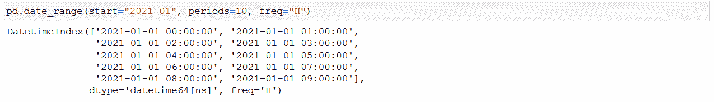*

*Screenshot by Author*

*如果需要，您甚至可以组合这些别名—下面的示例使用“2H3T”作为 freq 参数，代表 2 小时 3 分钟:*

*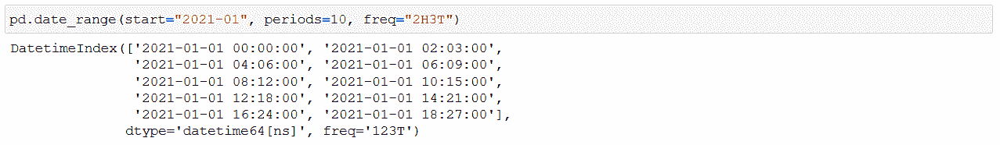*

*Screenshot by Author*

*当然，这些范围可用于在数据帧中创建序列，就像任何其他列表或数组一样:*

*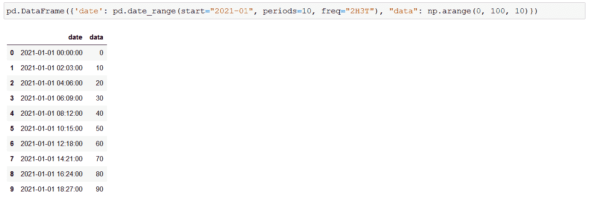*

*Screenshot by Author*

## ***部分字符串索引***

*可以使用解析到*时间戳*的日期和字符串对带有日期索引的系列或数据帧进行切片。例如，我们可以过滤特定年份:*

*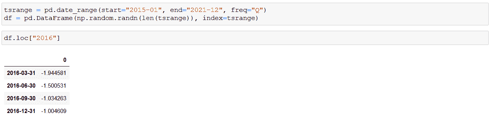*

*Screenshot by Author*

*几年的时间间隔也可以划分:*

*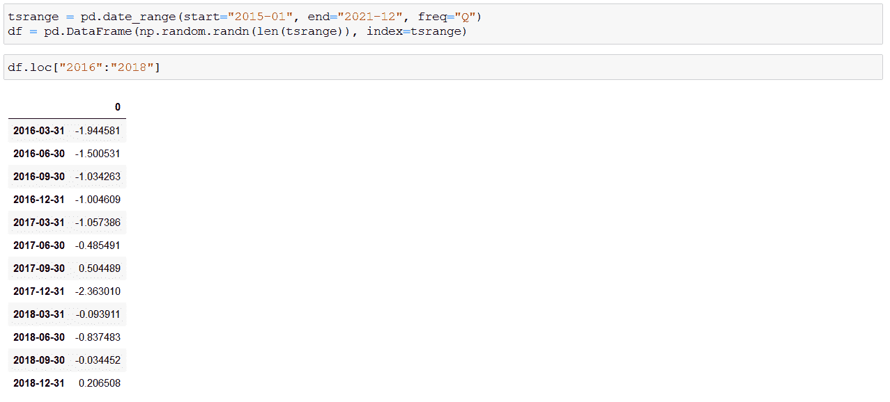*

*Screenshot by Author*

*当然，您可以将数据缩小到特定日期:*

**

*Screenshot by Author*

*将时间对象设置为索引(以防原始数据帧未加载索引)非常简单，DataFrame.index 属性可以替换为任何数组，只要其长度与数据中的行数相同:*

*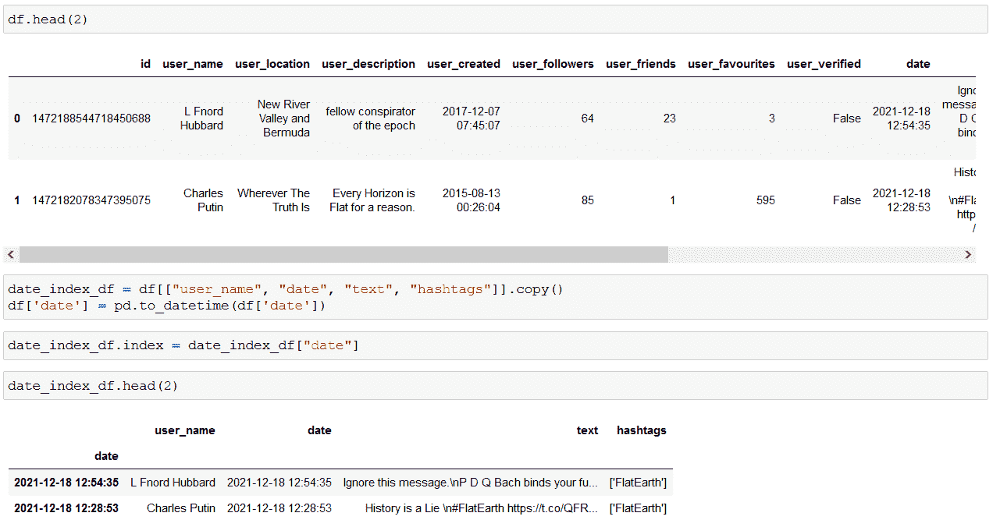*

*Screenshot by Author*

*现在，我们也可以使用部分索引按日期对数据进行切片:*

*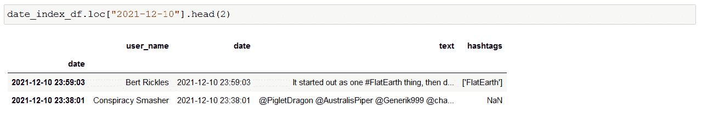*

*Screenshot by Author*

*在这篇文章中，我将重点放在时间戳上，我认为时间戳是熊猫日期和时间功能的核心。在第二部分中，我将继续探索时间序列能为您做些什么，研究时间戳的各种变化——比如时间增量、日期偏移量和周期。*