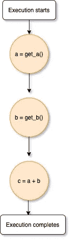
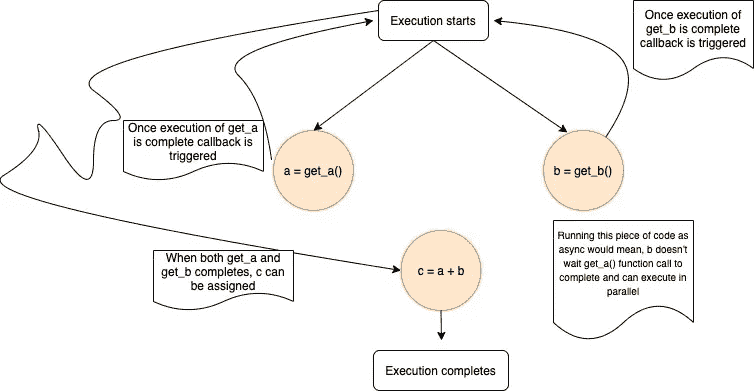
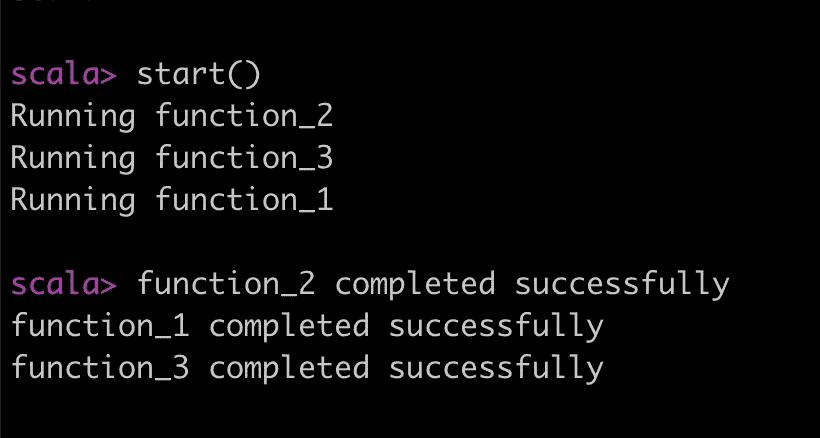
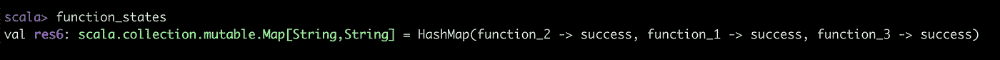

# 在 Scala 中处理未来

> 原文：<https://medium.com/geekculture/working-with-future-in-scala-c1f9462c9987?source=collection_archive---------13----------------------->

## scala 中的未来和回调入门

周末快乐！

不，这篇文章不是关于 scala 在 2030 年的样子，而是关于 Scala 未来的入门。

刚开始，我花了一些时间来熟悉 scala 中的 Future 和大量资源，以理解何时、如何以及为什么使用 Future/callback。有了经验，这里有一个指南，可以帮助像我一样需要开始接触 Scala 未来的人。


Photo by [Bradyn Trollip](https://unsplash.com/@bradyn?utm_source=unsplash&utm_medium=referral&utm_content=creditCopyText) on [Unsplash](https://unsplash.com/s/photos/sequence?utm_source=unsplash&utm_medium=referral&utm_content=creditCopyText)

我相信 scala 的未来就像 Javascript 的承诺，Javascript 也是*异步的*。如果你不熟悉 Javascript 承诺，不要担心，下面会澄清一切。

在开始理解未来、承诺或回调之前，让我们先试着理解一下*异步*是什么意思？

我们每天编写的代码以连续的方式执行，也就是说，同步执行。考虑下面这段代码:

```
a = get_a()  
b = get_b()  
c = a + b
```

**同步执行**



Synchronous execution

在同步执行中，下一个步骤等待前一个步骤完成，然后才进一步进行。同步调用中没有并行性。

流程图中描述了上述流程的执行流程。每一行都按顺序执行。

**异步执行**

在异步执行中，下一步不会等待上一步完成，即执行可以并行发生。

现在来回答这个问题，

*如果下一步没有等待上一步完成，我如何知道上一步何时完成或失败？*

为此，回调开始出现。异步调用的完成可以由回调控制，使用回调我们可以定义当执行成功或失败时如何继续。

在上面的代码中，考虑以异步模式运行的第 1 行和第 2 行:



Asynchronous execution of get_a and get_b

在设置了异步调用的上下文之后，让我们继续讨论 scala 的未来

**Scala 的未来**

如前所述，异步调用有助于并行运行代码(只要适用)，因为下一步直到上一步完成后才会被阻塞。

期货是 scala 中进行异步调用的方式。现在阅读关于并行性的文章，你脑海中可能出现的第一个问题是，我们不能只使用线程吗？我也是这么想的！

当然，Scala 多线程对于并行执行来说是现成的，但是在 Scala 中 Future 和 thread 的区别在于 Thread 不返回任何东西，而 Future 可以。因此，这取决于您想要使用的用例。

还有一点要注意的是，当 Future 运行时，它运行在一个新的线程上。这种线程管理由可配置的执行池属性负责。

**回调**

回调定义了如何处理未来的执行结果。最常见的期货回调是 *onComplete* ，我们可以定义在期货成功或失败的情况下做什么。
未来的返回值可以在这些回调中使用。

**在 scala 中书写你的第一个未来**

考虑这个用例，我们有三个功能:

*   功能 _1
*   功能 _2
*   功能 _3

所有的功能都是相互独立的，我们希望编写一个程序来并行运行所有的功能，并在失败/成功运行的情况下捕获功能的状态。

使用关键字`Future`定义 Future，如果它有返回类型，则像`Future[return_type]`一样定义它

这是使用 Future 的样子:

```
import scala.concurrent.Future
import scala.concurrent.ExecutionContext.Implicits.global
import scala.util.{Failure, Success}def execute(function_name: String): String = {
  println("Running " + function_name)
  # do something
  Thread.sleep(2000)

  function_name
}

var functions = Array("function_1", "function_2", "function_3")
val function_states: mutable.Map[String, String] = mutable.Map()

def start() = {
  functions.foreach(function => {
    # Execute functions in future which will return a string on completion
    var f = Future[String] {
      execute(function)
    }

    f.onComplete({
      case Success(return_value) => {
        println(return_value + " completed successfully")
        function_states(function) = "success"
      }
      case Failure(e) => {
        function_states(function) = "failed"
        e.printStackTrace()
      }
    })
  })
}

start()
```



The output of the above code



Function State after successful execution of all three functions

如上所述，所有三个函数与 future 并行运行，我们在这里使用回调来维护函数状态，以防 Future 运行成功/失败。这里使用的回调是 *onComplete* 。

当您使用函数时，如果您希望控制函数执行完成后要做的事情(这是通过回调实现的),了解未来有助于利用 scala 中的并行执行。

这只是冰山一角，未来还有比上面描述的更多的东西。有了对 executionContext 的理解，使用不同的回调、承诺等，如果您对本文的第 2 部分感兴趣，请留下评论。

快乐编码，
JD

**参考文献:**

[](https://github.com/jyotidhiman0610/medium-code/blob/main/scala/future.scala) [## jyotidhiman 0610/中等代码

### 在 GitHub 上创建一个帐户，为 jyotidhiman0610/medium-code 开发做贡献。

github.com](https://github.com/jyotidhiman0610/medium-code/blob/main/scala/future.scala) [](https://docs.scala-lang.org/overviews/core/futures.html) [## 未来和承诺

### 期货提供了一种推理并行执行许多操作的方法——以一种高效且无阻塞的方式。一个…

docs.scala-lang.org](https://docs.scala-lang.org/overviews/core/futures.html)