# 使用 Redis 上的列表。Net 6.0

> 原文：<https://medium.com/geekculture/working-with-list-on-redis-with-net-6-0-64f159f96b4e?source=collection_archive---------2----------------------->


[**The Brick-Making Women of India(National Geographic)**](https://www.pinterest.com/pin/the-brickmaking-women-of-india--316026098839115994/)

今天我们将讨论如何在 Redis 中使用累积数据。首先，Redis 不是一个缓存管理器工具。它是一个内存数据库。Redis 的意思是“远程词典服务”。Redis 中有五种不同的数据类型。今天我们将谈论“**列表**”。但是最终我们将不得不为新的商业规则改变我们的 Redis 数据类型。

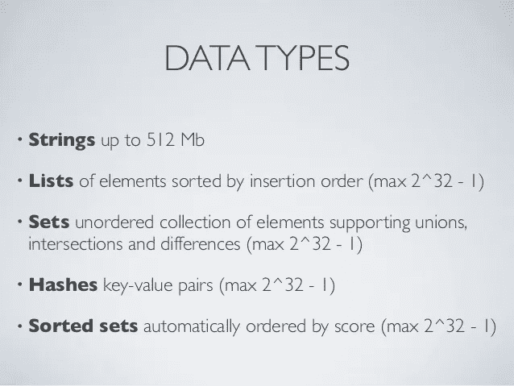

**场景**:我们有几个不同的类别。可以添加一个新的，也可以删除其中的任何一个。类别模型如下所示。我们将保存 Redis 上的所有类别，以提高我们的服务性能。

```
public class Category
{
   public int Id { get; set; }
   public string Name { get; set; }
   public int ParentID { get; set; }
   public DateTime CreateDate { get; set; }
}
```

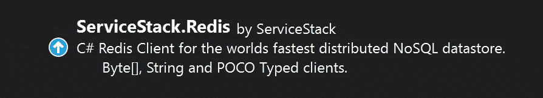

我们将在中为 Redis 使用 ServiceStack 库。Net 6.0

F第一种方法:

当我检查初级开发人员的代码时，我看到他将类别列表设置为带有键值对的 JSON 数据。当他向类别列表中添加一个新条目时，他获取 JSON 数据，反序列化它，向列表中添加一个新的类别条目，然后再次序列化，并将列表作为 JSON 设置到 Redis。这是不可接受的。对于大数据来说，这是一个性能杀手。

> *这种方法类似于从库中取出所有书籍，添加新书，然后将所有取出的书籍再次放回库中:)

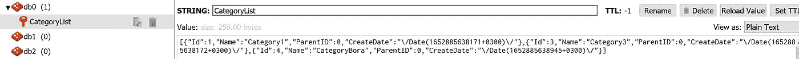

CategoryList Keeps in Redis as JSON

1.  我们创建了一些虚拟类别，并添加到“类别列表”

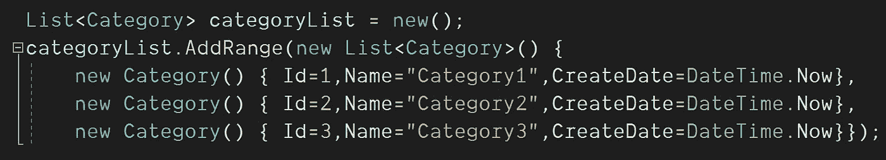

Dummy Category Items

2.我们设置了 Redis 连接服务器，得到了 Redis 客户端。

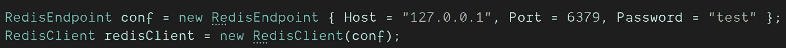

3.如上所示，我们将 Redis 的“CategoryList”设置为 JSON。又得到了“CategoryList”。

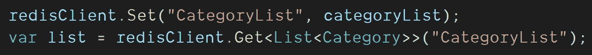

Set Current CategoryList to the Redis. And Got It back.

4.我们删除了类别 Id=2，添加了新的类别 Id=4，最后将“CategoryList”再次设置为 JSON。

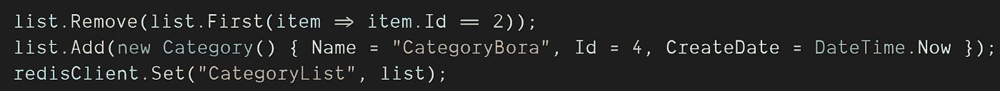

Remove “Category2” Add “CategoryBora”

5.最后，我们从 Redis 获得了所有的“CategoryList ”,并在一个循环中打印出来，如下所示。

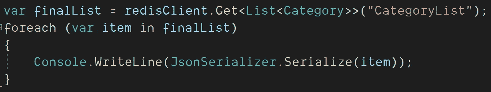

Print All CategoryList to the Screen

**Program.cs:**

```
List<Category> categoryList = new();categoryList.AddRange(new List<Category>() {
new Category() { Id=1,Name="Category1",CreateDate=DateTime.Now},
new Category() { Id=2,Name="Category2",CreateDate=DateTime.Now},
new Category() { Id=3,Name="Category3",CreateDate=DateTime.Now}});RedisEndpoint conf = new RedisEndpoint { Host = "127.0.0.1", Port = 6379, Password = "test" };RedisClient redisClient = new RedisClient(conf);redisClient.Set("CategoryList", categoryList);var list = redisClient.Get<List<Category>>("CategoryList");list.Remove(list.First(item => item.Id == 2));list.Add(new Category() { Name = "CategoryBora", Id = 4, CreateDate = DateTime.Now });redisClient.Set("CategoryList", list);var finalList = redisClient.Get<List<Category>>("CategoryList");foreach (var item in finalList)
{
   Console.WriteLine(JsonSerializer.Serialize(item));
}
```

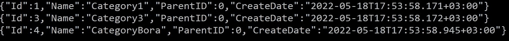

Result Screen

S第二种方法:

现在是时候给 Redis 中的“列表数据类型”一个机会了。当我们在列表中添加、更新或删除一个条目时，我们不必处理 Redis 中的所有数据。只处理一个项目，可能会提高性能。

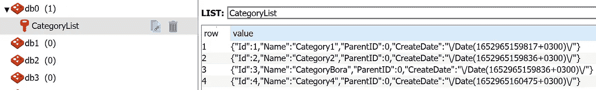

CategoryList Keeps in Redis as List

1.  我们在 Redis 上创建了“分类列表”。列表的类型是“类别”。它就像“*列表<类别>* ”。

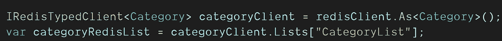

Redis Lists[“CategoryList”]

2.我们将所有类别批量插入 Redis 上的“CategoryList”。最后添加了一个新的“类别 4”而没有触及当前列表:)

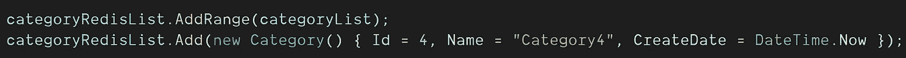

Bulk Insert CategoryList and Add Category4

3.从 Redis 列表中删除一个项目是非常痛苦的:)你必须找到将被删除的项目的索引。我用“Id==3”的“单个”过滤关键字得到了(值，索引)

我取出 removedCategory，将名称更改为“CategoryBora ”,并使用相同的索引号将其放回“CategoryList”。

***不是:(* removedCategory。Index-1 *)*** *因为删除了一项所以“当前索引号”= > 1 被删除。*

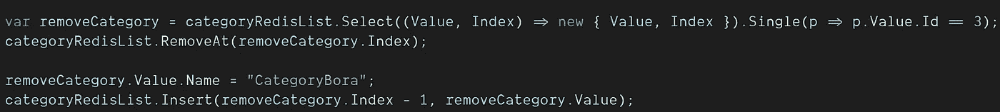

Remove Category 3, Change Name and Put It Back

4.我们从 Redis 得到了“目录列表”。我们在一个循环中打印了所有的项目，如下所示。

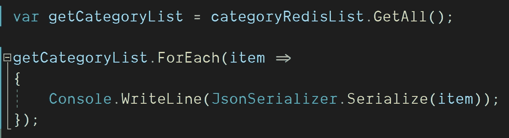

**Program.cs:**

```
List<Category> categoryList = new();categoryList.AddRange(new List<Category>() {
new Category() { Id=1,Name="Category1",CreateDate=DateTime.Now},
new Category() { Id=2,Name="Category2",CreateDate=DateTime.Now},
new Category() { Id=3,Name="Category3",CreateDate=DateTime.Now}});RedisEndpoint conf = new RedisEndpoint { Host = "127.0.0.1", Port = 6379, Password = "test" };RedisClient redisClient = new RedisClient(conf);//Create CategoryList on Redis and add all items to the list..
IRedisTypedClient<Category> categoryClient = redisClient.As<Category>();var categoryRedisList = categoryClient.Lists["CategoryList"];categoryRedisList.AddRange(categoryList);//Add new Category4 to the CategoryList
categoryRedisList.Add(new Category() { Id = 4, Name = "Category4", CreateDate = DateTime.Now });//Remove "Category Id=3" from the List with it's Index.
var removeCategory = categoryRedisList.Select((Value, Index) => new { Value, Index }).Single(p => p.Value.Id == 3);categoryRedisList.RemoveAt(removeCategory.Index);//Change the Name of Removed Category and put it back
removeCategory.Value.Name = "CategoryBora";
categoryRedisList.Insert(removeCategory.Index - 1, removeCategory.Value);//Get the CategoryList from the redis and print all items in a loop
var getCategoryList = categoryRedisList.GetAll();
getCategoryList.ForEach(item =>{
    Console.WriteLine(JsonSerializer.Serialize(item));
});
```

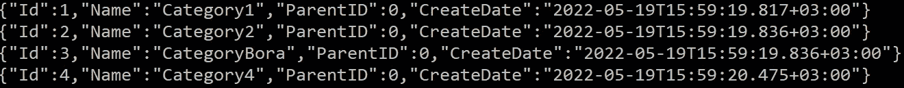

Result Screen

T **第三种方法:**

后来，我们从客户那里得到了一个新案例。"*每个类别都必须有一个到期时间。*“所以目前的 Redis Lists 数据类型解决方案到最后已经没用了。因为在列表中，我们无法为每个类别设置到期时间。只有我们可以为 Redis 列表中的类别组设置过期时间。所以批量过期时间对于客户来说是不可接受的。最后，上次我们在 Redis 中更改了数据类型。

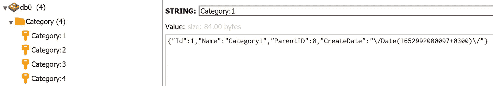

Every Category keeps in Category Group

1-)我们决定在 Redis 垂直增长。我们在“Category:”关键字下逐个添加了所有类别及其 id。“ ***类别*** ”是组的名称，“ ***id*** ”是每个类别的唯一标识。

> **"类别:{item。Id}**

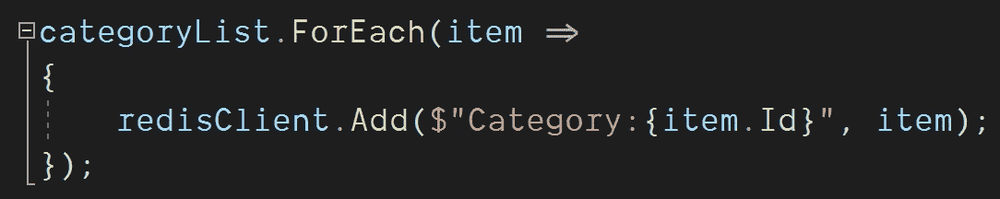

Set All Categories Under The Category: Keyword.

2-)我们在“Category:”关键字下添加一个新的“Category4”，其 Id 为“4”。

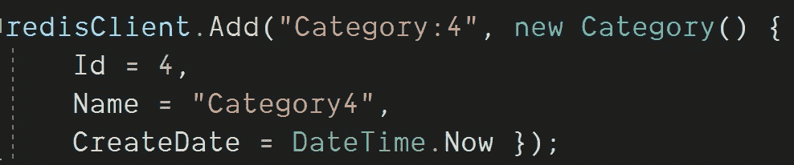

Add “Category4” under The “Category:”

3-)我们很容易通过关键字找到“类别 3”。对于列表数据类型，我们不需要任何索引来删除它。我们用“Bora”更改了“Category3”的名称，并通过使用它的“Category:3”关键字将其放回。

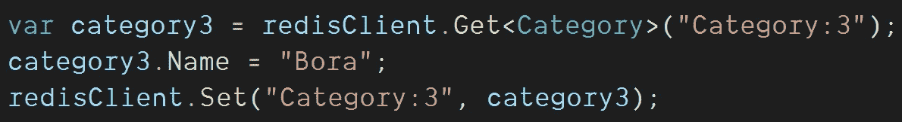

We Found “Category3” And Update It

4-)我们选择所有带有“**类别*** ”关键字的类别。我们称之为 Lua 脚本。我们过滤了所有 Redis 条目，即从“*”关键字开始。我们检查了是否有以“Category”关键字开始的项目。如果结果是肯定的，我们得到了它们，并按它们的“Id”排序。最后，我们把它们都打印到屏幕上。*

*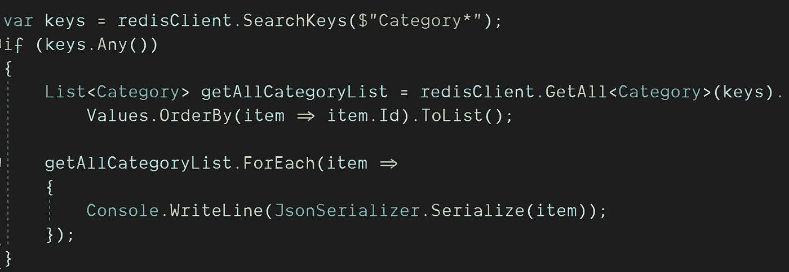*

*All Categories Printed One By One*

***Program.cs:***

```
*List<Category> categoryList = new();categoryList.AddRange(new List<Category>() {
new Category() { Id=1,Name="Category1",CreateDate=DateTime.Now},
new Category() { Id=2,Name="Category2",CreateDate=DateTime.Now},
new Category() { Id=3,Name="Category3",CreateDate=DateTime.Now}});RedisEndpoint conf = new RedisEndpoint { Host = "127.0.0.1", Port = 6379, Password = "test" };RedisClient redisClient = new RedisClient(conf);//We added all categories under the "Category:" with theirs Ids.
categoryList.ForEach(item =>
{
   redisClient.Add($"Category:{item.Id}", item);
});//We add new "Category4" to under the "Category:" keyword.
redisClient.Add("Category:4", new Category() { Id = 4, Name = "Category4", CreateDate = DateTime.Now });//We Found “Category3” And Update It.
var category3 = redisClient.Get<Category>("Category:3");
category3.Name = "Bora";
redisClient.Set("Category:3", category3);//All Categories found with "Category*" keyword and printed one by one to the screen.
var keys = redisClient.SearchKeys($"Category*");
if (keys.Any())
{
   List<Category> getAllCategoryList = redisClient.GetAll<Category>(keys).Values.OrderBy(item => item.Id).ToList(); getAllCategoryList.ForEach(item =>
   {
      Console.WriteLine(JsonSerializer.Serialize(item));
   });
}*
```

**

*Result Screen*

***结论:***

*Redis 不是唯一的键/值内存管理工具。它是一个内存数据库。在 Redis 中，你可以用几种方式保存你的数据。垂直增长对 Redis 来说不是性能问题。但是在 Redis 中以 Json 的形式保存大数据在高流量时可能会有问题。序列化和反序列化是高成本操作。我在这篇文章中试图解释的是，“如果你把你的数据分开，放在一个有唯一标识的组中，你可以解决你的性能问题”*

*下一篇文章再见。再见。*

**“如果你读到现在，首先感谢你的耐心和支持。欢迎大家来我的博客*[](http://www.borakasmer.com/)****了解更多！”*****

****来源:****

*   **[**https://redis.com**](https://redis.com)**
*   **[**https://redis.io/docs/manual/programability/eval-intro/**](https://redis.io/docs/manual/programmability/eval-intro/)**