# 在角度单元测试中与间谍一起工作

> 原文：<https://medium.com/geekculture/working-with-spies-in-angular-unit-test-71c1b9583208?source=collection_archive---------37----------------------->

# 介绍

在《Angular 中的 [**单元测试的上一篇教程中，我们介绍了您应该遵循的常见测试用例模式，并内置了您在编写测试用例时可以使用的匹配器。然而，随着应用程序变得越来越复杂，一个函数可能会与多个函数链接起来，这使得对单个函数进行**单元测试**变得更加困难。单元测试的思想是将应用程序分成多个单元，然后一次测试一个。这就是茉莉间谍发挥作用的地方。**](https://simpleweblearning.com/tag/unit-test-in-angular)

# 什么是间谍？

间谍是 Jasmine 中的一个特性，它允许你**监视某些东西**以达到以下目的:

1.  监视是否调用了一个函数以及传递给它的参数
2.  覆盖函数返回值或属性，以模拟测试期间的期望情况
3.  完全覆盖函数的实现

Spy 可以用于属性和函数，包括 window 对象中的 natvie 函数、组件中定义的函数，甚至 API 调用。

尽管 Spies 可以用于 API 调用，但是您只能覆盖返回值，而不能覆盖 HTTP 状态代码。我们将在另一章讨论如何处理异步 API 调用。

基本上来说，只要你想在测试中覆盖函数，间谍将是你的解决方案。

# 如何使用间谍

对于这一部分，我们将使用下面的代码来演示如何在单元测试中使用 Spies。

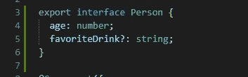

Person Interface

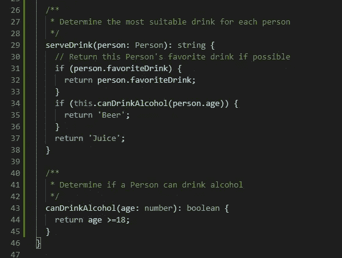

serveDrink and canDrinkAlcohol function

使用间谍的基本语法是:

spyOn( **要窥探的对象**，**要窥探的函数或属性**)

间谍接受两个论点:

1.  你想监视的对象
2.  要监视的对象的函数名或属性名

## 测试函数是否被调用

在上面的示例代码中，我们期望在调用**served link**时会调用 **canDrinkAlcohol** 函数。

我们可以用下面的测试用例来测试这种行为:

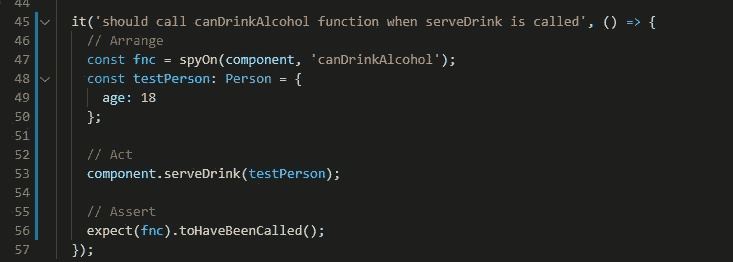

Test if function is called

在第 47 行，我们设置了 spy 并将其保存到一个名为 **fnc** 的变量中。
在第 53 行，我们调用了**served link**函数。
在第 56 行，我们测试我们监视的函数是否被调用了。

注意，spy 必须在调用函数之前设置**。如果我们将第 53 行放在第 47 行之前，测试将会失败，因为我们实际上是在函数已经被调用之后才窥探它的。**

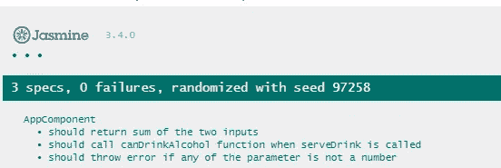

Test function called result

## 传递给函数的测试参数

canDrinkAlcohol 期望它的调用者传入年龄信息。我们可以用下面的测试用例来验证参数确实被传递给了它。

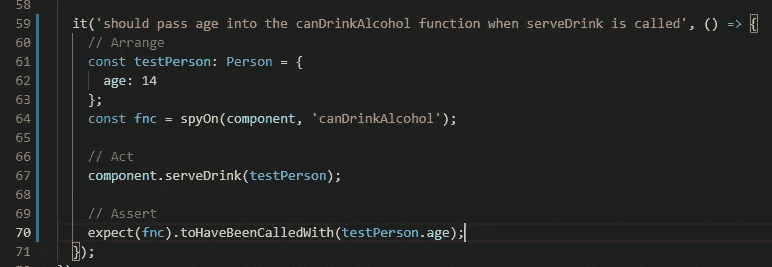

Test function is called with correct argument

测试用例与前一个非常相似。我们仅将匹配器功能更改为**来调用**匹配器。

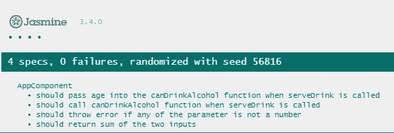

Test function argument result

## 测试函数被调用的次数

如果你想测试一个函数被调用了多少次，你可以遵循下面的测试用例。

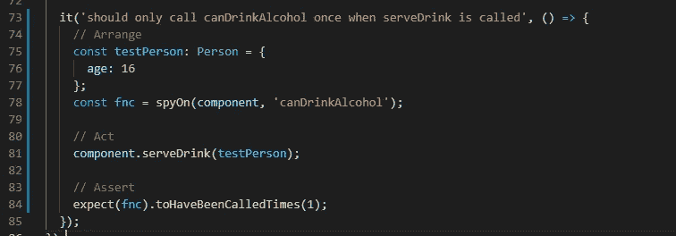

Test number of times a function is called

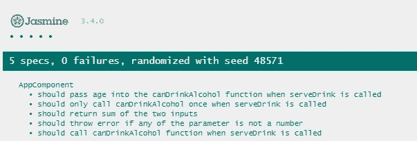

Test number of times a function is called result

当您有一个循环并且函数被调用的次数与数组的大小有关时， **toHaveBeenCalledTimes** 匹配器特别有用。

## 覆盖被探测对象的返回值

在某些情况下，您希望子函数返回特定的值，以便 TestSuite 可以测试您想要测试的 if 语句路径。

例如

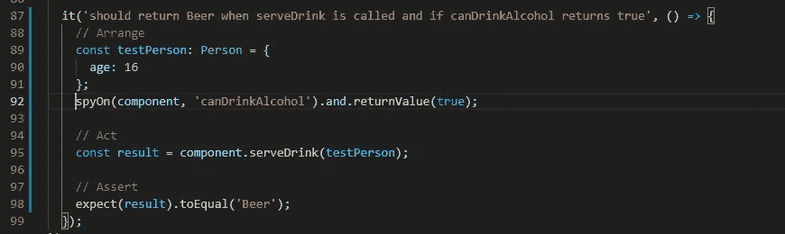

Override function return value test case

在第 89 行，我们准备了将在这个测试用例中使用的虚拟数据。请注意，只有当输入参数 age 大于或等于 18 时，我们的 **canDrinkAlcohol** 函数才会返回 true。然而，在第 92 行，我们通过用 **returnValue** 函数链接我们的 spy 对象来覆盖 **canDrinkAlcohol** 的返回值。也就是说，不管输入参数是什么，不管这个函数是如何实现的， **canDrinkAlcohol** 函数总是在被调用时返回 true。

然后在第 98 行，我们检查当 **canDrinkAlcohol** 函数返回 true 时**served link**是否会返回 Beer。

注意。还有一个名为 **returnValues** 的函数，它允许你传入多个参数。例如:

spyOn(component，' canDrinkAlcohol ')和. returnValues(true，false)；

上面的语句意味着在第一次调用 canDrinkAlcohol 函数时，返回 true，在第二次调用 canDrinkAlcohol 函数时，返回 false。

## 测试用例中的覆盖函数

假设您希望完全覆盖子函数的实现，而不是返回值，您可以使用下面的方法。

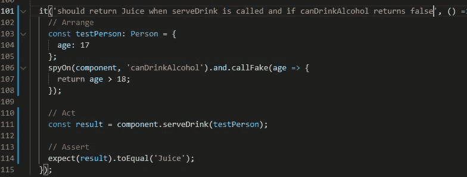

Override function in test case

在第 106 行，我们用 **callFake** 函数链接我们的 spy。当指定 callFake 时，TestSuite 将执行假函数，而不是 ts 文件中定义的实际函数。

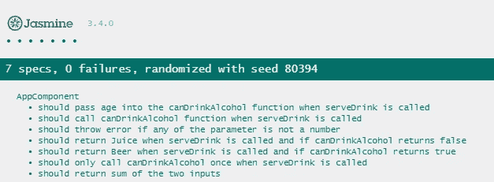

Override function result

# 结论

在本教程中，我们已经介绍了如何在单元测试中使用间谍。掌握 Spies 将允许你编写大量覆盖良好的测试。在角度 的 [**单元测试的下一个教程中，我们将使用本章所学内容来演示如何测试角度组件。**](https://simpleweblearning.com/tag/unit-test-in-angular)

原帖:
[https://simple web learning . com/working-with-spies-in-angular-unit-test](https://simpleweblearning.com/working-with-spies-in-angular-unit-test)