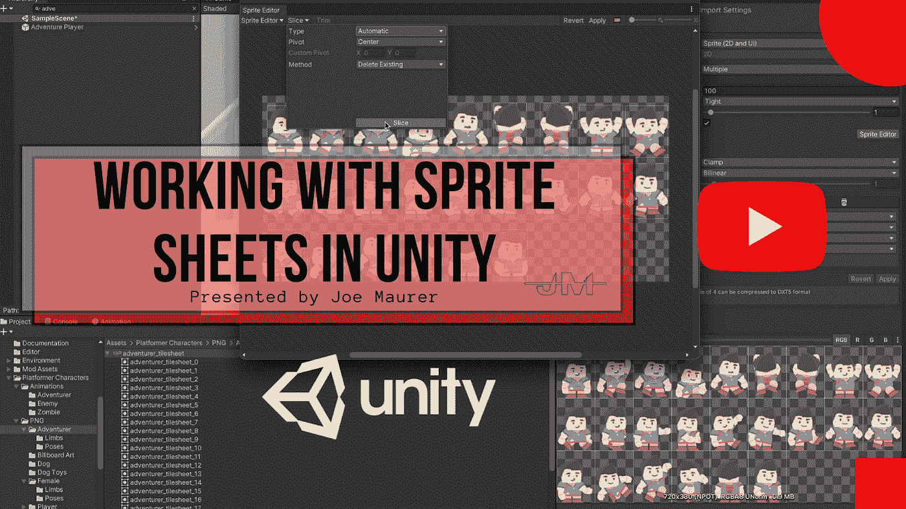
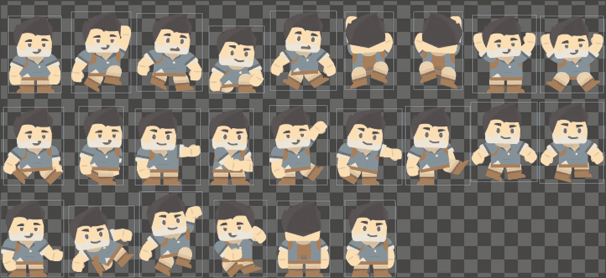
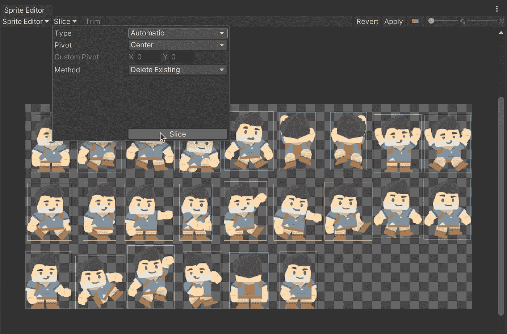
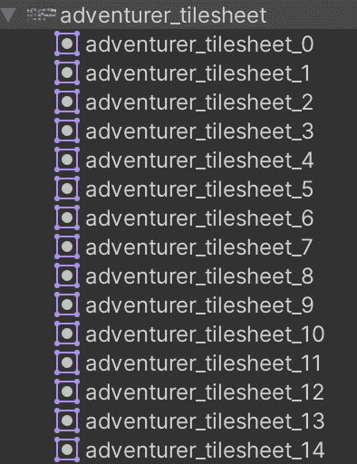
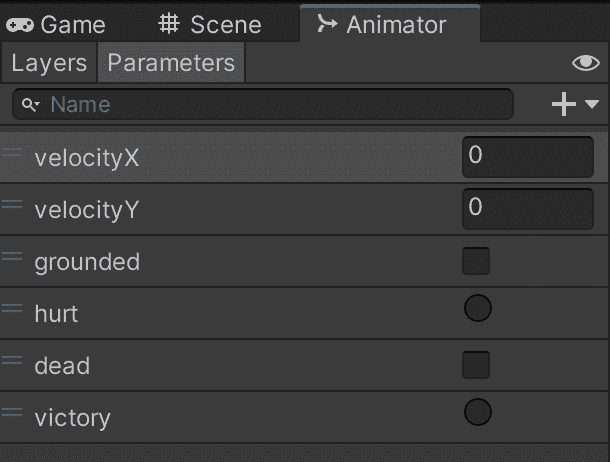

# 在 Unity 中使用精灵工作表

> 原文：<https://medium.com/geekculture/working-with-sprite-sheets-in-unity-d30278832370?source=collection_archive---------19----------------------->

精灵是 Unity 游戏中至关重要的一部分。其中一部分是如何对包含多个图像的 sprite 进行切片。我将花一些时间来看一个基本的例子，如何分裂一个精灵，并把它连接到一个动画 2D 平台游戏！我们开始吧！

首先，你需要从某个地方获得一个精灵表。这里有一个链接，链接到我为这个项目获得平台角色的地方。

一旦导入到 Unity，你将需要拼接精灵。你可以通过多种方式做到这一点，但我建议先看看 Unity 是否能自动识别每张图片。为此，使用自动模式，如下图所示。

完成后，您会在表单中的每个图像周围看到一个浅灰色框。点击“应用”,让 Unity 在幕后发挥魔力，将每张图片切割成可用的资产。当您可以展开工作表并看到附加的每个图像时，您就知道已经完成了。大概是这样的:

此时，你可以开始为你的角色制作动画了。在我的基本例子中，这只是涉及到交换每一个可能状态的精灵成为正确的图像。

专业提示:在你的动画师中暴露大量的变量，这样很容易告诉你的玩家如何移动！

然后你就完事了！你现在有一个简单的方法来控制你的播放器，这样你就可以制作一个很酷的游戏了！

**我希望这个建议有所帮助！关注我的** [**推特**](https://twitter.com/maurerpwer) **了解更多技术技巧！**