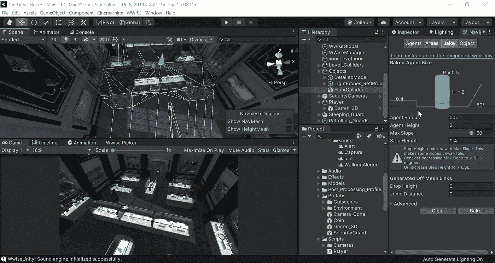
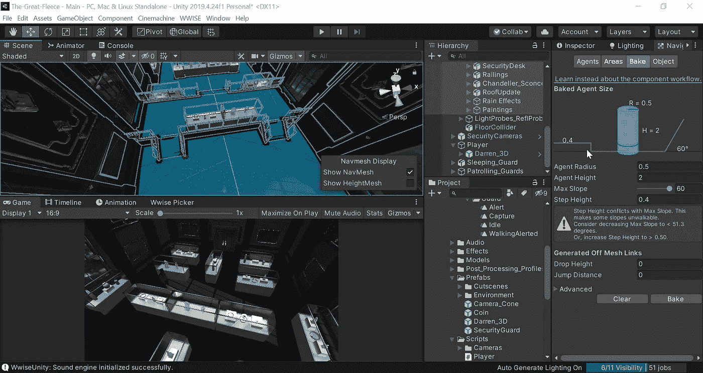
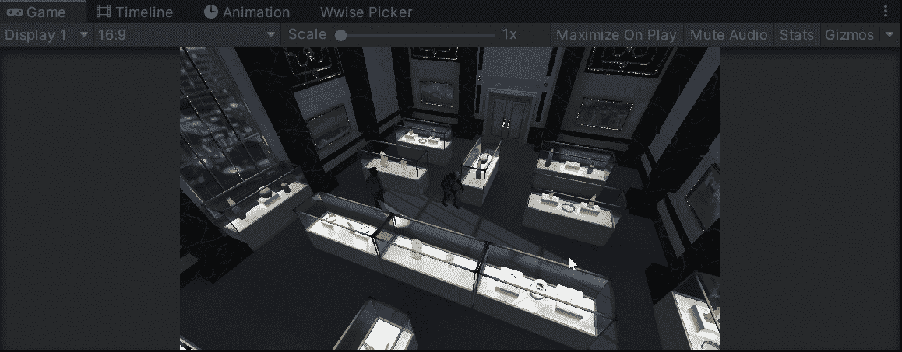

# 使用 Unity 的导航网格系统

> 原文：<https://medium.com/geekculture/working-with-unitys-nav-mesh-system-c8f6a1c2da2e?source=collection_archive---------21----------------------->

昨天，我们为我们的**玩家动作创建了一个**点击系统**。**但不是传入**向量**并用**变换在它们之间移动。翻译**，我们可以利用 **Unity 的 Nav Mesh 系统。**

稍后，我们将使用它来创建由人工智能控制的在博物馆巡逻的警卫，所以为什么不让我们的**玩家**使用同样的系统。

为了创建一个**导航网格**我们需要在 **AI** 部分打开我们的**导航窗口**。然后在**烘焙选项卡**中，我们可以选择我们的**地板**并**烘焙它，**允许 **Unity** 绘制出所有可以行走的表面。

我们现在分配的任何 navmeshemagents,在它们的运动中都将被限制在这个空间内，省去了计算各种不同限制的需要。虽然如果我们要包括我们的障碍，以防止任何代理剪辑，我们可以重新选择这些选择。

