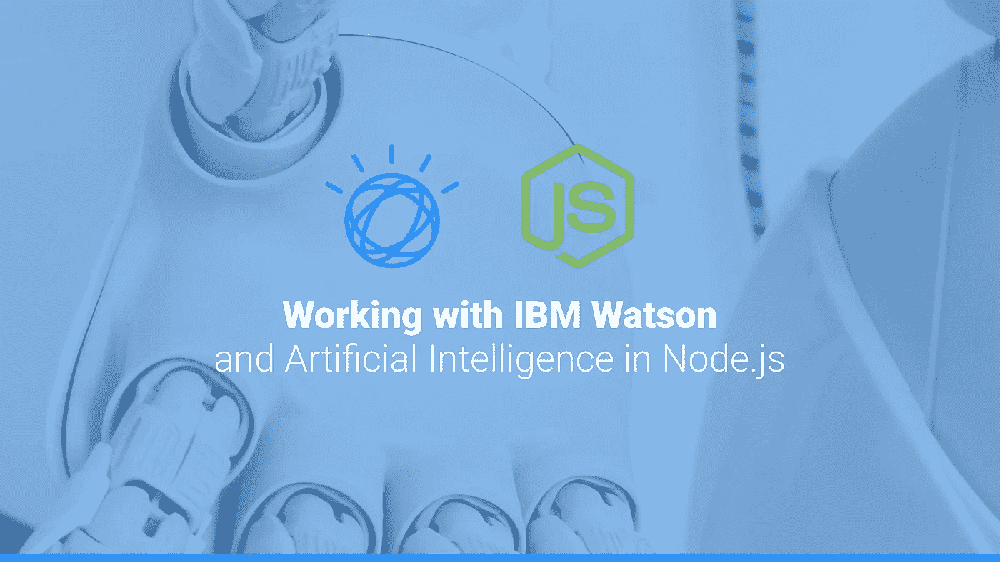
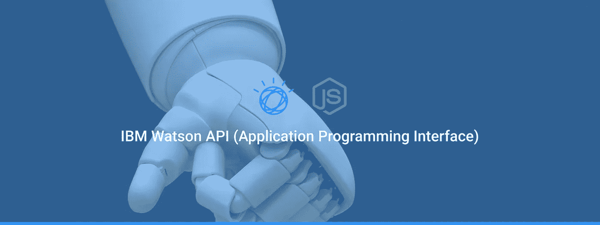
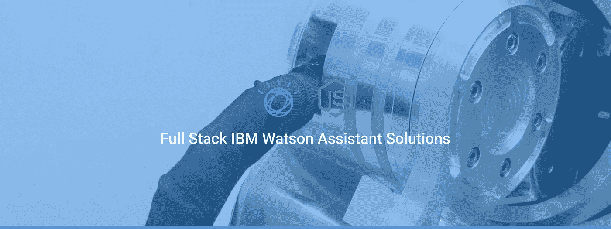

# 在 Node.js 中使用 IBM Watson 和人工智能

> 原文：<https://medium.com/geekculture/working-with-watson-be52ba7e9166?source=collection_archive---------46----------------------->

你可能一直想要一个助手，一个虚拟的商业助手来完成你的日常任务——一个检查、验证和批准结果的提醒。专注于补救任务，并将其转化为一个完整的事件，将重要流程的每一步都一气呵成。

沃森做到了，嗯，它可以。 *Dialog* 以你说话的方式工作——更确切地说，可能是，就像你在进行一场对话， *intents* ，它们监控你的类型交换的质量，并返回你的请求描述过程中某个步骤的精确程度的分数。

 [## 使用自然语言处理(NLP)构建应用程序| IBM Watson

### NLP 是一种人工智能，它说的是你的业务语言。与 IBM 合作构建解决方案，在三年内实现 383%的投资回报率…

www.ibm.com](https://www.ibm.com/watson/natural-language-processing) 

## **IBM Watson API(应用编程接口)**

**你可能想知道这个时代伟大的聊天机器人有多少是造出来的？如此多的人和企业是如何开发人工智能解决方案并如此快速地交付它们的？**

****

**W 好吧，你的答案是，事实上，经常有应用程序接口访问预先训练好的数据集，这些数据集将逻辑自然语言(NLP)转换成持久对话。你可以用许多编程语言来实现这一点，但是今天一个非常流行的方法是 Node.js，你正在使用的浏览器，很可能使用相同的技术。**

 **[## 沃森助手 v2 - IBM 云 API 文档

### IBM Watson ™助手服务结合了机器学习、自然语言理解和一个集成的…

cloud.ibm.com](https://cloud.ibm.com/apidocs/assistant/assistant-v2?code=node)** 

# **IBM Watson AI 入门**

****

**如果您熟悉 POST 请求，那么您可以开始在 Curl、JAVA、Node、Python、Go、.NET，Ruby，Swift，甚至 Unity——没错，华生，在你的游戏引擎里。**

**对于任何基于 PHP、JavaScript、Python、Go、C#和 Ruby 语言的人来说。有很多选项可以让你构建 Watson，通过一个应用程序当然是主要目标，但是刚刚开始只需要一个命令行工具。**

****成功秘诀:****

1.  **)如果你想直接与 Watson 建立连接，请使用完整的助手 URL，它有一个内置的会话。**
2.  **)想要更多地参与进来？创建一个应用程序来获取并返回会话 Id，并使用它来为您的消息创建帖子。**
3.  **)我看到您心里有一些计划，所以您真的想用 JSON 格式连接一个数据库，这样您就可以开始用日志构建开发的响应。**

**用 Watson 构建比用嵌入式脚本获取和发布更容易，嵌入式脚本使你的 web 助手能够将你的*对话框*和*意图*变为现实。如果你想在流程方面更进一步，甚至有 [web-hooks](https://cloud.ibm.com/docs/assistant?topic=assistant-dialog-webhooks) 和 [cloud functions](https://cloud.ibm.com/functions/) 可以与 Twilio 或 Slack 这样的通用 API hubs 进行消息传递。**

> **在预测解决方案之前，理解框架总会有很大的成功，使用无代码工具构建可以告知您未来的步骤和大规模的项目计划。**

** [## 沃森工作室-概述

### 构建、运行和管理人工智能模型。使用开源代码或可视化建模在任何云上准备数据和构建模型…

www.ibm.com](https://www.ibm.com/cloud/watson-studio)  [## 人工智能驱动的自动化——沃森编排

### 介绍沃森编排。专业人士的个人人工智能。自动化您的工作。收回你的时间。

www.ibm.com](https://www.ibm.com/cloud/automation/watson-orchestrate) 

为客户、合作伙伴、企业和用户的需求精心打造敏锐的解决方案对你的目标非常有帮助。简化耗费时间且可能更有趣的上下文问题、流程和日常流程将自然地展现在沃森生态系统中。

通过一个全天候的通用解决方案，做更多的事情，卖更多的东西，进行更多的交流，与全球更多的人联系，随时为您的用户提供支持。

# 全栈 IBM Watson 助手解决方案

您可能想知道如何构建自己的解决方案，当您的受众很大时，或者您希望替换遵循类似逻辑的必要业务事务时。API 可以根据业务进行定制，并且可以进行翻译，甚至请求超出 Watson 解决方案范围的需求。

幸运的是，Watson API 非常灵活和简单，更不用说它返回并接受 JSON (JavaScript 对象符号)，这使得使用 JavaScript 对象对许多人来说是一个非常解释性的解决方案。

 [## GitHub-collected view/Node-Watson:Chatbot 全栈应用- React、Redux、Axios、Node &…

### 聊天机器人全栈应用程序-由 IBM Watson 支持的 React、Redux、Axios、Node & Express 开发虚拟助手…

github.com](https://github.com/collectedview/node-watson) 

如果你熟悉 JavaScript，你可以在 [GitHub](https://github.com/collectedview/node-watson) 上找到最近构建的带有开源代码库的 Watson 解决方案。我想提一下，Nicholas Renotte 在 YouTube[上的演示也提供了这一功能，我从他的视频开始，并将其改编为我的解决方案。](https://www.youtube.com/watch?v=D_doogJln14)

> 这个应用程序用 Express 在 Node 中路由，通过 Axios 代理 React，用 Redux 处理响应，然后用 React 钩子更新 UI 状态。

发现自己想要添加更多内容？欢迎您使用这个简单的框架，一定要感谢创建者，归功于 Watson，并留下评论。如果您觉得这很有用，这可能是一个很大的开始，但它肯定值得自由构建以找到 Watson 的开发路径。

# 感谢阅读，继续讨论！

寻找更多的应用程序开发建议？在 [Twitter](https://twitter.com/collectedview) 、 [GitHub](https://github.com/collectedview) 和 [LinkedIn](https://www.linkedin.com/in/collectedview) 上关注。在线访问最新更新、新闻和信息，网址为 [collectedview.io](https://collectedview.io/) 。**