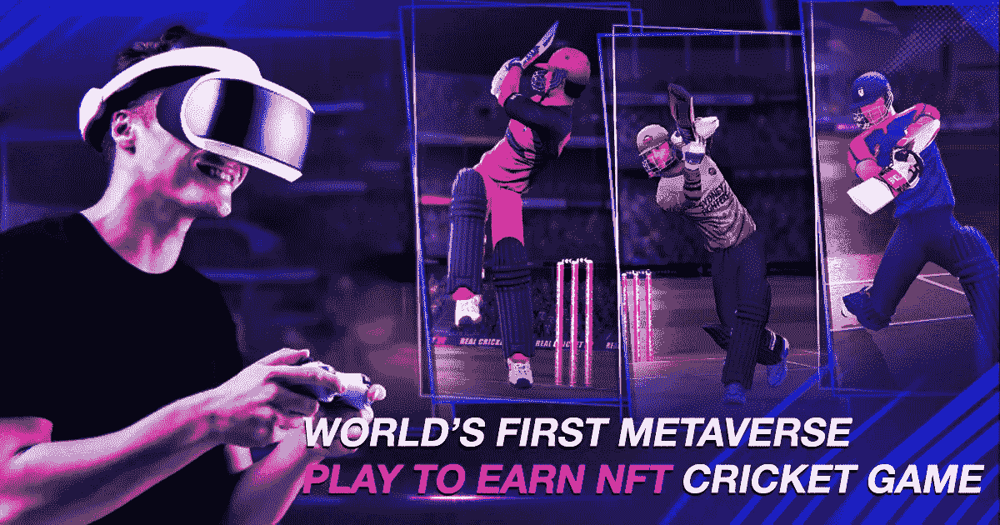
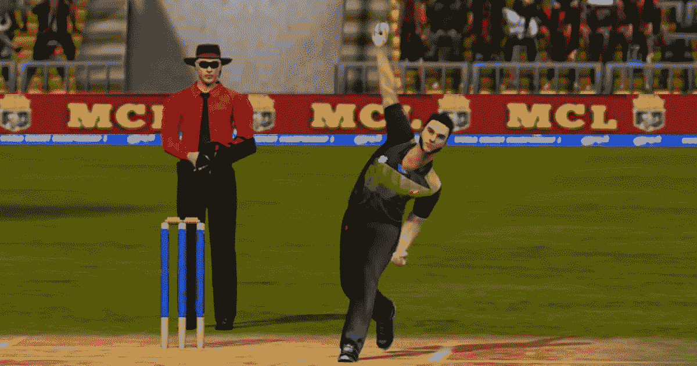

# 世界上第一个赢得 NFT 板球比赛的元宇宙选手！

> 原文：<https://medium.com/geekculture/worlds-first-metaverse-play-to-earn-nft-cricket-game-f82c9131b978?source=collection_archive---------9----------------------->

## **用元板球联赛游戏重新定义板球**

如果你问一个板球迷板球对他们来说意味着什么，我们会滔滔不绝地说下去。我们所有人都希望至少有一次能在体育场现场观看板球比赛，得到我们最喜欢的板球明星的签名，甚至得到我们最喜欢的球队的官方商品。这就是板球对我们许多人的意义。这一直是一件情感上的事情。我们也一直在关注这项运动带给我们的更多。按照这个顺序，元板球联赛为球员和观众都增添了趣味。围绕着粉丝和观众对**的期待，有很多猜测和期待。让我们祝愿一切顺利！**

**关于元板球联盟的大肆宣传是怎么回事？**

**从沟板球到在梅塔打板球，每一个板球迷都伴随着这项运动成长。虽然任何与板球有关的事情都会让板球爱好者兴奋不已，但让我们来看看元板球领域有什么。**

****

****Meta Cricket League****

**Meta Cricket League 是 Jump 推出的一款 NFT 游戏。交易一个即将到来的国际 NFT 市场。该市场标志着其进军 meta verse 游戏，并吸引了来自。它还获得了板球界的赞誉。市场使得用户能够购买属于元板球联盟 NFT 和元板球联盟球棒 NFT 的 NFT。用户需要有一个跳转。交易 [**板球 NFT**](https://jump.trade/?fsz=Karthik) 成为元板球联盟的一部分。跳。trade 现在为用户提供了组建自己的 Meta 板球队的机会，并通过赢得比赛来获得奖励。**

> **“为赢而战，但要享受乐趣。”~大卫·奥格威**

**现在，**元板球联赛游戏的玩法会如何？****

**当然，作为板球迷，我们会有很高的期望！让我们保持这个高度。**

*   **元板球联盟游戏可能有“我的玩家模式”或“超级明星模式”，其中玩家可以指导单个角色并构建他的职业生涯。这个功能将使用户能够跟踪玩家的投资组合，建立他的外观，等等。从球衣到配件和工具都可以作为 NFT 使用。基于每个玩家的优势，NFT 的价格可能会飙升。**
*   **可能会有一个拍卖，你可以购买你的球员，并建立你的球队。你也可以根据每个球员的表现和价值来交换你的球员。**

****

****Meta Cricket League game****

*   **一个动态的难度系统可以让游戏对新手和职业玩家的包容性更强。通过跨越每一关，玩家可能会获得令人兴奋的奖励。**
*   **与元板球联盟蝙蝠 NFTs，你可以获得自己的传奇签名蝙蝠。场上的球员可以使用这些球棒。这些球棒可能带有击球风格，包括防守型、平衡型、激进型和野蛮型。因此，根据你选择的球棒，你会有一个不同的和独特的击球。**
*   **VFX 和 3D 运动图形在为用户提供身临其境的体验方面发挥着非常重要的作用。增强现实和虚拟现实耳机将刺激你面前的整个体育场。还能听到观众跳起来给我们加油。更有理由感到兴奋！**
*   **在元宇宙，游戏机制将会升级和更新。这可能总是有助于增强整体体验。在先进的人工智能的帮助下，球员的众多相机角度和专业板球运动员的真实动作捕捉可以将体验提升到一个全新的水平。**
*   **可能会有一个竞争性的多人游戏模式，玩家可以面对面地进行游戏。场上的球员可以和其他球员近距离互动。全球志同道合的球迷可以在元板球联盟平台上走到一起。**
*   **除了观众的能量，我们爱听的另一件事是解说。双语评论系统也是可以期待的。**
*   **元宇宙最大的好处是你可以变换到任何你想去的地方。这意味着你可以在你选择的体育场比赛。想象一下在元宇宙的主教堂里玩耍。(内心喜悦的尖叫)。**
*   **据说 NFT 要进军 Meta 的房地产市场。这意味着你可以在元宇宙拥有一块土地，并建立自己的体育场。用户也可以拥有和交易这些体育场。**

****结束****

**整个元宇宙王国肯定会让我们大吃一惊。 [**元板球联赛**](https://jump.trade/?fsz=Karthik) ，作为元宇宙中基于板球的游戏的前沿，肯定不会让粉丝失望。所以，保持高期望值！游戏开始了！**