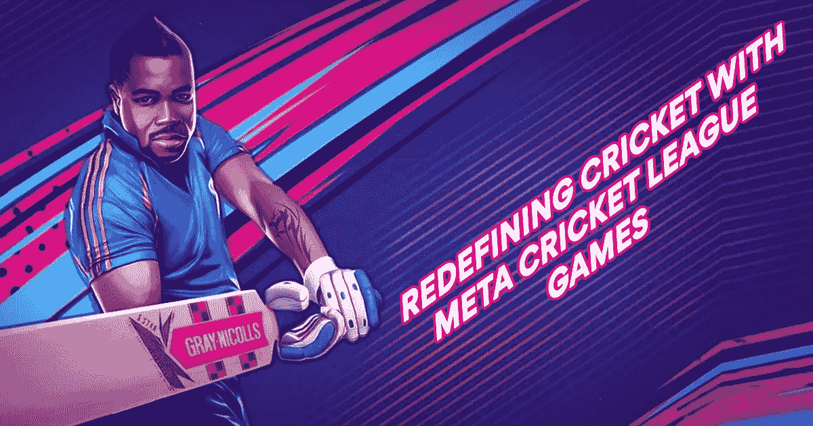
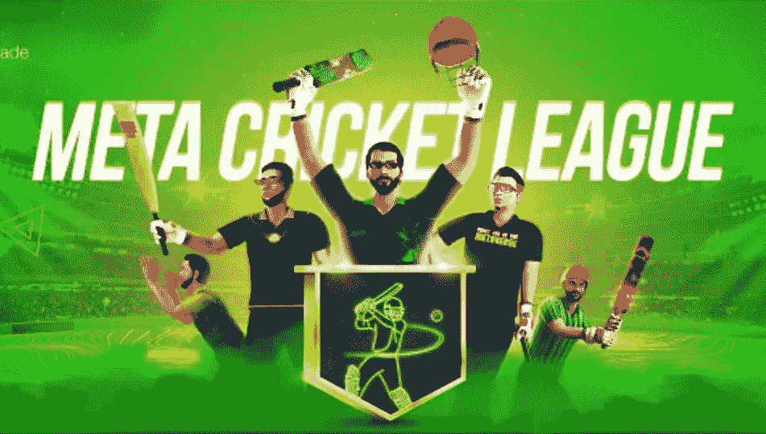

# 世界上第一个赢得元宇宙板球比赛的游戏-元板球联盟即将推出！

> 原文：<https://medium.com/geekculture/worlds-first-play-to-earn-metaverse-cricket-game-meta-cricket-league-is-about-to-launch-3df184af9ec1?source=collection_archive---------19----------------------->

## **“元板球联盟”已经准备好席卷 NFT 游戏世界**

**Jump.Trade’s most anticipated Meta Cricket League**

等待终于结束了！(鼓点！！).NFT 游戏世界中最令人期待的游戏就在这里！是啊！！跳。贸易的' [**元板球联赛**](https://www.jump.trade/?fsz=Karthik) '都是即将推出。如果你不能抑制你的兴奋，那么这意味着你已经进入了游戏的精神。保持那种兴奋感。

板球一直不仅仅是一项运动。从赢得板球比赛到观看现场比赛，我们全心全意地接受了这个标志。这是全球最著名的运动之一。板球的全部存在部分是由于球迷的支持。球迷们对这项运动表达的无条件的爱和支持帮助这项运动穿越了不同的领域。在这种情况下，板球进入 NFT 领域开创了一场彻底的革命。

**NFTs 和游戏**

当 NFT 在许多其他行业慢慢爬上成功的轨道时，他们转向了游戏行业。这对游戏玩家来说是一大福音，因为他们现在可以在做他们最喜欢的事情的同时获得金钱上的好处。体育产业紧随 NFT 的潮流。板球是通过创新适应 NFT 空间的最著名的运动之一。因此，板球 NFTs 成为镇上的话题。你可以从跳跃交易 MCL 板球 NFTs。贸易的 [**NFT 市场**](https://www.jump.trade/?fsz=Karthik)

**MCL 的诞生**

当我们看到板球 NFT 领域的创新时，我们会想起板球、海报、球棒等标志性的时刻。，被当做 NFT 卖。但这里是如何跳。贸易是游戏规则的改变者。

跳。贸易有着更加超前的眼光。他们的目标是将对板球的狂热和游戏的能量(以及金钱利益)结合在一起。对于用户来说，游戏不仅仅是一种游戏体验。它应该既吸引人，同时又有利可图。考虑到所有这些，市场肯定会提供一些独特的东西。

**Meta Cricket League Gameplay**

游戏开始了！

让我们看看市场能提供什么。

*   市场上有不同技能的玩家。用户可以购买这些 NFT 玩家来玩游戏。
*   每个玩家都有一套特殊的属性和能力来帮助玩家在特定的水平上玩游戏。
*   这款游戏的第二大最有价值的资产是“球棒”。
*   市场上的 NFT 板球拍和其他一些球拍很特别，因为它们由一些著名的板球运动员签名和认证。
*   还有一个独家的球棒 NFT，由 1983 年世界杯决赛和 2011 年世界杯等板球标志性事件的多名球员签名。

**Redefining Cricket With Meta Cricket League Games**

是时候看看球员和蝙蝠以外的东西了。更进一步，他们把板球比赛带到了元宇宙，开阔了眼界。尽管这一想法仍处于萌芽阶段，但可以预期板球粉丝和游戏玩家会超乎他们的想象。

游戏开始了！

*   MCL NFTs 可以满足你对 NFT 的所有期望。如果我们要在 NFT 的清单上打勾，我们会从可玩、可投资到可出租中打勾。
*   板球比赛的一个有趣之处在于，它满足了对板球和游戏感兴趣的广大观众的需求。
*   市场在 9 分钟内卖出了 52000 多张[**MCL NFT**](https://www.jump.trade/?fsz=Karthik)。
*   NFT 收藏家和 MCL 板球运动员都准备好玩这个游戏，并积极收集和交易 MCL NFT。

元板球联赛，一个独特的 P2E 板球比赛，即将如所说！查看预告片，体验细节，见证最期待的元板球联赛的结果。

[**Meta Cricket League (Trailer) — Experience what’s coming!**](https://www.youtube.com/watch?v=d4mzqS8Zsis)

> [https://www.youtube.com/watch?v=d4mzqS8Zsis](https://www.youtube.com/watch?v=d4mzqS8Zsis)

**结尾**

虽然我们可以不停地谈论元板球联赛将是多么令人惊讶，但现在是时候步入球场，体验这项运动了。众所周知，游戏已经开始了；你需要做的就是跟着跳。交易以获得更多关于游戏的更新。期待已久的' [**元板球联赛**](https://www.jump.trade/?fsz=Karthik) '即将启动，所有球员和板球爱好者都准备好见证这场革命性的比赛的展开。保持这种精神不变，并在商店里享受最好的乐趣！！另一边见！