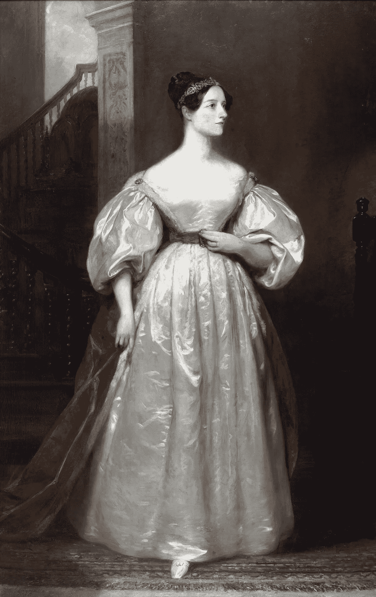

# 世界上第一个软件程序员是女性，她的名字叫阿达。

> 原文：<https://medium.com/geekculture/worlds-first-software-programmer-is-a-woman-and-her-name-is-ada-63640480768d?source=collection_archive---------42----------------------->

Portrait of Ada by British painter Margaret Sarah Carpenter (1836) — UK Government Art Collection website.Original upload was at English wikipedia at en:File:Ada_Lovelace.jpg, Public Domain, [https://commons.wikimedia.org/w/index.php?curid=354077](https://commons.wikimedia.org/w/index.php?curid=354077)

最近我在 [Finotes](https://finotes.com) [博客](https://www.blog.finotes.com)上写了一篇关于软件错误的[历史的文章。在那篇博客中，我写了关于洛夫莱斯伯爵夫人奥古斯塔·爱达·金，以及她为自己赢得第一位软件程序员声誉的作品。有人问我这是不是真的。他们无法相信一位生活在 19 世纪上半叶的年轻女士构想出了一种编程算法。](https://www.blog.finotes.com/post/software-bugs-some-history)

伯爵夫人阿达于 1815 年 12 月 15 日出生在伦敦。孩提时代，她就表现出对数学的热爱。1833 年，她遇到了查尔斯·巴贝奇，后者向她介绍了差速发动机的原型。巴贝奇对她的分析能力印象深刻。他称她为“数字魔女”。

1842 年，在查尔斯·巴贝奇提出**“分析引擎”**五年后，阿达开始翻译意大利数学家 Luigi Federico Menabrea 的一篇关于机器的文章。这不仅仅是翻译。她添加了一堆注释，试图解释分析引擎的功能，以及它与差异引擎的不同之处。她的工作很受欢迎，当时的顶尖科学家如迈克尔·法拉第也认可了她。

笔记的大小是梅纳布雷亚原始文章的三倍。他们按字母顺序从 A 到 G 排列。**她在笔记 G 中详细描述了计算伯努利数的算法**。她不仅编写了算法，还提供了足够的证据，证明分析引擎将如何按照算法中的指令进行计算。

Note G — Algorithm to compute Bernoulli Numbers By Ada Lovelace — [http://www.sophiararebooks.com/pictures/3544a.jpg](http://www.sophiararebooks.com/pictures/3544a.jpg), Public Domain, [https://commons.wikimedia.org/w/index.php?curid=37285970](https://commons.wikimedia.org/w/index.php?curid=37285970)

查尔斯·巴贝奇从未建造过分析引擎(就此而言，他的引擎没有一个真正耗费过生命)，因此这个项目从未被执行过。但是现在人们普遍认为，如果这个程序被执行，它将会成功运行。

阿达没活多久。她于 1852 年 11 月 27 日因癌症去世，享年 36 岁。

启发我在博客中提到 Ada 的是她对软件错误的看法。在笔记中，她解释了 Analytical engine 如何产生错误的输出，不是因为设备本身的任何错误，而是因为它可能被给予了错误的指令。世界上第一个程序员给我们所有认为我们的程序永远不会出错的人的一个好建议。不是吗？

计算机语言 **Ada** 以她的名字命名。

我不确定我们软件程序员对 Ada 的贡献有多认可。她的笔记包含了早期编程指令各个方面的详细信息。大约一个世纪后，艾伦·图灵写了一篇关于可计算数字的文章《T2》，应用于 Entscheidungsproblem，这被认为是第一个关于软件的理论。

在这个特别关注科技行业**女性的时代，她的贡献需要得到更广泛的认可。**