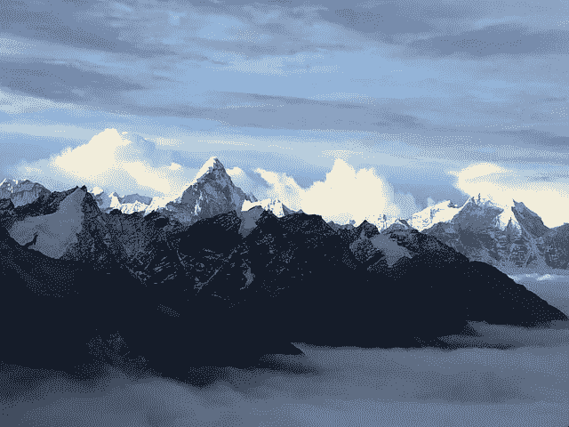
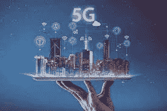

# 珠穆朗玛峰上世界最高的 5G 塔

> 原文：<https://medium.com/geekculture/worlds-highest-5g-tower-on-mount-everest-2c26ae857753?source=collection_archive---------12----------------------->

# 介绍

中国移动香港(CMHK)和科技巨头华为合作，在珠穆朗玛峰安装了该领域最大的 5G 天线。5G 天线连接在海拔 6500 米的基站上，这也使它成为世界上最好的 5G 天线。

# 描述

今年 4 月，CMHK [推出了名为“珠穆朗玛峰上的 5G”的项目。从那时起，在珠穆朗玛峰大本营海拔 5300 米处安装了 3 个 5G 基站，在 5800 米处安装了一个，在 6500 米处安装了两个。由于这个相当大的基站和天线社区，该企业已经能够在完整的山峰上提供 5G 保险，其中还包括位于 8848 米的山顶。现在，这是一个美丽的企业实现。](https://www.technologiesinindustry4.com/)

可以理解的是，这家企业[将](https://www.technologiesinindustry4.com/)变成了一项巨大的任务，并希望利用牦牛将这一设备支撑在如此高的海拔上。由于它们的精确适应，牦牛被证明是正确的运输方式，因为安装这座塔需要将近八堆工具。

基站的发布标志着珠穆朗玛峰从北坡首次成功登顶 60 周年。基站其实在珠峰大本营 5300 米，过渡营 5800 米，前进营 6500 米。

一名[中国移动](https://www.technologiesinindustry4.com/)技术人员告诉国家媒体，全新的 5G 社区速度快，足以让登山者和科学家在山上保持 4K 和虚拟现实。

华为的 5G AAU 和 SPN 技术已在底层站实施，由 12 名社区专业人员在海拔 5300 米及以上的地方全天候驻守，进行控制和维护。

华为声称，它的 5G AAU 被很好地整合到一个紧凑的尺寸中，使其可以干净地进行部署和设置，特别适合包括珠穆朗玛峰在内的恶劣环境中的基础设施。在这个项目中，一个“独立+非独立”(SA+NSA)模式的社区连接了 5 个 5G 基站。同时，5G 连接通过华为的大规模 MIMO 一代来执行。

华为的 Massive MIMO 具有三维细长波束。在海拔 5300 米的地方，5G 下载速度超过了 1。66 Gbps，其中添加速度超过 215 Mbps，华为声称。一些相反的技术正通过中国电信设备巨头被雇佣，如智能 OptiX [网络](https://www.technologiesinindustry4.com/)和 HoloSens 智能视频监控系统。珠峰大本营的 5G 基站由千兆 ONT、华为的 10G PON OLT 和 200G 超高速传输平台以及 HoloSens 智能视频监控系统组成。

# 最近 5G 塔的优势

全新 5G 塔的建立可以确保[电信](https://www.technologiesinindustry4.com/)为登山、医学研究、环境跟踪和高清流媒体等运动提供服务。除此之外，这座塔还允许旅行者和当地的山地人从竞技场的最高峰与家人进行无数次的交流。该设置与珠穆朗玛峰的重新维度相对应，采用应用 5G 社区的策略来帮助尽可能获得最大的正确维度。

# 让竞技场变得更好的技术方法

华为[强烈](https://www.technologiesinindustry4.com/)相信通用的方法会让竞技场变得更好。珠穆朗玛峰的壮丽可以通过 5G 高清视频和 VR 体验来展示，这另外为登山运动员、科学家和不同的专业人士提供了对自然的类似见解。珠穆朗玛峰突破性的现状再次证明了 5G 技术将人类和地球和谐地结合在一起。

更多详情请访问:[https://www . technologiesinindustry 4 . com/2022/11/worlds-higher-5g-tower-on-mount-Everest . html](https://www.technologiesinindustry4.com/2022/11/worlds-highest-5g-tower-on-mount-everest.html)

youtube 频道:[https://www . YouTube . com/Channel/ucbhq 84 dcj _ mzg 6 w 4 l 1s 1 B2 g/about](https://www.youtube.com/channel/UCbHQ84DcJ_mZG6W4L1S1b2g/about)