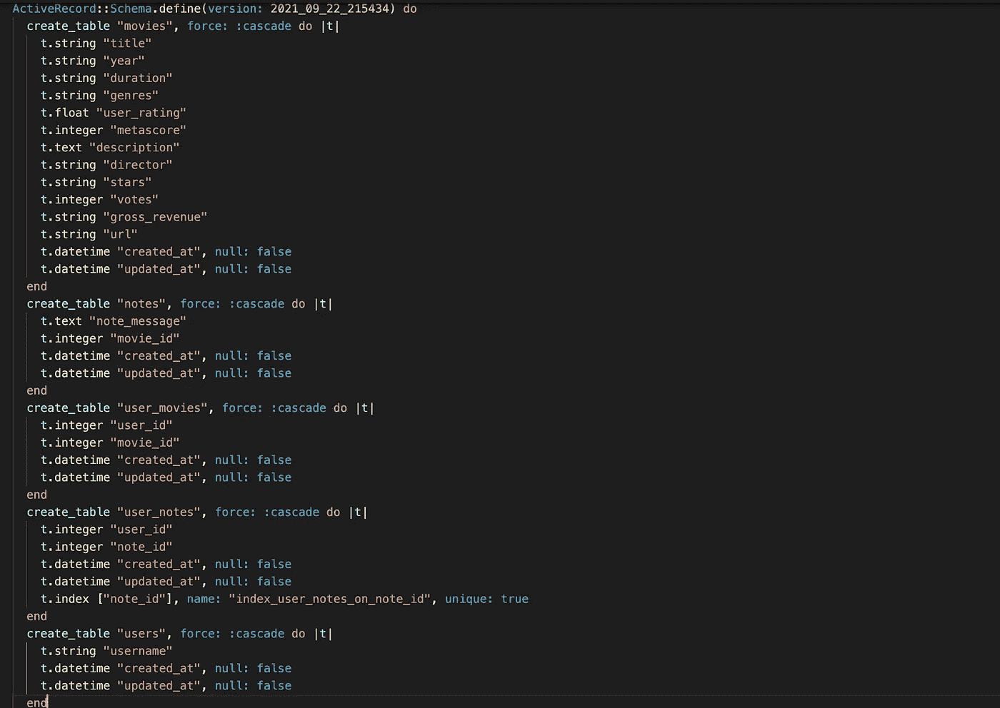
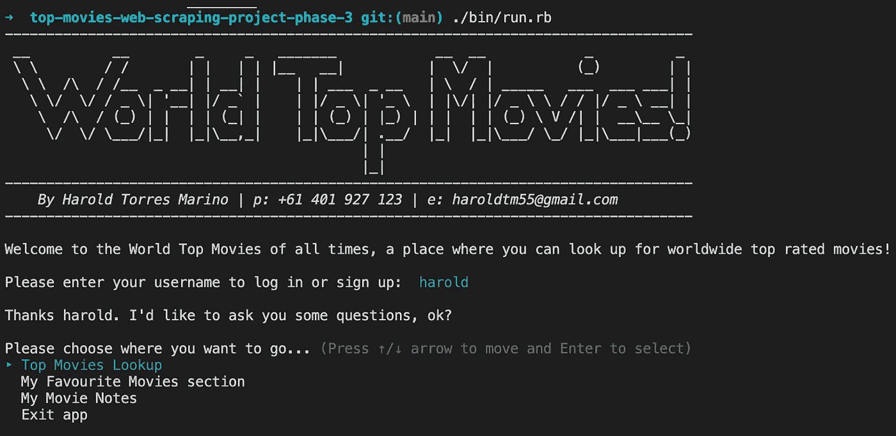
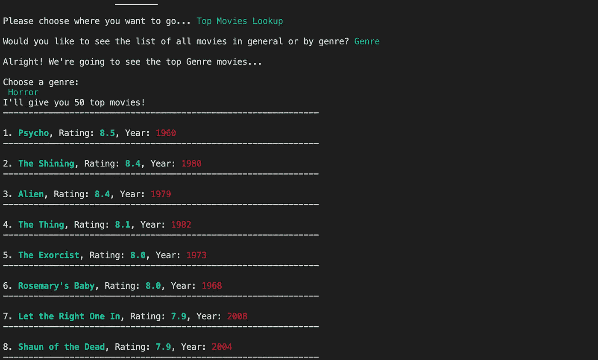
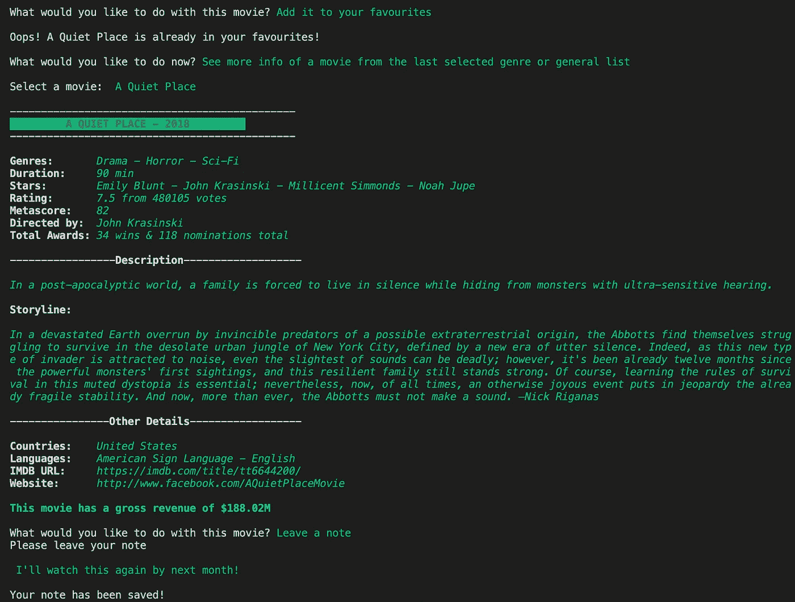
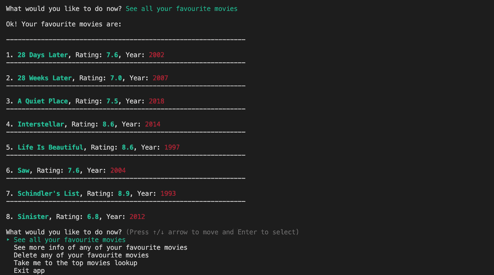
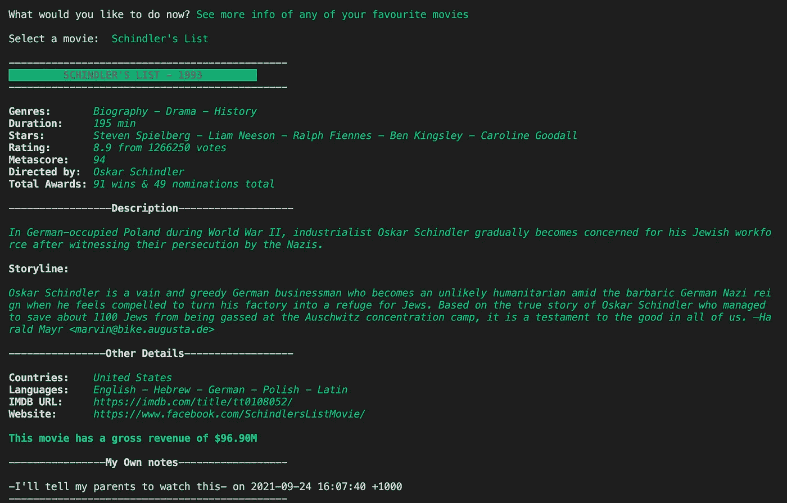
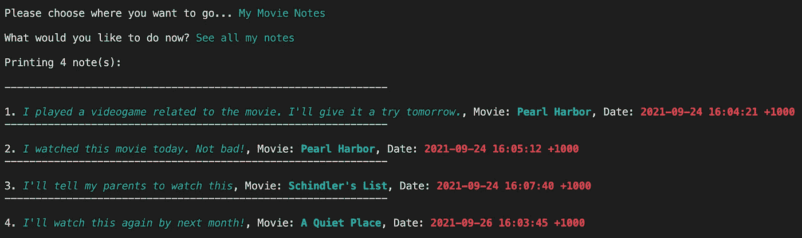
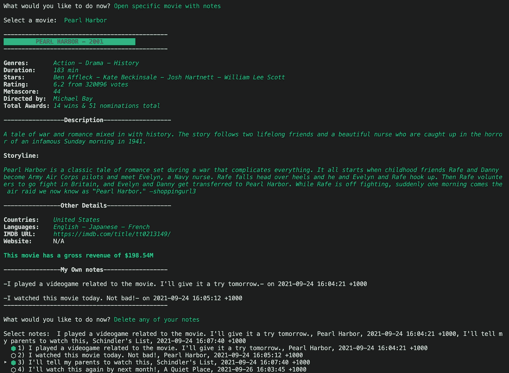

# 世界顶级电影:我的 CLI Ruby 应用项目

> 原文：<https://medium.com/geekculture/worlds-top-movies-my-cli-ruby-application-project-e365cb82d792?source=collection_archive---------21----------------------->

Photo by [Jon Tyson](https://unsplash.com/@jontyson?utm_source=medium&utm_medium=referral) on [Unsplash](https://unsplash.com?utm_source=medium&utm_medium=referral)

我将分享我在软件开发研究中对 Ruby 学习过程的思考，包括我的最终项目《T2 世界顶级电影》。

# 这期间我学到了什么？

在使用 *JavaScript* 及其 *ReactJS* 库完成我的前端[神奇宝贝匹配卡](/nerd-for-tech/pokémon-matching-cards-my-reactjs-app-project-8f69bee496a2) 项目后，是时候深入后端了。Ruby 被指定为完成这项任务的开源编程语言。原因？它的简单性和高效性，伴随着自然易读的语法。

冒险从大多数编程语言共有的所有常见主题开始:*变量和方法、布尔、逻辑*和*条件、循环、数组、迭代、散列*和*数据结构*。在这里，当我设法在短短几天内回顾所有这些主题时，我可以亲眼看到已经拥有一种编程语言( *JavaScript* )的经验的神奇之处。与其说是适应新语法背后的逻辑，不如说是适应新语法的问题。

在完成了程序性 Ruby 概念之后，我钻研了*面向对象*中的主题，在那里我了解了*类对象、对象属性、Self、类变量和方法、对象关系*和*继承*。在我学习 JavaScript 的过程中，我也了解了其中的一些主题，但是这次我明白了为什么 *OOP* 如此强大。作为奖励，我学习了*正则表达式的基础知识。*

从那时起，在我看来，事情开始变得更具挑战性。以下要回顾的主题是*元编程、配置应用程序、SQL、对象关系映射、使用 ActiveRecord、从远程源获取数据*和 *Rack。这是一大堆需要消化的信息，但是我做了大量的编码练习来更好地理解它们。*

# 我的项目:一个名为世界顶级电影的 CLI 应用程序

我做的项目的最初要求如下:

1.  它必须提供一个命令行界面。
2.  应用程序必须提供对来自网页或 API 的数据的访问
3.  提供的数据必须至少深入一个级别。
4.  使用良好的面向对象的设计模式，如创建对象集合，而不是散列，避免在每个网页上多次抓取数据，以提高应用程序的性能。
5.  可选地从应用程序创建一个 gem。

我想更进一步，所以我添加了数据库功能，并且我使用了 *SQLite3* 来完成这项工作。

# 结构和特征

我的项目是一个 CLI 应用程序，它利用*网络抓取*从 IMDB 获取数据，IMDB 是亚马逊的一个电视、视频游戏，尤其是电影*的在线数据库。*该应用程序根据 IMDB 用户评论抓取全球收视率最高的电影，并在 CLI 上显示，同时还拥有一个数据库，可帮助用户存储他们最喜爱的电影并留下注释。

## 数据库模式

我上面说过，我在这段学习期间学习的课题之一是*活动记录*，这是一个对象关系映射框架。我使用这个 Ruby gem 是因为它允许我快速有效地处理关系数据库。它是 Ruby 和数据库之间的纽带。

我使用的三个主要表格是:

*   **用户**:存储*用户名*
*   **电影**:存储所有喜爱的电影和带注释的电影
*   **备注**:通过 *movie_id* 外键存储**用户**给出的所有*备注信息*以及与每个备注相关联的电影。

为了创建关联，我必须创建两个表。

*   **用户 _ 电影:**通过*用户 _id* 和*电影 _id* 外键将用户与电影链接起来
*   **User_notes:** 通过 *user_id* 和 *note_id* 外键将用户与 notes 链接起来

Database schema

该应用程序的结构由以下部分组成:

*   简介&注册或登录
*   热门电影查找
*   我最喜欢的电影
*   我的电影笔记

现在您可能对模型有了一个概念，我将从用户的角度解释每一部分。

## 简介&注册或登录部分

首先，用户会看到标题、我的联系信息、一个简短的*介绍*，紧接着，他们被要求*登录或注册*。用户键入用户名，应用程序检查该用户名是否存储在数据库中。如果存储，则登录；否则，它会创建一个新用户名并将其保存在数据库中。在这个动作之后，用户被询问他们是否想要去*热门电影查找*、*我最喜欢的电影部分*或*我的电影笔记*。

Introduction & sign up or log in.

## 热门电影查找部分

If users go to the Top Movies Lookup, they’re asked to see the list of top movies by genre or a general lookup (not considering genre but merely by rating). Then the application does web scraping to retrieve the world’s top movies as per user specifications. To scrape the data, I utilised the *HTTParty* gemto get the response from a GET request and *Nokogiri (鋸)* for parsing the body of HTML responses and work efficiently with XML.

A user chooses Top Movies Lookup to look up movies by genre.

然后，用户被询问他们是否想要从该列表中查看任何电影的详细信息，或者将它们中的任何一个添加到他们最喜欢的列表中。此外，他们可以离开并开始新的查找，转到我最喜欢的电影或我的电影笔记部分，或者打印到目前为止已显示的所有电影，以防用户查找到更多电影。

如果用户选择查看一部电影的详细信息，他们将会看到下面的屏幕截图，最后，他们会被询问是否要将该电影添加到他们的收藏夹或留下注释。如果用户将电影添加到他们的收藏夹，应用程序将首先检查这些电影是否已经在数据库中链接到该用户。如果电影尚未链接，则添加电影；否则，用户会收到一条提示消息，说明它已经存储在他们最喜欢的电影部分。

另一方面，如果用户想留个便条，他们可以输入并按回车键。注释消息将自动保存在注释表中，并与数据库中的用户 id 相链接。

A user chooses to see detailed info about one of the movies and leave a note.

如前所述，用户可以将多部电影添加到收藏夹中。所以，他们不需要看到详细的信息来这样做。

A user can add multiple movies to their favourites.

## 我最喜欢的电影部分

这个部分包含了管理用户最喜欢的电影的所有内容。他们可以打印他们最喜欢的电影列表，查看其中任何一部电影的详细信息，或者从他们最喜欢的电影中删除电影。

如果用户想看他们喜欢的电影，CLI 将显示与在查找部分查找电影相同的视图。我尽可能做到“干巴巴”，所以我使用了电影中的同一个类方法来完成这两个动作。

The list of a user’s favourite movies

类似地，如果用户想要查看他们最喜欢的电影的详细信息，视图将与查找部分的电影相同。唯一的区别是底部，因为他们可以看到自己的笔记(如果有的话)。值得澄清的是，电影不一定是他们最喜欢的，才能留下注释。我将在*我的电影笔记*部分对此进行更多解释。

Detailed information of a favourite movie which also has a given note

如前所述，用户也可以从他们的最爱列表中删除电影。这个动作是通过从数据库中删除电影 id 和用户 id 的关联来完成的。

Users can select the movies they want to delete

## 我的电影笔记部分

在这个部分，用户可以看到他们所有的笔记和与这些笔记相关的电影。他们还可以通过注释查看任何电影的详细信息。最后但同样重要的是，他们可以删除任何笔记。

如果用户想看到他们所有的笔记，他们会看到它们按时间顺序排列，有相关的电影和日期以及留言的当地时间。

Notes list from a given user

如上所述，用户可以打开一部特定的电影，看到详细的信息。由于这些电影有注释信息，他们可以在底部看到与他们的用户 id 相关联的注释。如果他们想删除任何短信，他们也可以这样做。

Users can the notes of a given movie and delete any notes from any movie.

# 式样

你可能会问颜色、字体风格、命令行界面提示和标题风格怎么样。对于颜色和字体样式，我使用了一种叫做*的宝石，它做得非常好。对于 CLI 提示，我使用了 *TTY 提示* gem。为了标题，我使用了一种叫做 *Artii 的宝石。**

# 挑战

在开发这个 CLI 应用程序的过程中，我必须克服一些困难:

1.  **找到正确的 CSS 选择器:**找到正确的 CSS 选择器是一个很大的障碍。有些情况下，CSS 选择器在一个网页上工作，但在另一个网页上就不工作了。比如有的电影有官网，有的没有。这种情况使我找到了使用 CSS 选择器的方法，而不会影响获得想要的信息。
2.  **所有可能场景的 bug:**在开发过程中，我不得不不断地思考哪些地方可能会出错，这取决于具体的场景。值得一提的是，当两个用户有一部共同的电影时，其中一个用户决定从他们的收藏夹中删除这部电影。我必须确保我从*用户 _ 电影*表中删除了电影记录，而不是从*电影*表中删除。这种情况似乎很明显，但我没有考虑到这一点，这些电影实际上已经从所有用户那里删除了。另一种情况是，当用户没有任何喜欢的电影或笔记时，他们不应该访问*我最喜欢的电影*和*我的电影笔记*。用*撬*被*套下的* ace。多亏了这个工具，我学到了很多关于如何调试的知识。
3.  **字符串操作:**对于一些电影，网站没有按照我想要的方式显示一些数据，因为我需要它们存储在我的类实例和数据库中。例如，当我只需要在电影实例和记录中存储数字时，像投票数这样的数值就用逗号分隔。另一种情况是用逗号分隔流派和星星，我想将它们存储为数组，当我只需要数字时，年份在括号内。我使用了一些基本的正则表达式和 ruby 方法来按照我想要的方式检索数据。
4.  **定义模型之间的适当关系:**在定义表之间的关系时，我必须回顾一些关系数据库的概念，如*属于、拥有、拥有、拥有、拥有、拥有、拥有、一个、一个、一个、一个、一个、一个、一个、一个、一个、一个、一个、一个、一个、一个、一个、一个、一个、一个、一个、一个、一个、一个、一个、一个、一个、一个、一个、一个、一个、一个、一个、一个、一个、一个、一个、一个、一个、一个、一个、一个、一个、一个、一例如，如果一个注释被销毁，那么与该注释相关联的 user_note 记录也必须被销毁。*
5.  为这个项目制作一个宝石并在*rubygems.org**:*上发布这个任务非常具有挑战性。我不知道如何创建一个宝石，所以我必须阅读文档。我最终用 [*捆绑器*](https://bundler.io/v2.0/guides/creating_gem.html) 创造了宝石。这个过程并不简单，也许是因为我缺乏制作宝石的经验。其中一个问题是我必须删除*require _ all*gem*，因为它似乎只适用于开发，所以我必须重新设计所有的 *require* 和 *require_relative* 引用。另一个问题，也可能是最难解决的问题，是如何将数据库连接到安装 gem 的用户的本地文件夹。使用 *__dir__* 是解决这个问题的关键(感谢这位，[沙](https://twitter.com/sandyleo26)！).*

*总而言之，在我学习 Ruby 的过程中，我对自己的成绩非常满意。在学习期间，尤其是在 CLI 应用程序开发期间，我所经历的时间让我对所获得的技能充满信心。我已经准备好开始学习 Ruby on Rails 了！*

*这里是宝石储存库:[https://github.com/CodeHunt101/world-top-movies](https://github.com/CodeHunt101/world-top-movies)*

*如果你想试试我的宝石，你可以在下面的链接找到它:[https://rubygems.org/gems/world_top_movies](https://rubygems.org/gems/world_top_movies)。*

*如果你想看看我是如何从头开始构建我的项目的，请打开我的项目的资源库:[https://github . com/codehunt 101/top-movies-web-scraping-project-phase-3](https://github.com/CodeHunt101/top-movies-web-scraping-project-phase-3)*