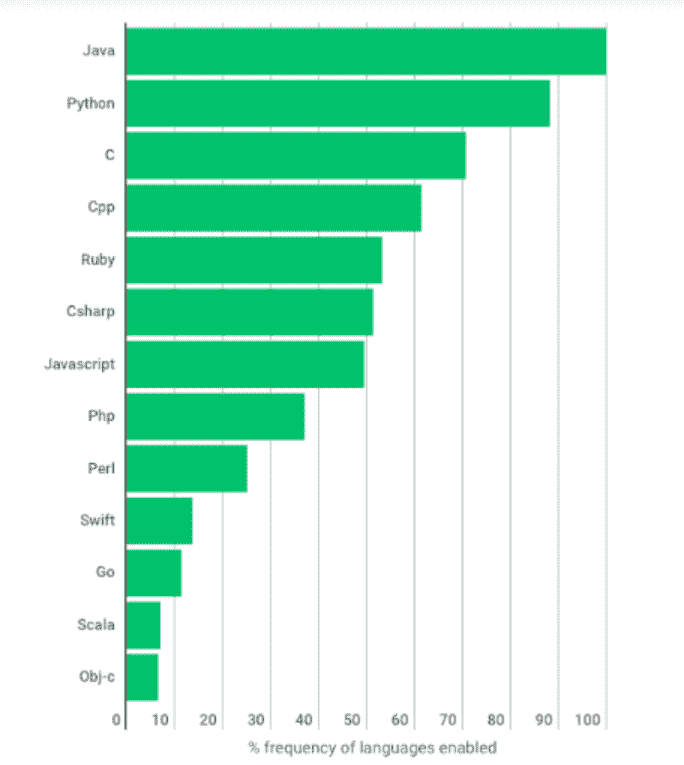

# 你会建议 Java 开发最好的金融科技应用吗？

> 原文：<https://medium.com/geekculture/would-you-advice-java-for-developing-the-best-fintech-application-28fda6e1cc68?source=collection_archive---------15----------------------->

根据一份 Hackerrank [报告](https://www.hackerrank.com/blog/emerging-languages-still-overshadowed-by-incumbents-java-python-in-coding-interviews/)，Java 是世界上评价最高的编程语言之一。这种语言给年轻的 [Java 开发者](https://www.botreetechnologies.com/blog/guide-to-hiring-java-developers/)一个自然的学习曲线，它可以处理大量的数据，并拥有严格的安全特性。超过 25 年来，Java web 开发已经成为金融科技企业[的时尚。](https://www.redhat.com/en/blog/25-years-and-going-strong-why-java-matters-future-banks)

HackerRank 对 3000 多项编码面试挑战进行了研究，以了解雇主主动寻求哪些语言。

**来源—**[**www.hackerrank.com**](https://www.hackerrank.com/)

金融机构不再保留账簿来跟踪和记录所有的交易。

随着技术的进步和金融科技的出现，古老的传统方法逐渐消亡。

Java 展示了如何将数据存储到结构化方法中，[Java 解决方案](https://www.botreetechnologies.com/blog/9-common-java-development-mistakes-to-avoid-in-2022/)保证了一个安全可靠的平台，为金融科技行业构建 web 应用。Java 在大数据行业也扮演着重要的角色。由于金融机构每天必须处理大量的数据，Java 有助于安全地维护如此庞大的数据库。

> **阅读更多:** [**现实世界中十大流行 Java 应用示例**](https://www.botreetechnologies.com/blog/java-applications-examples/)

# 让我们来详细看看 Java 是如何影响金融科技行业的。

**1。聊天机器人开发:**

*   聊天机器人在银行和其他金融机构中变得非常普遍，以增强精通技术的消费者的数字体验并降低成本。聊天机器人可以访问客户的数据，如 CIBIL 分数、贷款偿还历史、信用卡数量等，以便更好地为客户服务。
*   想知道这些聊天机器人是如何制造的吗？Java 及其框架用于开发。 [Java 应用开发](https://www.klusster.com/portfolios/shardul-bhatt/contents/279952)企业认为 Java 是聊天机器人开发的最佳工具。它促进了可移植性、透明性、可维护性、调试和可视化。这种语言对于创建传感器网络、机器学习和多机器人系统也是必不可少的。

**2。手机钱包:**

*   对于金融部门来说，通过移动互联网平台提供安全的金融服务令人望而生畏。然而，在机器学习、人工智能和 [Java 框架](https://www.botreetechnologies.com/blog/what-are-some-of-the-best-java-web-application-frameworks/)的帮助下，Java 移动应用开发公司正在提供电子钱包或移动钱包，以实现无忧无虑的个人财务管理。
*   [企业软件开发公司](https://www.botreetechnologies.com/software-development-company)利用人工智能和基于 Java 的算法制造移动钱包，帮助消费者在花钱时做出明智的决定。

**3。投资与交易:**

*   股票市场中的企业依靠计算机系统来准备统计数据和预测未来趋势。银行和金融科技公司依赖基于 Java 的应用程序进行数据模拟和建模。
*   这种系统可以由 Java 编程公司定制，用于投资市场所需的预测模型。此外，在制作用户友好、快速加载和完全安全的网站时，Java 具有很高的可靠性，这对于保险部门等数据密集型行业至关重要。

**4。欺诈检测和管理:**

*   许多金融服务组织和银行聘请 Java 顾问开发可用于卡和金融欺诈识别的 AI 工具。如今，组织正在利用人工智能工具来识别卡/金融欺诈。人工智能工具可以产生不可预见的知识，发现隐藏的模式，并为金融交易建立预测模型。对于人工智能软件开发来说，Java 是一种不可思议的编程语言。
*   [Java 开发服务](https://www.botreetechnologies.com/java-development-company)在开发有助于识别安全和欺诈的软件方面发挥着关键作用。Java 的安全特性在部署人工智能工具时是有益的，因为这允许人工智能框架决定什么可以被视为欺诈，什么不能。

**5。多线程语言:**

*   金融科技企业更喜欢用 [Java web 应用程序开发](https://www.botreetechnologies.com/blog/why-is-java-application-development-popular/)作为他们的组织，因为 Java 是一种多线程编程语言。
*   该语言可以无缝集成到过程、系统和应用程序中。此外，它不依赖于特定于操作系统的进程来启用多线程。
*   这导致应用软件与第三方服务、系统和应用程序的轻松集成。

**6。易于更新和迁移:**

*   Java 可以根据中央银行和其他政府法定机构不断变化的法规和政策来处理频繁的必要更新。
*   政府的政策经常变化。此外，组织有时可能需要从遗留系统迁移到平台的最新版本。任何有经验的内部团队或外包 Java web 开发服务公司都可以管理定期更新，以便在需要时管理那些变更。
*   Java 在这里扮演了一个英雄角色，因为程序编写、编译和调试都很容易，因此 FinTech 应用程序可以在短时间内更新。与构建在其他平台上的应用程序相比，Java 迁移也是一项轻松的任务。

**7。平台独立性:**

*   [Java 软件开发公司](https://botreetechnologies.medium.com/top-10-java-software-development-companies-to-know-in-2022-d1042a105d6a)可以独立于任何特定平台需求构建应用。Java 软件开发服务可以构建与 iOS、Android、Windows、Linux 和其他操作系统平台兼容的应用程序。
*   这使得这些功能有助于金融服务机构拓展到更大的目标市场。

**8。可靠性:**

*   整个金融行业必须为其客户提供高可靠性和可靠性。如果顾客不能从表面上信赖这个机构，就没有生意可做。
*   [软件开发公司](https://www.botreetechnologies.com/) **，**视 Java 为高度可靠和安全的编程语言，为目标市场消费者开发应用程序。因此，Java 顾问高度强调这种语言在任何情况下帮助他们保持性能的能力。此外，Java 的高可用性和增强的容错能力使其成为运行应用程序的流畅语言。

**9。分布式计算:**

*   现代金融服务组织在分布式环境中工作。因此，Java 软件开发服务必须探索简化分布式计算的方法。
*   由于 Java 具有集成的网络功能，它对 Java 开发者来说是一个福音。他们可以很容易地设计出可以轻松适应分布式计算的系统。

10。云技术:

*   云技术正成为许多组织的最爱，包括金融科技行业。从长远来看，云操作设置提供了经济高效的解决方案。
*   基于 Java 构建的金融科技应用允许机构无缝切换到云计算，因为它是一种服务器端的[编程语言](https://www.botreetechnologies.com/blog/top-reasons-java-development-remains-relevant/amp/)。

> **阅读更多:**[**2022 年 Java 开发要知道的 7 大用例**](https://www.botreetechnologies.com/blog/top-use-cases-of-java-development/)

# 结论

Java 经受住了时间的考验，这背后有几个原因。首先，该语言继续在金融科技公司中广泛使用，因为人们认为它是更安全、更有弹性的编程语言之一。它也是金融科技革命的基础语言之一。

Java 在不久的将来必将引领金融行业。其发展速度使得个人和金融机构的财务管理变得更加容易。此外，Java 提供的更快、更高效的解决方案使其成为未来金融科技的一项可靠投资。

BoTree Technologies 是一家领先的 Java web 应用程序开发公司。
[**如有任何 FinTech 应用开发需求，请联系我们**](https://www.botreetechnologies.com/contact) 。

*原载于 2022 年 7 月 11 日*[*https://www.botreetechnologies.com*](https://www.botreetechnologies.com/blog/java-for-best-fintech-application/)*。*