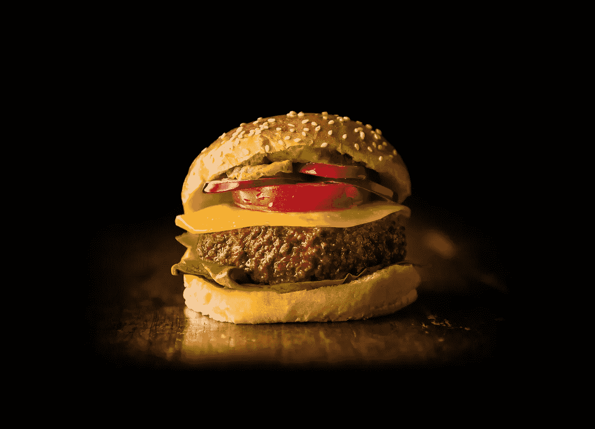

# 你会吃名人吗？(字面意思)。

> 原文：<https://medium.com/geekculture/would-you-eat-a-celebrity-literally-4059714c9f8f?source=collection_archive---------14----------------------->

A lab-grown burger by Mosa Meat. This particular burger isn’t made with human flesh, mind, could a burger in the future could be. The picture is from Mosa Meat’s [press kit](https://mosameat.com/press-kit).

## 实验室培育的肉类可以让我们对肉类更有创造力

是的，从字面上看。让我们想象一下，你可以去杂货店买埃隆·马斯克、莱昂纳多·迪卡普里奥或碧昂斯的各种身体部位制成的肉。如果你能抓到 300 克迪卡普里奥，回家，油炸它，然后配上一份马铃薯条，一份美味的沙拉和一份调味汁…