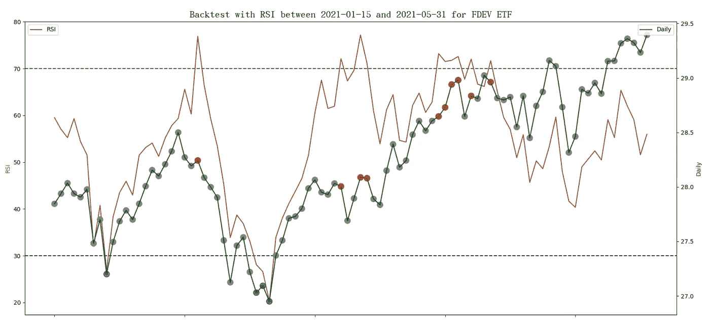
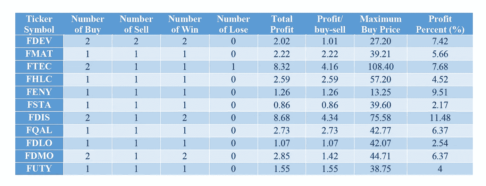

# 哇！弹性搜索中的回测 RSI 交叉策略

> 原文：<https://medium.com/geekculture/wow-backtest-rsi-crossover-strategy-in-elasticsearch-1cdf837a72a1?source=collection_archive---------14----------------------->

有时候，你可能会有一些疯狂的想法，想测试你的交易策略。通过使用历史市场数据进行回溯测试，您可以评估风险、利润和衡量绩效，以获得在未来使用交易策略的信心。当然，如果你是一个熟练的程序员，你是没有问题的。但是，您需要编写一个复杂且负载繁重的程序来处理数据检索后的数据分析。由于 Elasticsearch 在搜索、数据分析、机器学习方面的强大能力，值得写一系列关于 Elasticsearch 回溯测试不同交易策略的文章供大家参考。

在我之前的文章里， [RSI BB 还是 RSI & BB？简单，我们用 Elasticsearch](/nerd-for-tech/rsi-bb-or-rsi-bb-easy-lets-test-it-with-elasticsearch-51129e8819e5) 来测试一下，我们已经介绍了如何使用 Elasticsearch 实现相对强弱指数(RSI)指标。本文将继续制作一个简单的工具来回测 Elasticsearch 中的 RSI 交易策略。由于大部分工作都是在 Elasticsearch 集群中完成的，客户端的工作量不会很大。Elasticsearch 将提供买入或卖出信号，然后将它们与一个简单的 Python 程序集成，以进一步分析信号并生成报告。建议读者快速浏览一下我之前的文章，了解 RSI 以及使用 Elasticsearch 的实现细节。

RSI 是一个动量指标，它提供了价格变化的信息，以支持买卖资产的机会。价格变化被转换成两种类型的数据，最近的总收益和最近的总损失，通常周期为 14。RSI 方程可以写成这样，其中 SMA *gain，n，1* 和 SMA *loss，n，1* 分别是收益的总最近移动平均线和亏损的总最近移动平均线。对应于带窗口 *n* 的 Elasticsearch SMA 函数，需要右移 1 个数据来包含当前数据。


RSI 交叉策略定义 RSI 在指定值的交叉，表示超买(> = 70)和超卖(<= 30) signals. For other RSI values, be patient and wait for the buy or sell signal. It is much easier to use graphs to observe changes in values. In this article, we try to apply backtesting to commission-free exchange-traded funds (ETFs) and focus on Elasticsearch as an analysis tool. The following example randomly selects “Fidelity International Multifactor ETF”. Its ticker symbol is FDEV. 10 more ETFs randomly selected will be run, and the final results will be shown later. The data is selected from the time range between 2021–01–15 and 2021–05–31 provided by IEX, Investors Exchange. In the chart below, the RSI is plotted together with the daily closing price. In the daily price curve, the RSI values over 70 are marked in red, and the RSI values less than 30 are marked in blue.



Here, we present a simple RSI crossover strategy and use Elasticsearch to show the implementation details.

◆ Assuming that it is restricted to buy and hold 1 share at a time, no transaction will occur until the held share is sold.
◆当 RSI 值< = 30 时买入 1 股。
◆当 RSI 值> = 70 时卖出 1 股。
◆测试期结束时，持有份额按现价兑现。

有 4 个蓝点和 10 个红点，但是基于策略只允许两个买入和两个卖出交易。让我们描述一下使用 Elasticsearch 的实现。假设有一个用数据填充的 Elasticsearch 索引，其使用的数据映射与上一篇论文中描述的相同。以下步骤演示了 REST API 请求体的代码。

> 通过搜索操作收集所有相关文件

使用带有“must”子句的“bool”查询来收集符号为 FDEV 且日期在 2021–01–15 和 2021–05–31 之间的文档。由于 14 个交易日移动平均线的计算，额外数据调整 1 个月(从 2020 年 12 月 15 日到 2021 年 1 月 14 日)。

```
{
    "query": {
        "bool": {
            "must": [
                {"range": {"date": {"gte": "2020-12-15", "lte": "2021-05-31"}}},
                {"term": {"symbol": "FDEV"}}
            ]
        }
    },
```

> 提取基金的收盘价值

使用名为 Backtest_RSI 的“date_histogram”聚合，参数“field”为“date ”,参数“interval”为“1d ”,提取基金每天的价格。然后是名为 Daily 的“平均”聚合，以检索收盘价，因为后续的管道聚合不能直接使用文档字段。

```
 "aggs": {
        "Backtest_RSI": {
            "date_histogram": {
                "field": "date",
                "interval": "1d",
                "format": "yyyy-MM-dd"
            },
            "aggs": {
                "Daily": {
                    "avg": {"field": "close"}
                },
```

> 提取桶的日期

由于存在额外的数据，后续操作需要稍后过滤掉超出范围的部分。一个名为“DateStr”的“min”聚合将获取存储桶的日期。在 Elasticsearch 服务器中，日期字段以纪元时间存储。时间单位是毫秒，时区是 UTC。

```
 "DateStr": {
                    "min": {"field": "date"}
                },
```

> 选择包含 1 个以上文档的存储桶

为了过滤掉空的时段(非交易日)，使用一个名为 SDaily 的“bucket_selector”聚合来选择文档计数大于 0 的时段。

```
 "SDaily": {
                    "bucket_selector": {
                        "buckets_path": {"count":"_count"},
                        "script": "params.count > 0"
                    }
                },
```

> 计算每日差异

使用名为 Price_Diff 的“衍生”聚合，并使用参数“buckets_path”来指定每日收盘值，以计算与前一个值的差异。

```
 "Price_Diff": {
                    "derivative": {
                        "buckets_path": "Daily" 
                     }
                },
```

> 确定每日值相对于之前的数据是盈利还是亏损

使用两个名为 Gain 和 Loss 的“bucket_script”聚合，并使用参数“buckets_path”来指定 Diff 聚合的结果以确定值。两个值都是正的。

```
 "Gain": {
                    "bucket_script": {
                        "buckets_path": {"Price_Diff": "Price_Diff"},
                        "script": "(params.Price_Diff > 0) ? params.Price_Diff : 0"
                    }
                }, 
                "Loss": {
                    "bucket_script": {
                        "buckets_path": {"Price_Diff": "Price_Diff"}, 
                        "script": "(params.Price_Diff < 0) ? -params.Price_Diff : 0"
                    }
                },
```

> 计算总收益和总损失的每日简单移动平均线

使用两个“移动 _fn”聚合，命名为 GainSMA 和 LossSMA，参数 window 为 14，参数“buckets_path”分别为增益和损耗。参数“shift”设置为 1，以包括当天和过去 13 个交易日的数据。SMA 是使用未加权平均函数(MovingFunctions.unweightedAvg)计算的。

```
 "GainSMA": {
                    "moving_fn": {
                        "script": "MovingFunctions.unweightedAvg(values)", "window": 14, "buckets_path": "Gain", "shift":1
                    }
                },
                "LossSMA": {
                    "moving_fn": {
                        "script": "MovingFunctions.unweightedAvg(values)", "window": 14, "buckets_path": "Loss", "shift":1
                    }
                },
```

> 计算 RSI

使用名为 RSI 的“bucket_script”聚合和参数“buckets _ path”来指定 GainSMA 和 LossSMA 的结果。然后根据脚本中的等式计算 RSI 指标。

```
 "RSI": {
                    "bucket_script": {
                        "buckets_path": {"GainSMA": "GainSMA", "LossSMA": "LossSMA"}, 
                        "script": "100 - 100/(1+params.GainSMA/params.LossSMA)"
                    }
                },
```

> 识别 RSI 值的类型

使用名为 RSI_Type 的“bucket_script”聚合和参数“buckets_path”来指定 RSI 值，以确定类型。如果 RSI 值> = 70，则将类型设置为 2。如果 RSI 值<= 30\. Set the type to 0 for other RSI values.

```
 "RSI_Type": {
                    "bucket_script": {
                        "buckets_path": {"RSI": "RSI"}, "script": "params.RSI >= 70 ? 2 : params.RSI <= 30 ? 1 : 0"
                    }
                },
```

> Filter out the additional documents for output

Use a “bucket_selector” aggregation, named Buy_Sell_Signal, with the parameter “buckets_path” to specify “DateStr” and “RSI_Type” to select the correct buckets. The selection criteria are those buckets having the date on or after 2021–01–15 (the epoch time 1612137600000 in milliseconds) and RSI_Type = 1 (RSI > = 70)或 RSI_Type = 2 (RSI <= 30).

```
 "Buy_Sell_Signal": {
                    "bucket_selector": {
                        "buckets_path": {"DateStr": "DateStr", "RSI_Type": "RSI_Type"}, 
                        "script": "params.DateStr >= 1610697600000L && (params.RSI_Type == 1 || params.RSI_Type == 2)"
                     }
                }
```

> After collecting results, we can draw the figures as shown before.

The result of the implementation will emit buy or sell signals; however, those signals only satisfy the second and the third cases of our simply RSI trading strategy. For the first and fourth cases, we need to use Python programming language to code the program. The program includes four parts.

◆ Read two command line parameters. One is for the selected ticker symbol, and the other is for the file name containing the trading strategy written in Elasticsearch REST API Request body using JSON format.
◆从 Elasticsearch 服务器获取数据，则将类型设置为 1。
◆解析响应数据，提炼买卖信号。
◆上报回测统计。

主要功能如下所示:

```
def main(argv):
    inputfile, symbol = get_opt(argv)
    resp = get_data(inputfile, symbol)
    transactions = parse_data(resp)
    report(transactions)
```

在本文中，只显示了细化买卖信号的代码段。读者可以进一步参考 GitHub 上的开源项目( [Backtest_RSI](https://github.com/wtwong316/Backtest_RSI) )。为了确保一次买入并持有一股，并且在持有的股票卖出之前没有交易发生，我们使用布尔变量“hold”来确保交易满足以下条件。

◆当保持标志为假时，买入信号生效
◆当保持标志为真时，卖出信号生效

parse_data()函数如下所示。最后，事务数组将包含有效信号。

```
# parse the response data and refine the buy/sell signal
def parse_data(resp):
    result = json.loads(resp)
    aggregations = result['aggregations']
    if aggregations and 'Backtest_RSI' in aggregations:
        Backtest_RSI = aggregations['Backtest_RSI'] transactions = []
    hold = False
    if Backtest_RSI and 'buckets' in Backtest_RSI:
        for bucket in Backtest_RSI['buckets']:
            transaction = {}
            transaction['date'] = bucket['key_as_string']
            transaction['Daily'] = bucket['Daily']['value']
            # honor buy signal if there is no share hold
            if bucket['RSI_Type']['value'] == 1 and not hold:
                transaction['buy_or_sell'] = 'buy'
                hold = True
            # honor sell signal if there is a share hold
            elif bucket['RSI_Type']['value'] == 2 and hold:
                transaction['buy_or_sell'] = 'sell'
                hold = False
            # for other situations, just hold the action
            else:
                transaction['buy_or_sell'] = 'hold'
            transactions.append(transaction) return transactions
```

python 程序提供交易策略的统计数据，包括整个买卖交易的“赢”和“输”，如下所示:

```
number of buy:             2
number of sell:             2
number of win:             2
number of lose:            0
total profit:              2.02
profit/transaction:     1.01
maximum buy price:     27.20
profit percent:         7.42%
```

下表收集了 2021 年 1 月 15 日至 2021 年 5 月 31 日期间使用 RSI 交叉交易策略随机挑选的 11 只 ETF 的所有统计数据。结果表明，这个时期是一个很好的交易时期，因为所有选择的符号都可以获利。但是，不要根据大多数交易者的建议使用单一指标进行交易。



备注:
一、感谢 IEX(投资者交易所)提供 ETF 数据，GitHub 提供开源项目存储。
二世。本文基于一种技术思路，不构成任何投资建议。读者在使用时必须承担自己的责任。
三。文章可能还有错误，恳请读者指正。
四。感兴趣的读者可以参考作者撰写的《弹性搜索的基本技巧》一书。《高级弹性搜索 7.0》，2019 年 8 月，Packt，ISBN: 9781789957754。