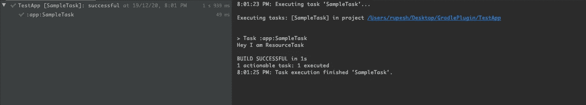
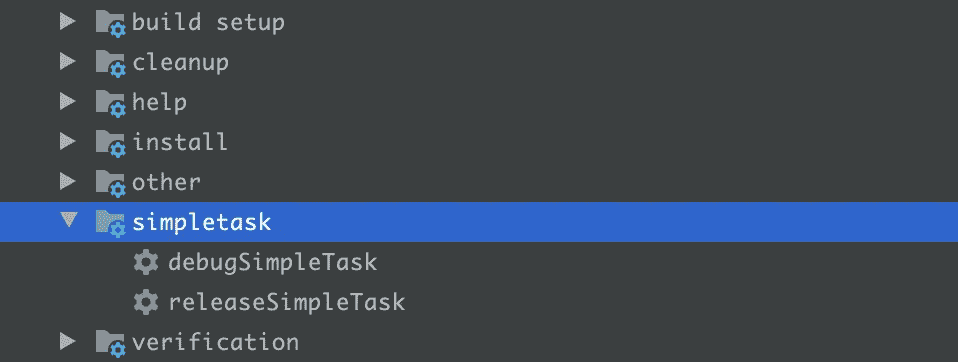
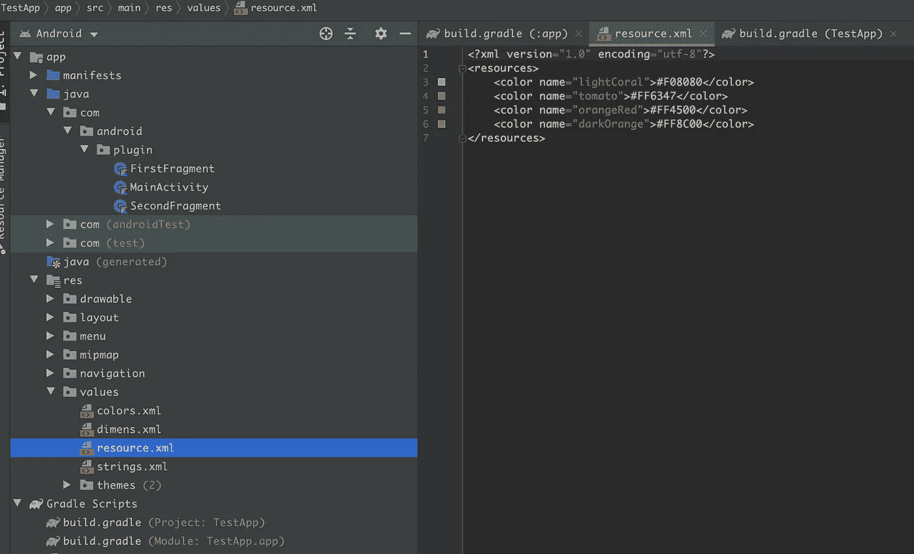

# 编写一个定制的 Gradle 插件(第 2 部分)

> 原文：<https://medium.com/geekculture/write-a-custom-gradle-plugin-part-2-1732ac39ff96?source=collection_archive---------1----------------------->

Image Credit: [https://gradle.org/](https://gradle.org/)

## 带有配置的自定义梯度任务

在[之前的博客](https://rupeshurmaliya.medium.com/write-a-custom-gradle-plugin-part-1-22b37c3b7326)中，我已经解释了如何创建一个简单的 Gradle 插件。在这里，我将更深入地讨论 Gradle task 以及如何在应用期间配置插件的参数。

## 让我们开始编写一个定制的 Gradle 任务:

让我们举一个例子，我将从 **JSON** 为一个 android 应用程序创建一个资源(XML)文件。

首先，我们将创建一个自定义的 Gradle 任务，并将其添加到插件中。

现在我们必须将这个任务添加到插件中。

现在通过使用以下命令触发`**uploadArchive**`任务或从终端执行:

现在从应用程序运行`SimpleTask`,我们将得到下面的输出。

*现在让我们更进一步，读取 JSON 文件并从该任务创建资源文件。*

## 生成资源:

首先，让我们创建一个`resource.json`文件，并把它放在应用程序目录中(这只是为了演示。您可以指定任何路径)。

现在我们将解析这个 **JSON** 并将其转换成一个**颜色资源文件**。为了实现这一点，我们需要对我们的 **SimpleTask 进行修改。这里我们需要两件主要的东西:**

1.  输入文件路径`(**resource.json**)`
2.  输出文件路径`(**resource.xml**)`

现在我们的**简单任务**将会是这样的:

现在我们必须将两个文件的路径都传递给 **SimpleTask。**

再次导出带有新代码更改的插件，并从应用程序运行**简单任务**。现在`**resource.xml**`将被添加到`**app/src/main/res/values**` 目录中。

## 将配置从应用程序传递到插件:

要将文件路径传递给插件，我们必须为插件添加一个扩展名。我为此创建了一个类 **PluginConfig** ，并作为扩展添加到插件中。

作为扩展添加到插件

现在让我们从应用程序中传递插件配置。为此，在应用程序的`build.gradle`(模块级)中添加以下代码行:

为了在插件中检索这个配置，我们最终的**sample plugin**&**simple task**类将如下所示:

下面几行代码是从我们的应用程序的`build.gradle`(模块级)传来的插件中检索输入文件的值。

## 简单任务:

## **任务分组:**

我们可以使用下面的代码将所有的任务分组。

现在，如果我们检查应用程序项目，任务将分组如下:

现在，如果我们运行此任务，我们会看到新文件将被添加到以下路径目录中:

***感谢阅读此文。在下一部分，我将讨论插件的单元&功能测试。***

## 参考资料:

 [## 开发自定义梯度任务类型

### Gradle 支持两种类型的任务。一种这样的类型是简单任务，其中您用一个动作闭包来定义任务…

docs.gradle.org](https://docs.gradle.org/current/userguide/custom_tasks.html)  [## 开发自定义梯度类型

### Gradle 有几种不同的“附加组件”可以开发，比如插件、任务、项目…

docs.gradle.org](https://docs.gradle.org/current/userguide/custom_gradle_types.html)  [## 创作任务

### 作为一个例子，我们来看看 Gradle 提供的复制任务。要为您的构建创建一个复制任务，您可以在…

docs.gradle.org](https://docs.gradle.org/current/userguide/more_about_tasks.html)