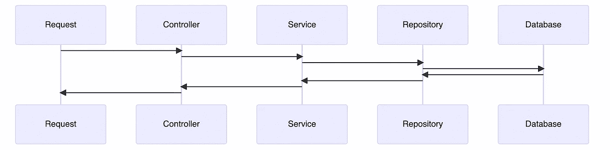
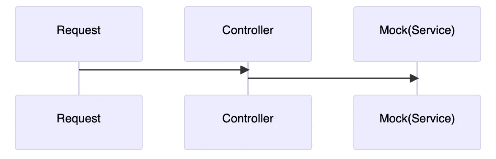

# 编写集成测试，而不是单元测试

> 原文：<https://medium.com/geekculture/write-an-integration-test-not-an-unit-test-a19572f880a8?source=collection_archive---------13----------------------->

## 作为一个懒惰的软件工程师，我只想在必要的时候写代码。如果我碰巧写了代码，我想尽可能地利用它。如果这听起来像你，那么让我们看看集成测试如何让你的代码更有效率。

# 太长了，读不下去

当你有足够的时间或者它是你的系统的一个关键部分时，编写两个测试，集成测试和 T2 单元测试。当时间不在本质上时，先写**集成**测试。

# 更多…

> 集成测试——是一种软件测试，其中软件应用程序的不同单元、模块或组件作为一个组合实体进行测试。

单元测试仅证明一个单元的**正确工作。而集成测试证明**的工作比一个单元**多** **。**

## 被测系统

为什么理解什么是被测系统很重要？它将帮助我们定义有效的测试。

> 受测系统(SUT) —正在测试是否正常运行的系统。

**集成**测试比**单元**测试覆盖更广的 SUT 是正常的。让我们考虑下面的测试:

Integration test

上面测试的 SUT 是 web 服务中请求的整个过程。根据我们的断言，我们可以在这个 web 服务的所有层中发现一个潜在的问题。

System Under Test: Controller, Service, Repository and Database

下面是**单元**测试如何在 web 服务中寻找控制器:

Unit test

System Under Test: Controller

正如我们所看到的，对于相似数量的代码，**集成**测试比**单元**测试覆盖了更广的 SUT。

# 结果

编写一个合适的集成是具有挑战性的，因为它需要初始设置。然而，随着时间的推移，它会得到回报。在开始的时候投入你的时间，然后对你的代码有一种稳定的感觉。

以下是如何确保你正在编写一个**集成**测试:

🗄️使用数据库的测试实例、外部依赖关系中的测试租户等。

🖥️使用测试服务器，而不是嘲笑和刺伤。

🐳使用 Docker 进行更简单的依赖性管理。

# 资源

1.  我的[示例](https://github.com/alkondrashov/cars)的一个**集成**测试。请参阅自述文件，了解如何运行它。
2.  [美人鱼 digram 编辑器](https://mermaid.live):作为代码的图。