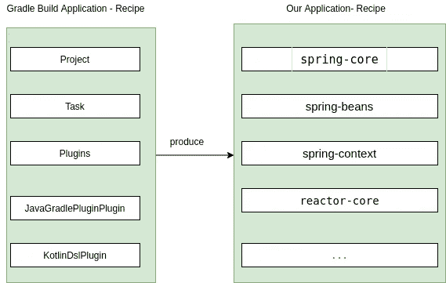
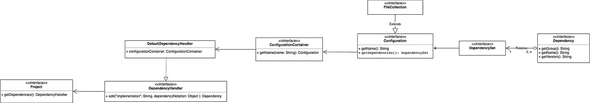
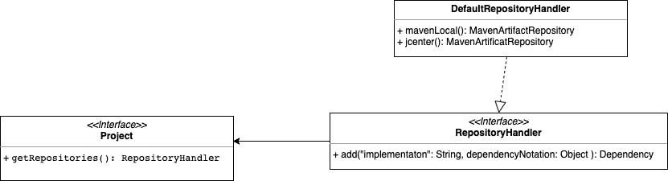
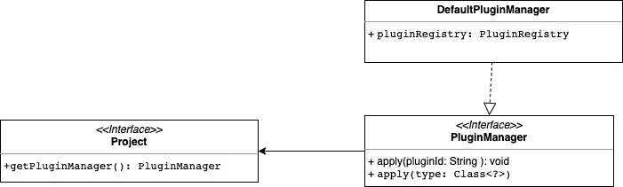
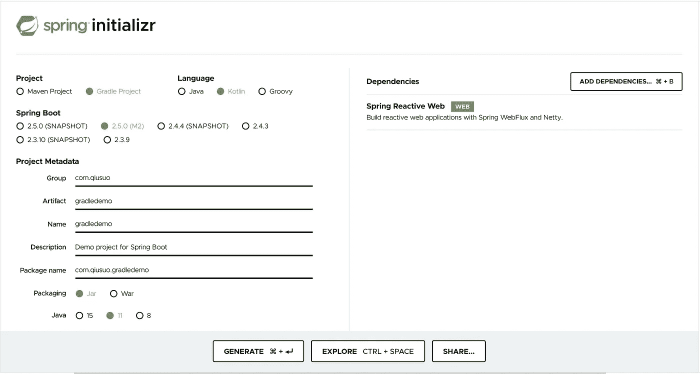

# 编写定制的 Kotlin Gradle 构建插件

> 原文：<https://medium.com/geekculture/write-custom-kotlin-build-plugin-3c71cbf0ee87?source=collection_archive---------15----------------------->

首先，我们将看看 Gradle 插件如何在内部工作。然后，我们将构建一个自定义插件，将我们的公共配置从 *build.gradle.kts* 提取到我们自己的自定义插件中。

*首先要注意的是，Gradle 本身就是一个 Java 应用程序。Gradle 项目将在我们所有的 build.gradle.kts 文件上运行，并执行构建操作。Gradle 构建的输出是我们自己的应用程序。*

每个 Java 程序都需要类路径上的依赖库。格拉德建筑也不例外。它需要所有必要的库来完成构建过程。这些库必须与我们自己的应用程序所需的库区分开来。



当 Gradle 运行构建时，它需要所有的 Project.java、Task.java、Plugin.java 等*类，就像当我们运行我们的 Spring 应用程序时，我们需要类路径上的 *spring-core、spring-beans* 等库。*

我们如何让 Gradle 知道它需要*KotlinDslPlugin.java*类来构建应用程序呢？答案是我们必须明确地告诉 Gradle，您需要这个类来运行构建，就像我们明确地指定 *spring-context* 应该在我们的类路径中一样。

## **构建脚本**

以前，Gradle 使用*构建脚本*告诉 Gradle 它需要依赖 jar 位于构建应用程序的类路径上。这个 jar 可以从由 *repositories* 块指定的 maven 仓库中取出。

```
buildscript {
   repositories {
     maven {
       url = uri("https://repo.spring.io/plugins-snapshot")     }  
   }   
   dependencies {
     classpath("io.spring.gradle:dependency-management-plugin:1.0.10.RELEASE")   
   } 
}  
apply(plugin = "io.spring.dependency-management")
```

现在语法简化为*插件{}* 块。我们只需要将*插件{}* 添加到 *build.gradle.kts* 中。

```
plugins **{
**    id("io.spring.dependency-management") *version* "1.0.10.RELEASE"
**}**
```

然后，Gradle 将把*依赖管理* jar 放到构建应用程序的类路径上，并将插件应用到我们的项目中。我们将在后面讨论当插件被应用到一个项目中时意味着什么。

我们如何为自己的应用程序声明依赖关系？我们在*构建脚本之外使用 *依赖关系*块。*

```
*dependencies* **{** *implementation*("org.springframework.boot:spring-boot-starter-web")
}
```

在 Spring 应用程序中，我们的项目通常包含多个与 Spring 相关的依赖项。依赖关系可以分为编译时依赖关系和运行时依赖关系等。它可以被认为是两类依赖关系。也可以更多。

Gradle 使用*配置*作为某类依赖关系的逻辑容器。每个*配置*都有一个名称。例如，我们可以有一个名为“编译”的配置。“编译”配置包含一堆 jar 作为编译时依赖项。下图显示了项目、配置和依赖关系之间的关系。可以从左到右查看每个类与其他类的关系。



Handling Dependencies

从上图我们可以看到*configuration . get dependencies 会返回一个 DependencySet。因为对于编译时或运行时，我们可能有多个 jar 作为依赖项。*

## **储存库**

Repository 告诉 Gradle 从我们的项目中提取依赖 jar 的远程 URL



API for adding repository

## **分机**

*扩展*的目的是使领域类(项目、任务等)能够使用用户定义类的任何其他对象。只需将 *ExtensionContainer* 视为一个*映射<字符串、对象>、*，这个映射就成为域对象(项目或任务等)*的一个属性。*通过这种方式，我们能够向地图中添加任何随机的类。轻松点。


API for add and get Extension

## **插件**

Plugin 可以被认为是一个助手类，在这个类中，我们将前面提到的 API 应用于*项目。*



API for apply plugin on project

## **实验**

目标:在大多数 Spring 云应用程序中，我们必须将以下插件应用到我们所有的 web 应用程序中。

```
plugins {
  java
  id("org.springframework.boot") version "2.4.3" 
  id "io.spring.dependency-management" version <<version>>
}
```

我们希望将上述逻辑提取到我们的自定义插件中。所以我们可以为每个项目应用我们自己的插件。

```
plugins {
  *id(“com.qiusuo.common”)*
}
```

在自定义插件中，我们以编程方式应用其他插件。这也是插件内部工作的方式。

## **开动火车**

创建 **gradledemo** 项目



将项目加载到 Intellij 中，并创建一个虚拟 helloworld 控制器。

```
@RestController
@RequestMapping(**"/helloworld"**)
**class** HelloWorldController {
    @RequestMapping
    **fun** posts(): Mono<String> {
        **return** Mono.just(**"hello world"**);
    }
}
```

现在在 **gradledemo** 项目下，创建一个文件夹 **buildSrc** ，再创建一个 *build.gradle.kts* 文件。我们将把以下内容添加到 *build.gradle.kts* 中。

```
plugins **{** *`kotlin-dsl`* **}** *repositories* **{** mavenCentral()
    jcenter()
    maven **{** setUrl(**"https://plugins.gradle.org/m2/"**) **}
}**
```

Intellij 会自动将其识别为新项目。我们将在包 *com.qiusuo.* 下创建插件类，并将以下内容添加到 build.gradle.kts 中

```
*dependencies* **{** *implementation*(**"org.jetbrains.kotlin:kotlin-gradle-plugin:1.4.31"**)
    *implementation*(**"io.spring.dependency-management:io.spring.dependency-management.gradle.plugin:1.0.10.RELEASE"**)
    *implementation*(group = **"org.springframework.boot"**, name = **"spring-boot-gradle-plugin"**, version = **"2.4.3"**)
**}**
```

我们在这里做的只是添加插件 jar 作为我们的 **buildSrc** 项目的依赖项。这样，我们能够在源代码中使用不同的插件类。把它看作一个普通的 java 应用程序。

现在我们在包 *com.qiusuo.* 下创建一个 *QiuSuoPlugin.kt*

```
**class** QiuSuoPlugin : Plugin<Project> {
    **override fun** apply(target: Project) {
        target.*configurePlugins*()
        target.*configureRepositories*()
    }
}

**fun** Project.configurePlugins() {
    *pluginManager*.apply(SpringBootPlugin::**class**.*java*)
    *pluginManager*.apply(DependencyManagementPlugin::**class**.*java*)
    *pluginManager*.apply(JavaPlugin::**class**.*java*)
    *pluginManager*.apply(ApplicationPlugin::**class**.*java*)
}

**fun** Project.configureRepositories() {
    *repositories*.mavenLocal()
    *repositories*.mavenCentral()
    *repositories*.jcenter()
}
```

这个文件的内容是不言自明的。我们使用前面的界面来配置目标项目对象。我们将 *SpringBootPlugin、DependencyManagementPlugin、JavaPlugin 和 ApplicationPlugin* 应用于目标项目。

我们只需要*gradledemo/build . gradle . kts*文件中的以下代码，就可以将我们的插件应用到 **gradledemo** 项目中

```
plugins {
  id(**"com.qiusuo.common"**)
}
```

插件块的效果现在非常明显了。当这个块被应用到某个项目时，会调用 *apply(target: Project)* 函数对项目执行一些自定义动作。

如果你阅读其他插件的源代码，你会发现他们所做的也是使用 Gradle 提供的 API 来应用插件或添加扩展或向项目添加任务。比如 *kotlin-dsl* 插件源代码是这样的。

```
class KotlinDslPlugin : Plugin<Project> {
     override fun apply(project: Project): Unit = project.run 
    {        
      apply<JavaGradlePluginPlugin>()      
      apply<KotlinDslBasePlugin>()
      apply<PrecompiledScriptPlugins>()   
    }
}
```

你可以在下面的 github repo 中找到这个演示的源代码

[https://github . com/Ryan-Zheng-teki/kot Lin-grad le-plugin-demo](https://github.com/ryan-zheng-teki/kotlin-gradle-plugin-demo)