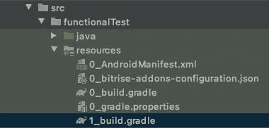
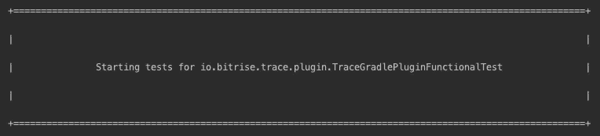

# 为你的 Android 库和 Gradle 插件编写你的测试

> 原文：<https://medium.com/geekculture/write-your-tests-for-your-android-libraries-and-plugins-3ec4b5da2faf?source=collection_archive---------20----------------------->

**注:文章原载于** [**Bitrise 博客**](https://blog.bitrise.io/post/write-your-tests-for-your-android-libraries-and-plugins?utm_source=twitter&utm_medium=web&utm_campaign=androidlibraries) **。本文是关于 Android 测试的系列文章的一部分，请在这里找到该系列文章的完整列表:** [1。为你的 Android 应用编写测试的指南。为你的 Android 库和 Gradle 插件编写你的测试。CI 上的测试](https://richrdbogdn.medium.com/a-guide-to-write-your-tests-for-your-android-apps-d4272424cb23)
[4。在 CI 上处理模拟器问题和 Android UI 测试失败](https://richrdbogdn.medium.com/dealing-with-emulator-issues-and-android-ui-test-failures-on-ci-7895694d58c8)

在你的 Android 开发职业生涯中，你可能会到达一个你必须开发 Android 库或 Gradle 插件的点。在本文中，我们将讨论测试它们最重要的方面以及与应用程序测试的区别！


# 测试库

我将直奔主题:它不是一个应用程序。这对你意味着什么？您将无法:

1.  在 android 清单中指定<application>标签。</application>
2.  将其作为应用程序在设备上启动。

# 为什么这是一个问题？

1.  这意味着，你不能为你的测试设置一些特定的东西。我过去面临的一个问题是，我无法将 android:usesCleartextTraffic 设置为 true。这意味着从 API 级别 28 开始，对不安全的端点进行网络调用的测试用例会失败(更多关于这个限制的信息[在这里](https://developer.android.com/training/articles/security-config#CleartextTrafficPermitted))。当然，正如我们在以前的文章中了解到的，我们应该限制真正的网络调用，并尽可能地模拟它们，但是在这种情况下，模拟服务器是不够的，您还必须模拟客户端。
2.  这限制了 UI 测试的选项，例如，您不能编写 [UIAutomator](https://developer.android.com/training/testing/ui-automator) 测试。当然，在大多数情况下这不是一个问题，但对某些人来说可能是，想象一下创建一个库，为使用它的应用程序提供不同的图表(视图)。

# 如何缓解？

嗯，像没有应用程序这样的小问题需要小的解决方案:**创建一个测试应用程序**，它将使用你的库作为依赖。我觉得这是处理这个问题最简单最顺畅的方法。它不必太复杂，但这真的取决于你的需求。最好的方法是当你的测试程序能够展示你的库的不同功能。

根据您正在开发的产品，可能在一个多模块项目中有您的库，该项目已经有一个应用程序，因此在这种情况下，您不必创建一个新的测试应用程序，只需使用现有的应用程序。

# 测试 Gradle 插件

当你开发 Gradle 插件时，你可以用不同的 JVM 语言编写，比如 **Java** 、 **Groovy** 或 **Kotlin** 。幸运的是，正因为如此，您可以使用传统的 JUnit 框架来测试大多数东西。


您可能还需要功能测试。插件通常会给给定的项目添加新的任务，或者修改现有任务的输出，所以你应该能够测试渐变任务。这可以用 [Gradle 测试套件](https://docs.gradle.org/current/userguide/test_kit.html)来完成。使用 Testkit，您可以在测试中运行 Gradle 任务，并分析构建结果。这听起来很棒，让我们看看怎么做吧！

```
final BuildResult buildResult =
       GradleRunner.create()
                   .withProjectDir(getTestDir())
                   .withArguments(“taskName”)
                   .forwardOutput()
                   .build();
```

**在上面的例子中，您得到了一个 Gradle 任务运行的结果。为此，您必须执行以下操作:**

1.  创建一个[grad runner](https://docs.gradle.org/current/javadoc/org/gradle/testkit/runner/GradleRunner.html)的实例。
2.  为将运行任务的项目设置目录(文件)。我在这里使用一个方法，来得到正确的目录，我将在后面解释它。
3.  添加 Gradle 命令的参数。您应该添加想要运行的任务的名称，但是也可以配置其他选项。
4.  转发输出是可选的，但有助于调试，因为在运行任务时，您将在控制台上看到测试的输出。
5.  调用 build 方法获取构建结果。我会解释你可以用它做什么。

我会按顺序解释，见下文。

# 我的 getTestDir()方法是做什么的？

```
@Rule
public TestName testName = new TestName();@NonNull
private File getTestDir() {
   return new File(testProjectDir.getAbsolutePath() + "/" +  
                   testName.getMethodName() + "/");
}
```

正如我提到的，它返回项目目录，这将运行给定的 Gradle 任务。由于您可以有多个测试用例，我认为为它们设置不同的工作目录是一个好主意，这样您可以确保执行的顺序不会影响结果。我只是连接了一个测试的基本路径，每个测试用例都有一个名为 test 的目录。要获得实际测试的名称，只需创建并使用一个[@规则](https://junit.org/junit4/javadoc/4.12/org/junit/Rule.html)。

根据用例，您可以决定创建一个临时目录来运行测试用例，或者您可以使用一个非临时目录，这样您将能够在以后检查它的内容。如果你想调试的话会很有用。如果您想创建一个临时文件夹，只需使用一个规则:

```
@Rule
public TemporaryFolder tempFolder = new TemporaryFolder();
```

如果您为您的测试用例使用一个非临时的文件夹，确保任务运行的结果不受先前运行的影响的最好方法是删除测试目录。如果你创建一个方法，并根据解决方案用 [@BeforeClass](https://junit.org/junit4/javadoc/4.12/org/junit/BeforeClass.html) 或 [@Before](https://junit.org/junit4/javadoc/4.12/org/junit/Before.html) 对其进行注释，这很容易做到。

# 如何向你的测试文件夹添加内容？

创建一个空目录是不够的，您必须用所需的内容来设置它。你必须至少在那里放一个 **build.gradle 文件**，但是当然你可以添加 settings.gradle，gradle.properties，local.properties 等等。可以通过两种方式添加 build.gradle。一种方法是将内容创建为字符串，并将其写入文件。可以工作，但是创建更复杂的内容真的很麻烦，更不用说阅读它们了。我更喜欢创建实际的测试资源文件，并将它们放在给定 sourceset 下的 resources 文件夹中:



这种方法的好处是，您将拥有与应用程序 build.gradle 中相同的功能，如代码完成、Gradle sync 等。您只需要确保在运行测试之前将它复制到正确的文件夹中。

***专业经验提示:*** *在你的测试文件或者测试 build.gradle 本身的某个地方添加几行注释，并解释这个 gradle 文件的用途。*

拥有多个测试用例可能需要很多不同的 build.gradle 文件。为了避免有大量重复的内容，尽量把通用的部分放在 gradle 文件中，这些文件将被多个较小的 gradle 文件使用。

从“我的-common.gradle”申请

您只需将给定的 Gradle 文件添加到上面一行，它将包含来自 Gradle 构建文件“my-common.gradle”的所有内容。请注意，您可以使用路径，因此它也可以在子目录中。

**包含来自不同 gradle.properties 文件的属性**有点复杂，但并非不可能:

```
final Properties myProperties = new Properties()
final File myPropertiesFile = new File(getProject().getProjectDir().getAbsolutePath() + ("/myproperties.properties"))
myPropertiesFile.withInputStream {
   myProperties.load(it)
}
def someProperty = myProperties.get("version")
```

**所以你在这里做的是你:**

1.  创建新的属性对象。
2.  从您想要获取属性的位置获取属性文件的文件引用。在我的例子中，它在根项目中。
3.  打开文件并将其内容加载到 properties 对象中。
4.  现在您也可以访问这些属性了。

# 你能用 BuildResult 做什么？

顾名思义，你能得到的一件事就是得到它提供的构建结果。在某些情况下，这是您想要的，只需调用 getOutput()方法。

您可以做的更高级的事情是访问已经运行的任务，检查它们的顺序、结果等。

```
final List buildTasks = buildResult.getTasks();final Optional processDebugManifestTaskOptional =
       buildTasks.stream()
                 .filter(buildTask ->   
                         buildTask.getPath().equals(
                         ":processDebugManifest"))
                 .findFirst(); assertThat(processDebugManifestTaskOptional.isPresent(), is(true));
```

‍ **通过上面的代码，你可以得到已经运行的任务，并检查给定的任务是否存在。**

```
final BuildTask processDebugManifestTask = processDebugManifestTaskOptional.get();final int manifestProcessIndex = buildTasks.indexOf(processDebugManifestTask);
assertEquals(TaskOutcome.SUCCESS, processDebugManifestTask.getOutcome());
```

正如我提到的，您可以检查并断言它们的结果，或者按照它们运行的顺序检查它们的索引，这样您也可以确定它们的顺序。有大量的机会，如果你有类似的东西，请让我知道你在做什么。

# 如何处理测试控制台输出？

随着您添加越来越多的测试用例，并且您将输出转发到您的控制台，您将会经历相当混乱和冗长的输出。有一些技巧可以减轻这种情况，我将介绍其中的三种:

1.  在测试用例输出之间添加分频器。
2.  定制测试用例控制台输出文本外观。
3.  将输出写入文件。

在测试用例输出之间添加分频器可能是最简单的一个。我们不需要做任何特别的事情，但是在测试用例之间添加一些日志行。下面是如何做到这一点:

1.  在你的测试类中获取一个对 Gradle [Logger](https://docs.gradle.org/current/javadoc/org/gradle/api/logging/Logger.html) 实例的引用。

```
logger = Logging.getLogger(this.getClass().getName());
```

1.  在之前用[@标注的方法中进行日志记录，这样它将在每个测试用例运行之前执行。](https://junit.org/junit4/javadoc/4.12/org/junit/Before.html)

```
@Before
public void setUpTest() {
  logTestNameInAsciiBox(testName);
}
```

正如您所看到的，我传递了测试的名称来将其打印出来，因此很容易跟踪哪个测试正在执行。此外，如果您对简单的一行日志不满意，并希望使它更具可读性，可以考虑将它改为多行，或者放入 ASCII 框中，如下所示:



有很多第三方库，你可以自由选择你最喜欢的，或者看看我下面的例子:

所以上面的框是 3 种不同类型的字符串的 5 行:开始/结束行(顶部和底部边界)，空行和带有测试名称的行。编写类似这样的代码可以达到目的:

```
/**
* Prints multiple lines with the given text in a pretty ASCII text 
* box.
*
* @param text the text to print.
*/
public void logInAsciiBox(@NonNull final String text) {
   final int textLength = text.length();
   final int paddingLength = 30;
   final int lineLength = paddingLength + textLength; final StringBuilder stringBuilder = new StringBuilder(); stringBuilder.append("\n");
   stringBuilder.append(getTestNameBorderLogLine(lineLength));
   stringBuilder.append(getTestNameEmptyLogLine(lineLength));
   stringBuilder.append(getTestNameLogLine(text, paddingLength));
   stringBuilder.append(getTestNameEmptyLogLine(lineLength));
   stringBuilder.append(getTestNameBorderLogLine(lineLength)); logger.lifecycle(stringBuilder.toString());
}
```

你可以在这里找到潜在的逻辑:

```
/**
* Prints the top or bottom line. Contains separators only.
*
* @param lineLength the length of the lines.
* @return the line.
*/
@NonNull
private String getTestNameBorderLogLine(final int lineLength) {
   final StringBuilder stringBuilder = new StringBuilder();
   stringBuilder.append("+");
   stringBuilder.append(concatString("=", lineLength));
   stringBuilder.append("+");
   stringBuilder.append("\n");
   return stringBuilder.toString();
}/**
* Prints a line with empty content.
*
* @param lineLength the length of the lines.
* @return the line.
*/
@NonNull
private String getTestNameEmptyLogLine(final int lineLength) {
   final StringBuilder stringBuilder = new StringBuilder();
   stringBuilder.append("|");
   stringBuilder.append(concatString(" ", lineLength));
   stringBuilder.append("|");
   stringBuilder.append("\n");
   return stringBuilder.toString();
}/**
* Prints the line with the name of the test.
*
* @param testName      the given text to display.
* @param paddingLength the length of padding for the line, excluding
*                      starting and ending chars. Padding length
*                      should be an even number, otherwise it will
*                      result in uneven line lengths.
* @return the line.
*/
@NonNull
private String getTestNameLogLine(final String testName, final int paddingLength) {
   final StringBuilder stringBuilder = new StringBuilder();
   stringBuilder.append("|");
   stringBuilder.append(concatString(" ", paddingLength / 2));
   stringBuilder.append(testName);
   stringBuilder.append(concatString(" ", paddingLength / 2));
   stringBuilder.append("|");
   stringBuilder.append("\n");
   return stringBuilder.toString();
}/**
* Concatenates the given String the given amount of times.
*
* @param string the String to concat.
* @param times  the number of times it should be concatenated.
* @return the concatenated String.
*/
@NonNull
private String concatString(@NonNull final String string, final int times) {
   return IntStream.range(0, times).mapToObj(
          i -> string).collect(Collectors.joining(""));
}
```

定制测试用例控制台输出文本外观有点棘手，但并非不可能。当创建 runner 而不是 forwardOutput()时，您必须创建自己的 [Writer](https://docs.oracle.com/javase/7/docs/api/java/io/Writer.html) 实现，并使用 forwardStdOutput(Writer)和 forwardStdError(Writer)方法(参见本文开头)。这个 Writer 实现将向你展示如何给每一行添加缩进，并为输出选择不同的颜色。

首先，为了改变颜色，我简单地使用了 [ANSI 转义码](https://en.wikipedia.org/wiki/ANSI_escape_code)，这将改变你的本地环境和配置项。为了简单起见，我扩展了 [PrintWriter](https://docs.oracle.com/javase/7/docs/api/java/io/PrintWriter.html) 类，并覆盖了 [write(char[]，int，int)](https://docs.oracle.com/javase/7/docs/api/java/io/PrintWriter.html#write(char[],%20int,%20int)) 方法。

```
@Override
public void write(@NonNull final char[] chars, final int i, final int i1) {
  final char[] charsToWrite = Arrays.copyOfRange(chars, i, i + i1);
  final char[] coloredChars = color(charsToWrite);
  final char[] indentedAndColoredChars = addIndent(coloredChars);
  final char[] toPrint = 
        concatCharArrays(indentedAndColoredChars, coloringEnd);
  super.write(toPrint, 0, toPrint.length);
}
```

‍ **看起来很酷，但是它是怎么变魔术的呢？我将解释上面的五个步骤。**


1.  将需要在控制台上写入的字符复制到一个新数组中。
2.  给给定的文本添加颜色，

```
@NonNull
private char[] color(@NonNull final char[] chars) {
   final char[] escaped = concatEscapeChar(coloringCode);
   return concatCharArrays(escaped, chars);
}‍
```

2a。根据 ANSI 转义码创建一个颜色代码。

```
@NonNull
private static char[] createColorCode(final int red, final int green, final int blue) {
   return String.format("[38;2;%s;%s;%sm", 
                        red, green, blue).toCharArray();
}
```

2b。在给定文本前添加颜色代码。

2c。在着色代码前添加转义字符。

```
private static final char[] escapeChar = new char[]{27};
```

3.给定的字符添加所需的缩进。

```
@NonNull
private char[] addIndent(@NonNull final char[] chars) {
   return concatCharArrays(indentation, chars);
}
```

4.为着色转义序列添加结尾。

```
private final char[] coloringEnd = 
concatEscapeChar("[39;49m".toCharArray());
```

5.用新的内容打电话给 super，躺回你的座位上享受结果。

不要担心，我们就快成功了，出于好奇，我在这里留下了 helper 方法的代码:

```
/**
* Inserts to the start the escape char.
*
* @param chars the given chars to escape.
* @return the given chars with the escape char.
*/
@NonNull
private static char[] concatEscapeChar(@NonNull final char[] chars) {
   return concatCharArrays(escapeChar, chars);
}/**
* Concatenates two arrays of chars.
*
* @param first  the first array.
* @param second the second array.
* @return the concatenated result.
*/
@NonNull
private static char[] concatCharArrays(@NonNull final char[] first, @NonNull final char[] second) {
   final StringBuilder stringBuilder = new StringBuilder();
   stringBuilder.append(first);
   stringBuilder.append(second);
   return stringBuilder.toString().toCharArray();
}
```

请注意，如果您不希望缩进，您可以在写入任何字符之前设置着色代码(例如在构造函数中)，并在打印出您想要的所有内容时关闭转义序列(例如您可以为此覆盖 close 方法)。这样你就必须设置一次颜色，然后重新设置一次。

还有一件事，**将输出写入文件**。


这将是一个快速的方法:使用一个 [FileWriter](https://docs.oracle.com/javase/7/docs/api/java/io/FileWriter.html) 用于 forwardStdOutput(Writer)和 forwardStdError(Writer)方法。有大量的例子，如果你需要一个例子，如何创建一个，所以请使用你最喜欢的搜索引擎。

# 关闭

希望你喜欢这篇文章。我很确定还有其他一些我可以提到的关于测试库和插件的东西，如果你认为缺少了一些重要的东西，不要害怕联系我，告诉我你的想法。另外，请加入我的下一部分，我将写关于如何在 CI 中设置测试的[。](https://richrdbogdn.medium.com/testing-on-the-ci-aa400c914b1f)

