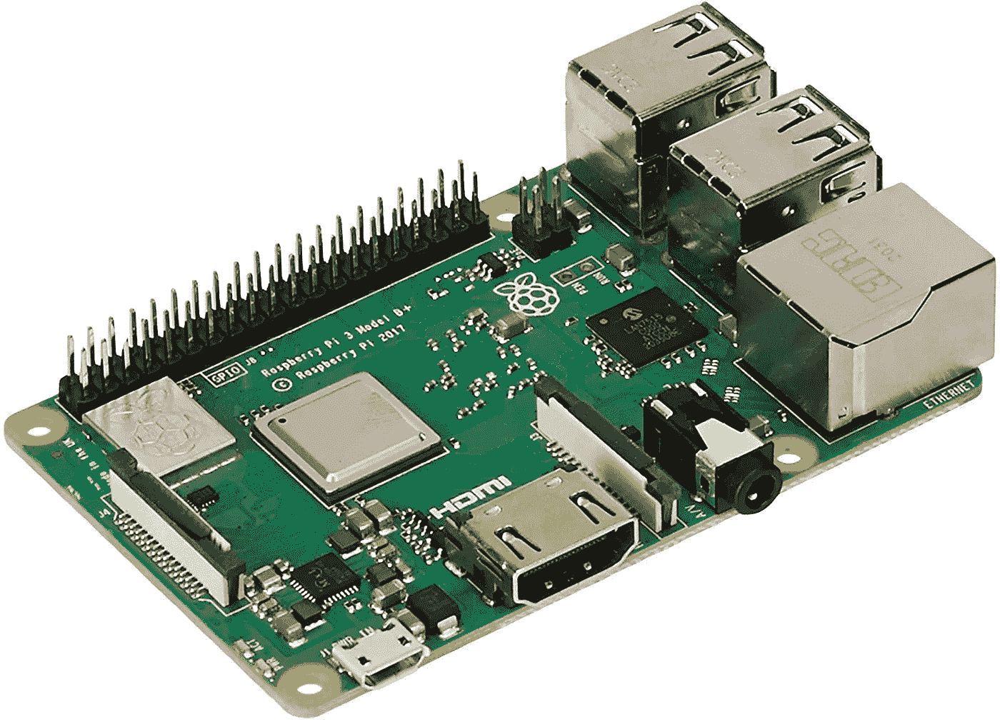
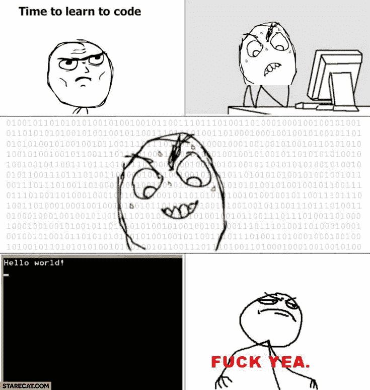

# 在 Raspberry Pi 上为 CTFS 网络安全公司编写裸机固件—设置

> 原文：<https://medium.com/geekculture/writing-baremetal-firmware-on-raspberry-pi-for-cyber-security-ctfs-setup-fbf92c422a8e?source=collection_archive---------8----------------------->

我是威森德，拉格纳安全公司的创始人。今年早些时候，我写了一系列关于逆向工程裸机固件的文章。我们分析并开发了一个为 UMDCTF 设计的 Raspberry Pi Zero 固件。这让我们了解了使用这种固件的设备的局限性。现在我们要从一个不同的角度来看:我们要写我们自己的固件！

为什么我们要在一个关注网络安全的博客上写自己的固件？ 了解开发人员如何创建他们的软件可以帮助安全专家确定为什么在开发生命周期中会出现缺陷。它有助于我们了解 It 面临的挑战，并且有助于更快地发现漏洞/漏洞，以便能够减轻它们。因此，通过拥有多种观点，我们将在工作中做得更好。

## 让我们开始吧！

# 必备知识

在开始开发裸机固件之前，您应该先熟悉几项技能:

*   **对编译语言有所了解:**不编译是不可能写出固件的。所以，知道如何用 C、C++、Rust 这样的语言编码，有助于为写固件打好基础。在本教程中，我们将特别关注 C 语言。
*   **理解汇编语言**:能够阅读汇编语言将有助于理解代码执行时发生了什么。当调试和控制嵌入式设备的特定方面(如驱动程序)时，它变得特别有用。*在本教程中，我们将重点介绍 ARM 和 AARCH64 (ARM 64 位)。*
*   **了解硬件工作原理:**嵌入式系统的固件不同于标准计算机的固件。某些输入和输出不相同(例如串行引脚、JTAG 等)。了解各种接口和嵌入式系统的工作原理至关重要。*对于本教程，我们将重点介绍树莓 Pi Zero 和树莓 Pi 3* ***。***

# 项目的设置

为了开始对裸机固件进行编程，我们需要一些关键的东西:

*   一个 Linux 开发环境——尽管在 Windows 上是可能的，但是大多数嵌入式系统都利用 Linux 来编译固件。事实上，大多数嵌入式操作系统都是基于 Unix 的，但是我们不会使用它们，因为我们关注的是裸机。
*   构建系统——这允许我们在编写代码后创建固件。
*   调试环境——为此我们将使用 GDB；然而，我们需要远程进入运行固件的进程。我们将写一个脚本来帮助我们做到这一点。
*   软件开发环境——这完全取决于你；然而，我的建议是要么使用 Visual Studio 代码，要么使用 Vim。

## 创建构建系统

构建系统将自动执行/编写我们创建固件所需的步骤。因为这不是一个简单的 C 程序，所以需要很多步骤来创建固件。因此，32 位和 64 位 ARM 都需要使用 GDB 的 Make(我使用了 gdb-arm-none-eabi 和 gdb-aarch64-linux-gnu)。

Makefiles 是至关重要的，因为它们将定义我们如何编译我们的固件。更具体地说，它们将包含编译所有 C 文件的命令(将它们转换成目标文件，创建可执行文件等)。它们还包含处理固件映像所需的命令(如 objcopy)。此外，我们可以使用 Makefiles 来确定我们是为调试还是为生产而编译。

## 调试环境

良好的调试环境有几个关键方面:

*   我们需要它易于使用
*   我们需要它易于重复使用
*   我们需要快速找到固件中的问题

对此的最佳解决方案是利用 QEMU (5.0+)。QEMU 是 Linux 中的一个模拟器，它能够连接到 GDB。在一个单一的命令行中，我们可以执行固件，并逐步通过它。另一种方法是使用 JTAG 或串行端口进行调试；然而，它比开发固件所需的要复杂得多。我们将在以后的文章中回到这一点(当我们准备好在硬件上调试时)。

QEMU 5.0+为 Raspberry Pi 到 3 预配置了仿真器。这使我们能够通过一个命令行选项运行固件映像:

这里有三点需要注意:

*   我们使用 QEMU-system-AAR ch 64，它包含 32 位和 64 位 arm 设备的嵌入式设备仿真。
*   -M 指定您要使用的机器。在这种情况下，示例是一个 Raspberry Pi 3 B
*   我们需要传入内核映像，并将串行传递给标准输出。这是图像实际运行的方式，我们可以看到输出。对于其他类型的输出(如嵌入式系统的 stdio)，还有其他选项；然而，对于本教程，我们将关注 QEMU 中的串行。

这是我正在使用的完整的 Makefile 文件。这是开始构建固件映像的绝佳模板。注意，在这个 Makefile 示例中，我告诉编译器不要使用任何标准库。因此，我们必须实现 memset、malloc、printf 等。

## 此环境的重要文件和文件夹

在我们开始编写代码之前，我们需要了解事物的位置。在根目录中，我们有几个关键文件:

*   链接器脚本—在这个 Makefile 中，它被称为 link
*   Makefile —已经解释过了
*   debug.gdb/debug-gef.gdb——我们稍后会谈到这一点
*   公共和主文件夹—代码文件夹
*   包含文件夹-标题的文件夹。

链接器脚本将是我们布置内存的方式(通过利用 GNU 链接器)。在这里，我们将定义一些常见的东西，比如代码段。文本)、BSS 部分等。下面是我们将在本教程中使用的链接器脚本:

Common、Main 和 Include 文件夹是我们将要完成大部分工作的地方。为什么我们有三个文件夹？仅仅是为了组织的目的。您可以自定义 make 文件，使其包含任意数量(或更少)的文件夹(并决定其中包含的内容)。以下是我采用这种文件夹结构的原因:

*   common——这是我存储所有“标准库”类型代码的地方。在这里，我们有 Raspberry Pi 实现的特定代码，如基于 UART 和内存管理的代码。
*   main——与 Common 不同，我使用这个文件夹为我的固件编写特性。文件夹中最重要的文件是我的引导汇编代码(start。s)。
*   Includes —存储 Common 和 Main 的所有标题。

## 现在怎么办？

现在我们准备开始创建固件，这将从第 2 部分开始！我们将创建一个“Hello World”firmwarre，并构建一些实用功能供我们使用。因为这是裸机，一个“Hello World”程序将会比平常花费更多的精力，因为我们需要设置串行连接、一些内存处理函数和管理 Raspberry Pi 硬件行为的头。

如果您还没有，请在我们的社交平台上关注我们:

**推特**:【https://twitter.com/ragnarsecurity】T2

红迪网:[https://www.reddit.com/user/ragnarsecurity](https://www.reddit.com/user/ragnarsecurity)

这里上**中**！