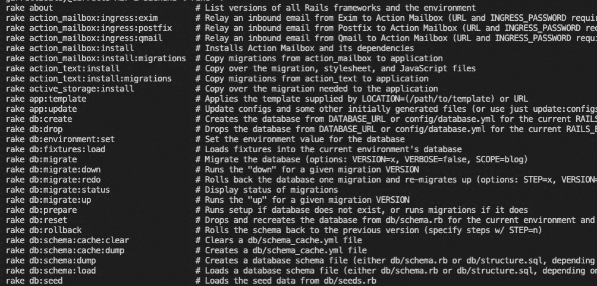

# 编写自定义 Rake 任务

> 原文：<https://medium.com/geekculture/writing-custom-rake-tasks-f656f43336cc?source=collection_archive---------5----------------------->

## 自动化您的 Rails 后端

## 命名空间、模块和元任务


Photo by [Tom Byrom](https://unsplash.com/@tombyrom?utm_source=unsplash&utm_medium=referral&utm_content=creditCopyText) on [Unsplash](https://unsplash.com/s/photos/tool-shed?utm_source=unsplash&utm_medium=referral&utm_content=creditCopyText)

代表“Ruby Make”的 Rake 是一个 Ruby 实用程序，它取代了常见的 Unix `make`实用程序。如果你曾经使用过 rails，我相信你会很熟悉使用像`rake db:migrate`或`rake db:rollback`这样的命令来管理你的服务器数据库。这些默认的 rake 任务会自动与 rails 安装捆绑在一起，但是您也可以编写定制的 rake 命令来自动化您选择的任何任务。

# 创建我们的 Rake 文件

您的定制 rake 任务必须写在扩展名为`.rake`的文件中，该文件必须位于`./lib/tasks`内。

```
touch ./lib/tasks/example.rake
```

# 编写任务

在我们的`.rake`文件中声明一个任务非常简单

虽然描述在技术上是可选的，但是需要注意的是，当在命令行中输入 `**rake -T**` **时，没有描述的**任务不会被列出。****

调用上面的例子:

```
rake something
```

# 组织我们的任务



You can view available rake tasks by typing “rake -T” in the command line

如果你看一下默认的`.rake`任务，你会看到 Rails 开发者选择通过命名空间来组织事情。虽然技术上没有要求，但是在一个名称空间中对相似的函数进行分组有助于保持代码的整洁。

幸运的是，给你的定制 rake 任务命名再简单不过了:

它在命令行中的调用如下:

```
rake custom_task:something
```

您也可以使用嵌套命名空间:

并通过命令行调用:

```
rake custom_tasks:productive:something
rake custom_tasks:unproductive:nothing
```

# 在 Rake 任务中利用模块

[模块应该包含在每个任务](https://stackoverflow.com/a/55011187/11035290)中，并且必须位于文件的顶部。将模块包含在任务中限制了它的范围，防止它被包含在整个应用程序中，这可能会导致意外的错误。

# 在另一个 Rake 任务中调用 Rake 任务

您也可以通过`Rake::Task['your_subtask_name_as_a_string'].execute`编写调用现有 rake 任务的元任务。重要的是，使用的字符串要与您通过命令行调用子任务时使用的字符串相匹配。这意味着当从不同的任务内部调用时，命名空间任务必须包括它的命名空间。

# 一个例子

下面是我编写的自定义 rake 任务，用于自动化我的一个项目的抓取行为。实际的抓取逻辑包含在我的`PicParser`模块中，而各种任务指定要抓取的 URL 和时间段。您还会注意到，我使用了`:environment`标志，允许`PicParser`模块访问我的应用程序其余部分中使用的模型。