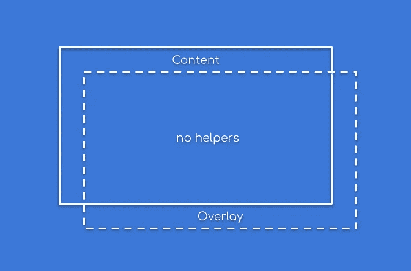

# 在 Flutter 中编写定制小部件(第 3.b 部分)——简单覆盖(无助手)

> 原文：<https://medium.com/geekculture/writing-custom-widgets-in-flutter-part-3-b-simpleoverlay-no-helpers-9ddf45cea983?source=collection_archive---------33----------------------->



# 介绍

正如我所承诺的，现在我将展示如何在没有任何助手的情况下编写 SimpleOverlay 小部件。我将省略一些在以前的文章中已经描述过的样板代码。

# 快速理论

在实现可能包含多个子部件的小部件时，我们还需要知道一些事情。

我们需要理解的第一件事是**槽**的概念。Slot 基本上只是子部件在我们的部件中的一个位置。它与 x 和 y 像素坐标无关，而是与逻辑位置有关。例如，在工具栏的情况下，它可以表示导航图标、徽标、标题或动作(命名槽)。但是对于列，它将是每个子元素的索引。

子元素也可以从一个槽移动到另一个槽，而不需要重新创建。例如，当我们为我们的孩子指定 **GlobalKey** ，然后在构建方法期间改变它的槽。或者当我们在元素中调用 updateChid 并为同一个元素传递不同的 Slot 时。

还有一点就是调用子方法的顺序:

*   布局-顺序无关紧要，除非一个子元素的大小取决于另一个子元素的大小
*   绘画——当孩子互相重叠时，从后向前的顺序，否则顺序并不重要
*   HitTest —当子元素相互重叠时，从前到后的顺序，否则顺序并不重要

# 密码

第一个不同是我们的小部件不再扩展**multichildrendeobjectwidget**，而是切换到更简单的 **RenderObjectWidget** :

```
**class** SimpleOverlay **extends** RenderObjectWidget {
  **final** Widget **child**;
  **final** Widget **overlay**;

  **const** SimpleOverlay({
    **required this**.**child**,
    **required this**.**overlay**,
  });

  @override
  RenderObjectElement createElement() {
    **return** SimpleOverlayElement(**this**);
  }

  @override
  RenderObject createRenderObject(BuildContext context) {
    **return** SimpleOverlayRenderObject();
  }
}
```

现在，我们需要向元素中添加子管理逻辑:

```
**class** SimpleOverlayElement **extends** RenderObjectElement {Element? **_child**;
  Element? **_overlay**;

  *// ...*

  @override
  **void** mount(Element? parent, newSlot) {
    **super**.mount(parent, newSlot);

    **_child** = inflateWidget(**widget**.**child**, **true**);
    **_overlay** = inflateWidget(**widget**.**overlay**, **false**);
  }

  @override
  **void** update(SimpleOverlay newWidget) {
    **super**.update(newWidget);

    **_child** = updateChild(**_child**, newWidget.**child**, **true**);
    **_overlay** = updateChild(**_overlay**, newWidget.**overlay**, **false**);
  }

  @override
  **void** unmount() {
    **super**.unmount();

    **_child** = **null**;
    **_overlay** = **null**;
  }
}
```

这里与前面的“没有助手”的例子实际上不同的是槽的使用。在简单覆盖的情况下，我们只有两个槽—子槽和覆盖槽。我选择使用 Boolean 作为 Slot，因为我们只有两个可能的值——**true**用于子对象，而 **false** 用于覆盖对象。

再次声明，插槽可以是您想要的任何东西，但是它们应该是一致的。

还有一点需要补充——将子 RenderObjects 生命周期方法传递给我们自己的方法:

```
**class** SimpleOverlayElement **extends** RenderObjectElement {
  *// ...*

  @override
  **void** insertRenderObjectChild(RenderBox child, bool slot) {
    **renderObject**.insertRenderObjectChild(child, slot);
  }

  @override
  **void** moveRenderObjectChild(RenderBox child, bool oldSlot, bool newSlot) {
    **renderObject**.moveRenderObjectChild(child, oldSlot, newSlot);
  }

  @override
  **void** removeRenderObjectChild(RenderBox child, bool slot) {
    **renderObject**.removeRenderObjectChild(child, slot);
  }
```

这里唯一的新东西是出现了 **moveRenderObjectChild** 方法。正如我之前提到的，当一个孩子从一个槽( **oldSlot** )移动到一个新槽( **newSlot** )时，这个方法将被调用。

这就是我们的元素。没什么大不了的，大部分代码都一样。现在让我们实现我们的 RenderObject。首先，我们需要处理来自元素的插入、移动和移除调用:

```
**class** SimpleOverlayRenderObject **extends** RenderBox {
  *//...*RenderBox? **_child**;
  RenderBox? **_overlay**;

  **void** insertRenderObjectChild(RenderBox child, bool slot) {
    **if** (slot) {
      **_child** = child;
    } **else** {
      **_overlay** = child;
    }
    adoptChild(child);
  }

  **void** moveRenderObjectChild(RenderBox child, bool oldSlot, bool newSlot) {
    **if** (oldSlot) {
      **_child** = **null**;
    } **else** {
      **_overlay** = **null**;
    }
    **if** (newSlot) {
      **_child** = child;
    } **else** {
      **_overlay** = child;
    }
  }

  **void** removeRenderObjectChild(RenderBox child, bool slot) {
    **if** (slot) {
      **_child** = **null**;
    } **else** {
      **_overlay** = **null**;
    }
    dropChild(child);
  }}
```

我们在这里接收的 Slot 的值与我们之前传递给 out 元素中的 inflateWidget 和 updateChild 的值相同。多亏了这个槽，我们知道哪个渲染框应该放在哪里。还要注意 **moveRenderObjectChild** 方法——我们不需要从中调用 **adoptChild** 或 **dropChild** ,因为 Child 实际上被重用并且已经被附加。

最后一项创新是绘画和点击测试:

```
**class** SimpleOverlayRenderObject **extends** RenderBox {
  *//...* @override
  **void** paint(PaintingContext context, Offset offset) {
    **if** (**_child** != **null**) {
      context.paintChild(**_child**!, offset);
    }
    **if** (**_overlay** != **null**) {
      context.paintChild(**_overlay**!, offset);
    }
  }@override
  bool hitTestChildren(BoxHitTestResult result, {**required** Offset position}) {
    **if** (**_overlay**?.hitTest(result, position: position) == **true**) {
      **return true**;
    }
    **if** (**_child**?.hitTest(result, position: position) == **true**) {
      **return true**;
    }
    **return false**;
  }}
```

请注意我们叫孩子的顺序。我们最后绘制覆盖图，因为我们希望它在孩子的上方可见，但是点击测试使用相反的顺序——覆盖图应该优先。

这是结果:


你可以在我的 GitHub 上找到实现:
[https://github.com/MatrixDev/Flutter-CustomWidgets](https://github.com/MatrixDev/Flutter-CustomWidgets)

希望你喜欢它！

# 其他文章:

*   [第 1 部分—省略文本](https://rlesovyi.medium.com/writing-custom-widgets-in-flutter-part-1-ellipsizedtext-a0efdc1368a8)
*   [第 2.a 部分——子女人数(带助手)](https://rlesovyi.medium.com/writing-custom-widgets-in-flutter-part-2-singlechildrenderobjectwidget-5637fecdf9bb)
*   [第 2.b 部分—子女人数(无助手)](https://rlesovyi.medium.com/writing-custom-widgets-in-flutter-part-2-b-childsize-no-helpers-61c578c9bbd2)
*   [第 3.a 部分—简单叠加(带助手)](https://rlesovyi.medium.com/writing-custom-widgets-in-flutter-part-3a-simpleoverlay-with-helpers-6b3990db48b6)