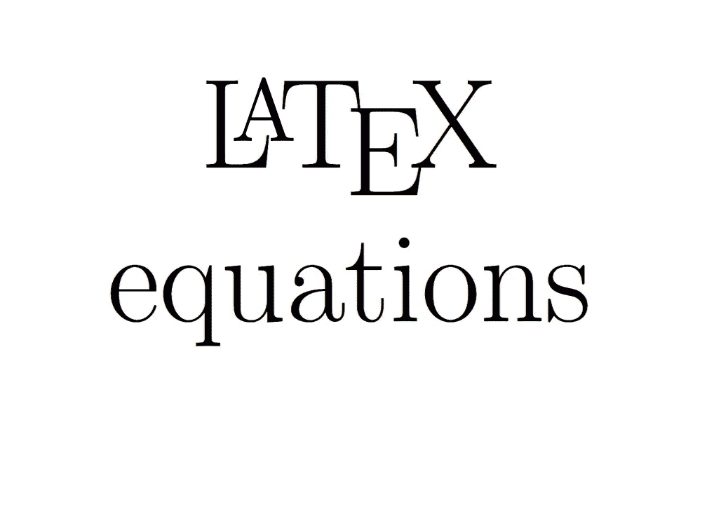

# 用 LateX 书写方程式/符号

> 原文：<https://medium.com/geekculture/writing-equations-symbols-in-latex-ece4427269ad?source=collection_archive---------8----------------------->

Image by Author

LateX 是一种控制文档格式的非凡手段。如果您要求您的研究文章采用双栏格式，想要移动图形以换行，创建用作超链接的图标(例如在 CV/resume 中)，这将非常有用。对于这类事情有一些 word 模板(我特别注意到 IEEE 的)，但是与格式化作斗争是一场噩梦。